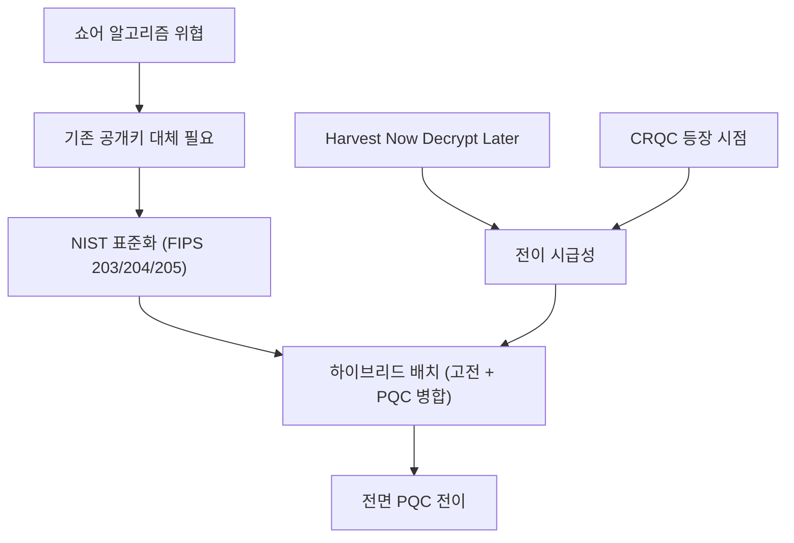

# MOC - Post-Quantum Cryptography

## 개요
양자 내성 암호(PQC)는 보안 근거를 양자물리 현상이 아니라 양자컴퓨터로도 효율적으로 풀기 어렵다고 여겨지는 계산 문제의 난해성에 두는 분야다. 격자, 코드, 해시, 다변수 같은 수학 구조에서 어려움을 끌어오며, 고전 컴퓨터와 양자컴퓨터 양쪽에서 모두 안전하다고 본다. 동기는 분명하다. [[Shor's Algorithm|쇼어 알고리즘]]이 RSA와 타원곡선 같은 기존 공개키 암호를 다항 시간에 무너뜨리므로, 충분히 강력한 양자컴퓨터가 등장하기 전에 대체 알고리즘으로 갈아타야 한다.

이 지도는 PQC 도메인의 최상위 진입점이다. 개념을 직접 길게 설명하지 않고, 알고리즘과 표준, 위협과 전이 전략, 지속 관리 영역으로 가는 링크 허브 역할만 한다. 보안 근거가 물리 현상(측정 교란, 복제 불가)에 있는 양자암호(QKD)는 별개 도메인이며 [[MOC - Quantum Cryptography]]에서 다룬다.

## 핵심 개념과 알고리즘
- [[Kyber (ML-KEM)]] 격자(Module-LWE) 기반 KEM 표준(FIPS 203)
- [[Dilithium (ML-DSA)]] 격자 기반 서명 표준(FIPS 204)
- [[SPHINCS+ (SLH-DSA)]] 해시 기반 무상태 서명 표준(FIPS 205)
- [[FN-DSA (Falcon)]] 격자 기반 컴팩트 서명(표준화 진행)
- [[HQC]] 코드 기반 KEM(ML-KEM의 수학적 백업, 2025 선정)
- [[Module-LWE]] Kyber와 Dilithium 안전성의 수학적 기반
- [[Hybrid Key Exchange]] 고전 알고리즘과 PQC를 병합하는 전이기 배치
- [[Crypto-Agility]] 알고리즘 교체를 가능케 하는 설계 원칙

## 일반 구성 요소와 변환
- [[Key Encapsulation Mechanism]] 공개키로 공유 비밀을 캡슐화하는 일반 KEM 추상
- [[Fujisaki-Okamoto Transform]] IND-CPA 방식을 IND-CCA2 KEM으로 끌어올리는 일반 변환

## 해시 기반 서명 내부 구조
- [[WOTS+]] SPHINCS+의 잎을 이루는 일회용 윈터니츠 서명
- [[FORS]] 메시지 일부를 임의 부분집합으로 서명하는 소수 무작위 서명
- [[XMSS]] 머클 트리로 WOTS+ 다수를 묶는 상태형 해시 서명
- [[Hypertree]] XMSS 층을 쌓아 무상태 서명을 가능케 하는 다층 인증 트리

## 하이브리드 전이 구성 요소
- [[ECDH]] 전이기 하이브리드에서 병합되는 고전 타원곡선 키 교환
- [[X25519MLKEM768]] X25519와 ML-KEM-768을 병합하는 표준 하이브리드 KEM 조합
- [[HKDF]] 병합한 공유 비밀에서 키를 유도하는 추출 확장 함수

## 표준
- [[FIPS 203]] ML-KEM 표준
- [[FIPS 204]] ML-DSA 표준
- [[FIPS 205]] SLH-DSA 표준
- [[@NIST2024 - IR 8547|NIST IR 8547]] 기존 공개키 알고리즘의 전이 일정을 정리한 문헌 노트
- [[CNSA 2.0]] 국가안보시스템 PQC 전환 요구

이 표준 항목 중 일부는 아직 선링크이며, 향후 단일 출처 문헌 노트로 채운다. NIST IR 8547은 이미 문헌 노트로 작성되었다.

## 위협과 전이 전략
- [[Shor's Algorithm]] 공개키 암호를 다항 시간에 파훼
- [[Grover's Algorithm]] 대칭키와 해시 보안 강도를 제곱근만큼 약화
- [[Harvest Now Decrypt Later]] CRQC 이전에도 작동하는 소급 위협
- [[Cryptographically Relevant Quantum Computer]] 전이 시급성을 정하는 위협 기준
- [[Mosca's Inequality]] 전이 시급성을 정량화하는 부등식 $X + Y > Z$

## 관리 영역과 프로젝트
- [[PQC 전이 감시]] 전이 표준과 배치를 지속 관리하는 Area
- [[양자 위협 정세 감시]] CRQC 시점과 HNDL 노출을 평가하는 Area
- [[양자 하드웨어 로드맵 추적]] CRQC 시점 추정에 입력을 제공하는 Area
- [[BB84 QKD 문서화]] 물리 기반 대안 경로를 다루는 Project(대비 참고)

## 의존 구조

## 관련 MOC
- [[MOC - Quantum Cryptography]] 물리 기반 보안(QKD)을 다루는 형제 도메인 지도
- [[MOC - Foundations of Quantum Information]] 쇼어와 그로버가 작동하는 양자정보 기초 지도
