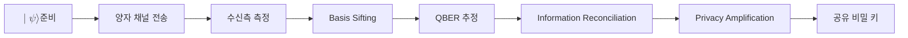

# MOC - Quantum Cryptography

## 개요
양자암호는 보안의 근거를 계산 복잡도가 아니라 양자역학의 물리 법칙에 두는 분야다. 미지의 양자 상태를 측정하면 그 상태가 교란되고(측정 교란), 임의의 미지 상태는 그대로 복제할 수 없다(복제 불가)는 두 성질이 핵심 자원이다. 도청자가 통신 도중 정보를 얻으려 하면 흔적이 남으므로, 정당한 두 주체는 통계적 이상을 관찰해 도청 여부를 검출할 수 있다. 이는 공격자의 연산 능력을 가정하는 고전 암호와 달리, 충분한 양자 컴퓨터가 등장해도 흔들리지 않는 정보이론적 안전성을 지향한다.

이 MOC는 양자암호 도메인의 최상위 진입점이다. 직접 설명을 길게 두지 않고 키 분배의 핵심 개념, 프로토콜 변형, 키 증류 단계, 위협과 보안 근거로 진입하는 링크 허브 역할만 한다. 양자 내성 암호(PQC)는 보안 근거가 계산 난해성에 있는 별개의 도메인이므로 이 지도에서 다루지 않는다.

## 핵심 개념
- [[Quantum Key Distribution]] 양자 채널로 두 주체가 공유 비밀 키를 합의하는 기법
- [[BB84 Protocol]] 양자 키 분배의 출발점이 된 준비-측정형 프로토콜
- [[Conjugate Coding]] 비가환 기저에 정보를 싣는 양자암호의 토대 개념
- [[Qubit]] 키 분배에서 정보를 운반하는 양자정보의 기본 단위

## 프로토콜과 변형
- [[BB84 Protocol]] 최초의 준비-측정형 키 분배 프로토콜
- [[E91 Protocol]] 얽힘과 벨 부등식 위반에 기반한 키 분배형
- [[B92 Protocol]] 두 비직교 상태만 쓰는 간소화 변형
- [[Decoy-State BB84]] 미끼 펄스로 다광자 누설을 방어하는 실용 변형

## 키 증류 단계
- [[Basis Sifting]] 측정 기저가 일치한 비트만 남기는 선별 단계
- [[Quantum Bit Error Rate (QBER)]] 도청과 잡음을 가늠하는 오류율 지표
- [[Information Reconciliation]] 공개 토의로 비트 불일치를 교정하는 단계
- [[Privacy Amplification]] 도청자 부분 정보를 짜내 비밀 키를 정제하는 단계

## 위협과 보안
- [[Intercept-Resend Attack]] 측정 후 재전송으로 도청을 시도하는 기본 공격
- [[Photon Number Splitting Attack]] 다광자 펄스에서 광자를 가로채는 공격
- [[No-Cloning Theorem]] 미지 상태 복제 불가가 부여하는 보안 근거
- [[Heisenberg Uncertainty Principle]] 비가환 관측량 동시 결정 한계가 부여하는 측정 교란

## 흐름

## 관련 MOC
- [[MOC - Foundations of Quantum Information]] 양자암호가 의존하는 측정, 얽힘, 복제 불가 등 기초 개념 지도
- [[MOC - Post-Quantum Cryptography]] 같은 위협(양자컴퓨터)에 계산 난해성으로 대응하는 형제 도메인 지도
