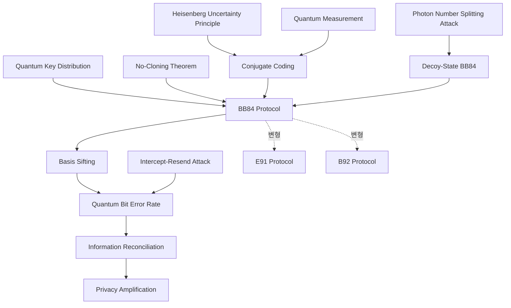

# BB84 QKD 문서화

> 최초의 양자 키 분배 프로토콜인 BB84를 원자적 개념 노트들로 분해해 문서화하는 프로젝트 허브다.

## 개요
BB84는 1984년 Bennett과 Brassard가 제안한 최초의 [[Quantum Key Distribution|양자 키 분배]] 프로토콜이다. 단일 거대 문서로 다루면 인코딩, 키 증류, 도청 모델, 보안 증명이 한 노트에 뭉쳐 재사용이 어렵다. 이 프로젝트는 BB84를 독립적으로 재사용 가능한 개념 단위로 쪼개고, 각 단위를 양방향 링크로 잇는 것을 목표로 한다.

작업 결과물인 개념 노트는 프로젝트 진행 중에는 `Drafts/`에서 초안 상태로 다듬고, 완성되어 evergreen에 가까워지면 `3 - Resources/Quantum-Cryptography/`로 추출(extract)한다. 조사 메모와 출처 발췌는 `Research/`에 fleeting 노트로 둔다.

- 목표: BB84 관련 개념을 원자적 노트 12개로 완성하고 [[MOC - Quantum Cryptography]]에 매단다.
- 범위: 프로토콜 본체, 키 증류 4단계, 도청 모델과 방어, 주요 변형 프로토콜.
- 비범위: QKD 상용 하드웨어 구현 세부, 측정 장비 독립 QKD(MDI-QKD)는 후속 프로젝트로 분리.
- 마감: 미정.

## 산출물 (계획 노트)
각 항목은 단일 개념 노트 하나로 작성한다. 선링크로 작성 지점을 미리 남겨 둔다.

### 핵심 프로토콜
- [ ] [[Quantum Key Distribution]] QKD 일반 개념과 BB84의 위치
- [ ] [[BB84 Protocol]] 편광 4상태 인코딩과 프로토콜 본체
- [ ] [[Conjugate Coding]] 직교 기저와 대각 기저를 번갈아 쓰는 인코딩 원리

### 키 증류 단계
- [ ] [[Basis Sifting]] 공개 채널에서 기저를 대조해 키를 추리는 시프팅
- [ ] [[Quantum Bit Error Rate (QBER)]] 오류율 추정과 도청 탐지 임계값
- [ ] [[Information Reconciliation]] 공개 채널 오류 정정(Cascade 등)
- [ ] [[Privacy Amplification]] 부분 정보를 제거해 비밀 키를 압축

### 도청과 보안
- [ ] [[Intercept-Resend Attack]] 가로채기 후 재전송 공격과 오류 유발
- [ ] [[Photon Number Splitting Attack]] 약한 결맞음 펄스를 노리는 다광자 분할 공격
- [ ] [[Decoy-State BB84]] 디코이 상태로 PNS 공격을 방어(graphify 자료 보유)

### 관련 변형
- [ ] [[E91 Protocol]] 얽힘 기반 QKD
- [ ] [[B92 Protocol]] 2상태로 간소화한 변형

### 기반 의존 (기존 노트, 링크만 사용)
- [[No-Cloning Theorem]] 복제 불가에서 나오는 도청 탐지 가능성
- [[Heisenberg Uncertainty Principle]] 비가환 기저 측정의 교란
- [[Quantum Measurement]] 기저 측정과 상태 붕괴
- [[Qubit]] 광자 편광으로 구현하는 큐비트

## 의존 구조


## 작성 규칙 (일관성 게이트)
이 프로젝트의 모든 산출 노트는 다음을 지켜 일관성을 유지한다.

- 유형: 모두 `type: concept`. 한 노트 한 개념(원자성).
- 도메인: `domain: quantum-cryptography`. 변형 프로토콜도 동일.
- 태그: 핵심 태그로 `qkd/bb84`를 기본 포함하고, 세부는 taxonomy를 따른다(`qkd/e91`, `qrng` 등).
- 상위: `up: "[[MOC - Quantum Cryptography]]"`로 매단다.
- 본문: 한 문장 정의로 시작하고 핵심, 왜 중요한가, 연결 순서로 쓴다. 수식은 LaTeX, 도식은 Mermaid.
- 배치: 완성 노트는 `3 - Resources/Quantum-Cryptography/`로 옮긴다. 프로젝트 폴더에는 초안만 둔다.
- 작성은 `vault-concept-author`에 위임하고, 완료 후 `vault-content-verifier`로 내용 검증, `vault-schema-auditor`로 형식 감사를 거친다.

## 진행 현황
산출물 체크리스트로 추적한다. Resources로 이동한 노트는 아래 Dataview로 자동 집계된다.

```dataview
TABLE status, confidence, updated FROM "3 - Resources/Quantum-Cryptography"
WHERE contains(tags, "qkd/bb84") SORT updated DESC
```

## 연결
- [[MOC - Quantum Cryptography]] 이 프로젝트 결과물이 매달릴 도메인 지도(작성 예정)
- [[MOC - Foundations of Quantum Information]] BB84가 의존하는 기초 개념 지도
- [[No-Cloning Theorem]] BB84 도청 탐지의 수학적 근거
- [[Heisenberg Uncertainty Principle]] 켤레 기저 측정 교란의 원천
