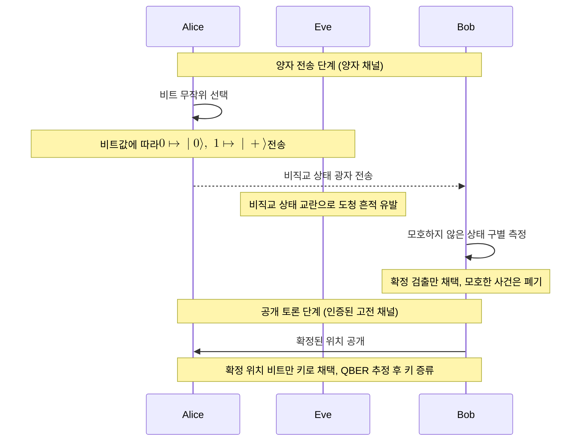

# B92 Protocol

> B92는 Bennett이 1992년 제안한 양자 키 분배 프로토콜로, 비직교인 단 두 양자 상태만으로 [[BB84 Protocol|BB84]]를 간소화한 준비-측정형 변형이다.

## 핵심
B92의 출발점은 [[BB84 Protocol|BB84]]가 네 상태(두 기저 각각의 두 상태)를 쓰는 데 비해, 서로 직교하지 않는 단 두 상태만으로도 안전한 키 분배가 가능하다는 통찰이다. 두 상태가 직교하지 않는다는 점, 즉 [[Conjugate Coding|비직교성]]이 보안의 토대이며, 이는 BB84의 보안 근거와 같은 뿌리를 공유한다.

Alice는 비트 0과 1을 비직교인 두 상태에 대응시킨다. 대표적인 선택은 비트 0에 $\lvert 0 \rangle$, 비트 1에 $\lvert + \rangle$을 싣는 것이며, 여기서

$$ \lvert + \rangle = \tfrac{1}{\sqrt{2}}(\lvert 0 \rangle + \lvert 1 \rangle). $$

두 상태가 직교하지 않으므로 겹침이 0이 아니다.

$$ \langle 0 \vert + \rangle = \tfrac{1}{\sqrt{2}}, \qquad \lvert \langle 0 \vert + \rangle \rvert^2 = \tfrac{1}{2}. $$

이 겹침 때문에 어떤 측정으로도 두 상태를 항상 확실히 구별할 수는 없다. 양자역학은 비직교 상태를 단 한 번의 측정으로 완벽히 식별하는 것을 금지한다. 바로 이 식별 불가능성이 B92 보안의 핵심 자원이다.

### 모호하지 않은 상태 구별
Bob은 받은 상태가 $\lvert 0 \rangle$인지 $\lvert + \rangle$인지를 모호하지 않은 상태 구별(unambiguous state discrimination)로 판정한다. 핵심 발상은 다음과 같다. 각 상태에 대해 그 상태와 직교하는 사영을 측정하면, 그 직교 상태가 검출되는 사건은 입력이 그 상태였을 가능성을 완전히 배제한다.

구체적으로 Bob은 두 상태와 각각 직교하는 방향을 검사한다. $\lvert 1 \rangle$이 검출되면 입력은 $\lvert 0 \rangle$일 수 없으므로 반드시 $\lvert + \rangle$, 즉 비트 1이다. 마찬가지로 $\lvert - \rangle = \tfrac{1}{\sqrt{2}}(\lvert 0 \rangle - \lvert 1 \rangle)$이 검출되면 입력은 $\lvert + \rangle$일 수 없으므로 반드시 $\lvert 0 \rangle$, 즉 비트 0이다. 두 직교 상태 중 어느 것도 검출되지 않은 모호한 사건에서는 비트를 확정할 수 없어 폐기한다.

| Bob의 검출 결과 | 배제되는 상태 | 확정 비트 |
|------|------|------|
| $\lvert 1 \rangle$ 검출 | $\lvert 0 \rangle$ 배제 | 1 ($\lvert + \rangle$) |
| $\lvert - \rangle$ 검출 | $\lvert + \rangle$ 배제 | 0 ($\lvert 0 \rangle$) |
| 둘 다 미검출 | 배제 없음 | 폐기 (모호) |

겹침이 $\tfrac{1}{\sqrt{2}}$일 때 본문의 단순 사영 측정으로 확정 식별되는 사건의 평균 확률은 $\tfrac{1}{4}$ 수준에 머무르고, 최적의 모호하지 않은 상태 구별을 쓰더라도 그 상한은 $1 - \lvert \langle 0 \vert + \rangle \rvert = 1 - \tfrac{1}{\sqrt{2}} \approx 0.293$을 넘지 못하므로, 전송한 광자의 상당 부분이 모호한 결과로 버려진다. Bob은 확정된 위치만 공개 채널로 알리고, Alice와 Bob은 그 위치의 비트만 키로 채택한다.

## 흐름

## 보안 직관
B92의 보안은 BB84와 마찬가지로 비직교 상태가 완벽히 구별될 수 없다는 양자역학의 성질에서 나온다. Eve가 광자를 가로채 어느 상태인지 알아내려 해도, $\lvert 0 \rangle$과 $\lvert + \rangle$은 겹침이 0이 아니므로 단 한 번의 측정으로 확실히 식별할 수 없다. Eve가 추측한 상태를 다시 만들어 Bob에게 보내면 원래 상태와 어긋나 Bob의 시프트 키에 오류가 섞이고, 이 교란이 통계적 흔적으로 남아 도청이 드러난다. Alice와 Bob은 BB84처럼 표본 비트를 공개해 오류율을 추정하고 임계값과 비교한다.

다만 두 상태만 쓰는 구조는 대가를 치른다. 모호한 결과를 대량으로 폐기하므로 키 생성 효율이 BB84보다 낮고, 비직교 두 상태에 기댄 판정은 채널 잡음과 손실에 더 민감해 잡음 내성도 BB84보다 약하다. 특히 손실 채널에서는 모호한 사건과 손실 사건을 구분하기 어려워 구현이 까다롭다.

## 왜 중요한가
B92는 단 두 비직교 상태만으로도 양자 키 분배가 성립함을 보임으로써, QKD에 반드시 네 상태나 두 기저가 필요한 것은 아님을 드러냈다. 보안에 본질적으로 필요한 것은 기저의 가짓수가 아니라 [[Conjugate Coding|비직교성]] 그 자체라는 점을 명확히 했다. 이로써 B92는 BB84를 단순화한 대표 변형으로 자리 잡았고, 프로토콜 설계의 자유도를 넓혀 이후 다양한 준비-측정형 변형이 탐색되는 길을 열었다.

## 연결
- [[BB84 Protocol]] B92가 간소화 대상으로 삼은 원형 프로토콜, 네 상태 대 두 상태의 대비
- [[Quantum Key Distribution]] B92가 속하는 상위 개념이자 분야
- [[Conjugate Coding]] 두 상태의 비직교성이라는 B92 보안의 토대 원리
