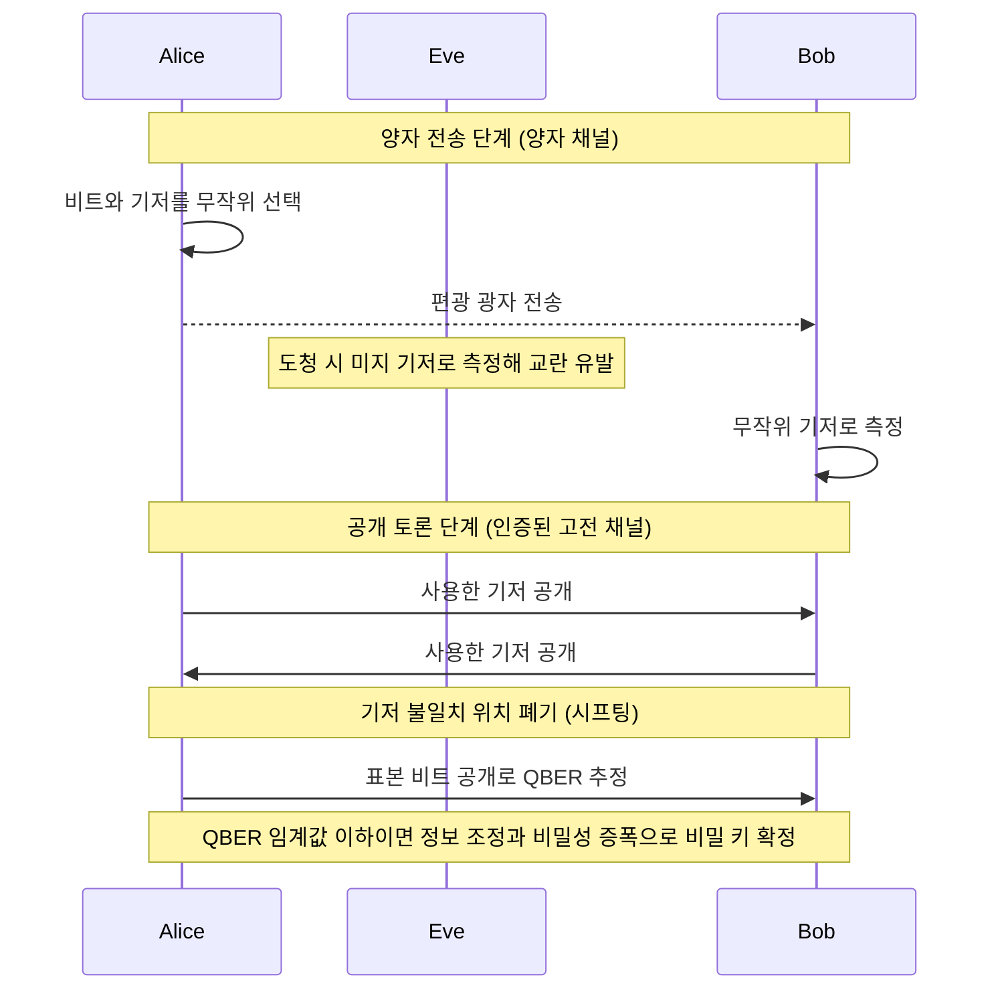

# BB84 Protocol

> 1984년 Bennett과 Brassard가 제안한 최초의 [[Quantum Key Distribution|양자 키 분배(QKD)]] 프로토콜로, 비가환 두 기저에 정보를 실어 도청 시 필연적 교란을 만들어 무조건적(정보이론적) 보안을 제공한다.

## 핵심
BB84의 목표는 공개망을 공유하는 두 주체 Alice와 Bob이 도청자 Eve의 존재 아래에서도 안전한 공유 비밀 키를 합의하는 것이다. 핵심 착상은 비트를 서로 비가환인 두 켤레 기저에 무작위로 실어 보내는 데 있다. 측정 기저를 모르는 채로 광자를 가로채면 Eve는 [[Heisenberg Uncertainty Principle|불확정성 원리]]에 따라 상태를 교란하고, [[No-Cloning Theorem|복제 불가 정리]]에 따라 원본을 그대로 복사해 두지도 못한다. 그 교란이 통계적 흔적으로 남아 도청을 탐지 가능하게 만든다.

인코딩에는 두 켤레 기저를 쓴다. 직교(rectilinear) 기저 $\{\lvert 0\rangle, \lvert 1\rangle\}$과 대각(diagonal) 기저 $\{\lvert +\rangle, \lvert -\rangle\}$이며, 여기서

$$ \lvert \pm \rangle = \tfrac{1}{\sqrt{2}}(\lvert 0 \rangle \pm \lvert 1 \rangle). $$

각 기저 안에서 두 상태가 비트 0과 1에 대응한다. 두 기저는 최대로 비가환이어서, 한 기저의 상태를 다른 기저로 측정하면 결과가 완전히 무작위가 된다.

$$ \lvert \langle 0 \vert + \rangle \rvert^2 = \lvert \langle 0 \vert - \rangle \rvert^2 = \tfrac{1}{2}. $$

기저를 모르고 측정하면 절반의 확률로만 맞고 그 측정이 상태를 붕괴시킨다는 이 사실이 BB84 보안의 출발점이다. 이렇게 비가환 기저를 번갈아 쓰는 인코딩 원리 자체는 [[Conjugate Coding]]으로 분리해 다룬다.

### 4상태 인코딩

| 기저 | 비트 | 상태 |
|------|------|------|
| 직교(rectilinear) | 0 | $\lvert 0 \rangle$ |
| 직교(rectilinear) | 1 | $\lvert 1 \rangle$ |
| 대각(diagonal) | 0 | $\lvert + \rangle$ |
| 대각(diagonal) | 1 | $\lvert - \rangle$ |

각 상태는 광자의 편광으로 구현하며, 직교 기저는 수평과 수직 편광, 대각 기저는 두 사선 편광에 대응한다. 정보를 싣는 물리적 단위는 광자 편광으로 표현한 [[Qubit|큐비트]]다.

### 프로토콜 단계
1. 양자 전송. Alice가 비트와 기저를 각각 독립적으로 무작위로 골라 그에 해당하는 편광 광자를 양자 채널로 보낸다.
2. 측정. Bob이 각 광자를 자신이 무작위로 고른 기저로 측정한다. 기저가 Alice와 같으면 결과가 결정적으로 일치하고, 다르면 무작위가 된다. 측정과 상태 붕괴의 일반 원리는 [[Quantum Measurement]]를 따른다.
3. 기저 시프팅. 전송이 끝난 뒤 공개 채널에서 사용한 기저만 공개해 대조하고, 기저가 일치한 위치의 비트만 남긴다. 무작위 선택이므로 약 절반이 생존하며, 이 단계는 [[Basis Sifting]]에서 자세히 다룬다.
4. 오류율 추정. 남은 시프트 키 일부를 무작위로 공개해 비교하고 불일치 비율로 [[Quantum Bit Error Rate (QBER)|QBER]]을 추정한다. 이 비교에 쓴 비트는 노출되었으므로 버린다.
5. 키 증류. QBER이 임계값 아래면 [[Information Reconciliation|정보 조정]]으로 잔여 오류를 공개 정정하고, [[Privacy Amplification|비밀성 증폭]]으로 Eve가 얻었을 부분 정보를 압축해 제거함으로써 최종 비밀 키를 도출한다.

## 흐름

## 보안 직관
BB84의 보안은 계산 복잡도 가정이 아니라 양자역학 법칙에 뿌리를 둔다. Eve가 광자를 가로채 측정하려면 기저를 골라야 하는데, Alice의 기저를 모르므로 평균 절반의 광자를 틀린 기저로 측정하고 그 측정이 상태를 교란한다. 가로챈 결과를 다시 같은 모양으로 만들어 Bob에게 보내는 가장 단순한 가로채기-재전송 전략은 시프트 키에 약 25%의 QBER을 유발한다. 이런 공격의 상세는 [[Intercept-Resend Attack]]에서 다룬다.

Alice와 Bob은 추정한 QBER을 임계값과 비교해 안전성을 판단한다. 일방향 키 증류를 가정할 때 임계값은 대략 11% 근처이며, QBER이 이 아래면 정보 조정과 비밀성 증폭을 거쳐 Eve의 정보를 무시할 수 있는 수준으로 줄여 비밀 키를 추출할 수 있다. 위라면 도청이 의심되므로 키를 버리고 중단한다. 이 보안은 Eve의 계산 능력이 아무리 커도 깨지지 않는다는 의미에서 무조건적, 즉 정보이론적이다. 계산 복잡도 기반 암호가 특정 문제의 풀이 난이도에 기대는 것과 대비된다.

실무에서는 결정적 단일 광자원이 어려워 약한 결맞음 펄스로 BB84를 구현하는 경우가 많고, 이때 한 펄스에 광자가 둘 이상 실리는 다광자 사건이 다광자 분할 취약점을 만든다. 이 취약점은 [[Decoy-State BB84]]로 완화한다.

## 왜 중요한가
BB84는 보안의 근거를 계산 가정이 아니라 물리 법칙에 둔 최초의 프로토콜이다. 측정이 상태를 교란하고 미지의 양자 상태를 복제할 수 없다는 성질을 키 분배에 직접 활용함으로써, 도청을 사후에 통계로 탐지 가능하게 만들었다. 이 발상은 이후 [[E91 Protocol|얽힘 기반 QKD]]를 비롯한 양자암호 전체의 출발점이 되었고, QKD라는 분야 자체를 열었다.

## 연결
- [[Quantum Key Distribution]] BB84가 속하는 상위 개념이자 최초 사례로서의 위치
- [[Conjugate Coding]] 직교 기저와 대각 기저를 번갈아 쓰는 4상태 인코딩 원리
- [[No-Cloning Theorem]] 가로챈 상태를 복제해 두지 못하게 하는 도청 탐지의 근거
- [[Heisenberg Uncertainty Principle]] 미지 기저 측정이 상태를 교란하는 원천
- [[Quantum Measurement]] 기저 측정과 상태 붕괴의 일반 원리
- [[Qubit]] 광자 편광으로 구현하는 정보 단위
- [[Basis Sifting]] 공개 기저 대조로 약 절반의 키를 추리는 시프팅 단계
- [[Quantum Bit Error Rate (QBER)]] 오류율 추정과 도청 탐지 임계값
- [[Information Reconciliation]] 공개 채널에서 잔여 오류를 정정하는 단계
- [[Privacy Amplification]] Eve의 부분 정보를 제거해 비밀 키를 압축하는 단계
- [[Intercept-Resend Attack]] 약 25% QBER을 유발하는 대표적 도청 전략
- [[Decoy-State BB84]] 약한 결맞음 펄스의 다광자 취약점을 완화하는 변형
