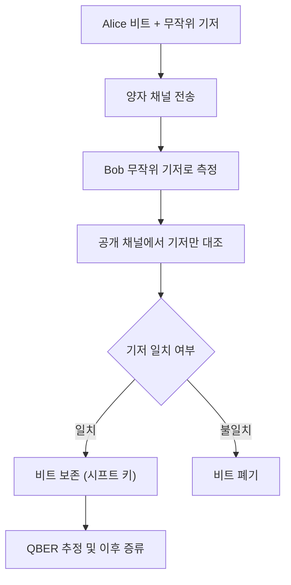

# Basis Sifting

> 기저 시프팅은 양자 전송이 끝난 뒤 Alice와 Bob이 인증된 공개 채널에서 각 펄스에 사용한 측정 기저만 대조하고, 기저가 일치한 위치의 비트만 남겨 시프트 키를 만드는 키 증류의 첫 단계다.

## 핵심
기저 시프팅의 출발점은 양자 채널 전송이 모두 끝난 시점이다. Alice는 각 펄스마다 무작위로 직교 기저($Z$, 수평/수직 편광)나 대각 기저($X$, 사선 편광) 중 하나를 골라 비트를 인코딩하고, Bob 또한 각 펄스를 자신이 무작위로 고른 기저로 측정한다. 이 두 선택은 서로 독립적인 무작위 과정이므로, 한 펄스에서 두 사람의 기저가 우연히 같을 확률은 절반이다.

전송이 끝나면 두 사람은 인증된 공개 채널에서 각 위치에 어떤 기저를 썼는지만 공개한다. 핵심은 비트값은 절대 공개하지 않고 기저(직교 또는 대각)만 공개한다는 점이다. 기저가 일치한 위치의 비트는 남기고, 불일치한 위치의 비트는 양쪽 모두 버린다. [[Conjugate Coding|켤레 부호화]]의 성질상 기저가 어긋난 측정은 결과가 완전히 무작위가 되어 비트가 무의미해지기 때문이다.

남긴 비트들의 모음을 시프트 키라고 부른다. Alice와 Bob의 무작위 독립 선택 때문에 [[BB84 Protocol|BB84]]에서는 평균적으로 절반의 위치만 생존하며, 시프트 비율은 다음과 같이 약 $1/2$이다.

$$ R_{\text{sift}} = \Pr[\text{기저 일치}] = \frac{1}{2} $$

길이 $N$의 원시 비트열에서 시프트 키의 기대 길이는 $\mathbb{E}[L_{\text{sift}}] = N/2$가 된다. 이렇게 얻은 시프트 키는 아직 최종 키가 아니다. 잡음과 도청이 일으킨 오류가 남아 있으므로, 이후 [[Quantum Bit Error Rate (QBER)|QBER]] 추정으로 오류율을 가늠하고, [[Information Reconciliation]]으로 비트 불일치를 교정한 다음, [[Privacy Amplification]]으로 도청자가 가진 부분 정보를 짜내 비밀 키를 정제하는 단계로 이어진다.

## 흐름

## 왜 중요한가
기저 시프팅이 없으면 원시 비트열의 절반은 측정 기저 불일치로 무작위가 된 무의미한 비트로 오염되어 있다. 이 잡음을 먼저 걷어내지 않으면 오류율 추정도 키 교정도 의미를 잃는다. 기저 시프팅은 두 사람의 측정 결과가 물리적으로 상관될 수 있는 위치만 추려내어, 이후 모든 키 증류 단계가 딛고 설 깨끗한 출발점을 만든다. 또한 비트값이 아니라 기저만 공개하므로 도청자에게 키 정보를 흘리지 않으면서도 선별을 수행한다는 점에서, 정보이론적 안전성을 깨지 않고 진행할 수 있는 첫 후처리 단계가 된다.

## 연결
- [[BB84 Protocol]] 기저 시프팅이 후처리 첫 단계로 속하는 전체 준비-측정형 키 분배 프로토콜
- [[Conjugate Coding]] 기저가 어긋난 측정이 무작위 결과를 주는 이유를 제공하는 토대 개념
- [[Quantum Bit Error Rate (QBER)]] 시프트 키를 입력으로 받아 도청과 잡음을 가늠하는 다음 단계
- [[Information Reconciliation]] 시프트 키의 비트 불일치를 공개 토의로 교정하는 후속 증류 단계
- [[Privacy Amplification]] 교정된 키에서 도청자 부분 정보를 제거해 최종 비밀 키를 정제하는 단계
