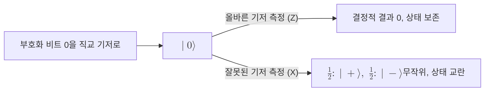

# Conjugate Coding

> 켤레 부호화는 정보를 상호 비편향(mutually unbiased)인 두 기저 중 하나에 실어, 올바른 기저를 모르는 측정은 결과가 무작위가 되고 상태를 교란하도록 만드는 인코딩 기법이다. Stephen Wiesner가 제안했다.

## 핵심
켤레 부호화는 하나의 [[Qubit]]에 한 비트를 실을 때, 비트값뿐 아니라 어떤 기저를 쓸지까지 선택의 자유로 삼는다. 표준 직교 기저 $\{\lvert 0\rangle,\lvert 1\rangle\}$와 대각 기저 $\{\lvert +\rangle,\lvert -\rangle\}$가 가장 흔한 한 쌍이다. 두 기저는 다음 관계로 연결된다.

$$
\lvert +\rangle = \tfrac{1}{\sqrt{2}}\bigl(\lvert 0\rangle + \lvert 1\rangle\bigr),\qquad
\lvert -\rangle = \tfrac{1}{\sqrt{2}}\bigl(\lvert 0\rangle - \lvert 1\rangle\bigr)
$$

이 두 기저는 서로 최대로 비편향(maximally unbiased)이다. 한 기저의 어떤 상태를 다른 기저로 사영해도 그 결과 분포가 완전히 균일하기 때문이다. 구체적으로 모든 교차 내적의 절댓값 제곱이 동일하다.

$$
\bigl\lvert\langle 0\vert +\rangle\bigr\rvert^2
= \bigl\lvert\langle 0\vert -\rangle\bigr\rvert^2
= \bigl\lvert\langle 1\vert +\rangle\bigr\rvert^2
= \bigl\lvert\langle 1\vert -\rangle\bigr\rvert^2
= \tfrac{1}{2}
$$

여기서 핵심 결과가 나온다. 보내는 쪽이 직교 기저로 부호화한 상태 $\lvert 0\rangle$을 받는 쪽이 대각 기저로 측정하면, 측정 규칙상 $\lvert +\rangle$과 $\lvert -\rangle$이 각각 확률 $\tfrac{1}{2}$로 나온다. 결과는 실린 비트와 아무 상관이 없는 동전 던지기가 되고, 그 측정으로 상태는 측정한 기저의 고유상태로 붕괴해 원래 정보를 되돌릴 수 없게 교란된다. 잘못된 기저를 고른 측정은 정보를 얻지 못할 뿐 아니라 흔적을 남긴다.

이 성질은 [[Heisenberg Uncertainty Principle|불확정성 원리]]와 [[Quantum Measurement|측정 붕괴]]의 직접적인 귀결이다. 두 기저에 대응하는 관측가능량은 교환하지 않으므로 한 비트에 두 기저의 값을 동시에 확정해 담을 수 없고, 어느 한쪽을 읽는 측정은 다른 쪽 정보를 본질적으로 흩뜨린다. 여기에 미지의 상태를 그대로 복사할 수 없다는 [[No-Cloning Theorem]]이 더해지면, 도청자는 상태를 베껴 두고 정답 기저를 나중에 알아내는 우회로마저 막힌다. 이 세 가지가 함께 켤레 부호화를 도청 탐지의 물리적 토대로 만든다.

## 구조

## 상호 비편향 기저
상호 비편향 기저(mutually unbiased bases, MUB)는 한 기저의 임의 상태를 다른 기저로 측정했을 때 모든 결과가 같은 확률로 나오는 기저들의 모음이다. $d$차원 공간에서 두 직교정규 기저 $\{\lvert a_i\rangle\}$와 $\{\lvert b_j\rangle\}$가 상호 비편향이라는 것은 모든 $i, j$에 대해 $\bigl\lvert\langle a_i\vert b_j\rangle\bigr\rvert^2 = \tfrac{1}{d}$가 성립함을 뜻한다. 큐비트는 $d=2$이므로 직교 기저와 대각 기저 사이의 값이 정확히 $\tfrac{1}{2}$이 되어 최대 비편향 조건을 만족한다. 큐비트에는 블로흐 구의 직교하는 세 축에 대응하는 $X$, $Y$, $Z$ 기저까지 합쳐 최대 세 개의 상호 비편향 기저가 존재한다. 켤레 부호화가 도청을 탐지하는 능력은 결국 이 비편향성의 크기에서 나온다. 기저가 비편향일수록 정답 기저를 모르는 측정이 얻는 정보가 줄고 남기는 교란이 커진다.

## 왜 중요한가
켤레 부호화는 양자키분배의 인코딩 계층을 떠받치는 원리다. [[BB84 Protocol]]은 두 개의 상호 비편향 기저를 무작위로 번갈아 쓰는 켤레 부호화를 그대로 채택해, 송수신 기저가 어긋난 비트를 버리는 기저 비교 단계와 도청 탐지를 가능하게 한다. [[B92 Protocol]]은 같은 원리를 비직교 두 상태만으로 더 단순하게 변주한다. 어느 쪽이든 도청자가 신호를 가로채 측정하면 정답 기저를 모르는 한 상태를 교란할 수밖에 없고, 그 교란이 양자비트오류율의 상승으로 드러나 도청이 흔적을 남기게 된다. 정보 이론적 안전성을 물리 법칙에서 끌어내는 양자암호의 출발점이 바로 이 인코딩이다.

## 연결
- [[BB84 Protocol]] 두 상호 비편향 기저를 무작위로 쓰는 켤레 부호화를 인코딩으로 채택한 프로토콜
- [[B92 Protocol]] 같은 원리를 비직교 두 상태로 단순화한 변형
- [[Heisenberg Uncertainty Principle]] 비편향 기저를 동시에 확정할 수 없게 만드는 근본 원리
- [[Quantum Measurement]] 잘못된 기저 측정이 결과를 무작위화하고 상태를 붕괴시키는 메커니즘
- [[No-Cloning Theorem]] 상태 복사로 정답 기저를 우회하는 공격을 봉쇄하는 보완 원리
- [[Qubit]] 켤레 부호화가 한 비트와 기저 선택을 함께 싣는 물리적 단위
