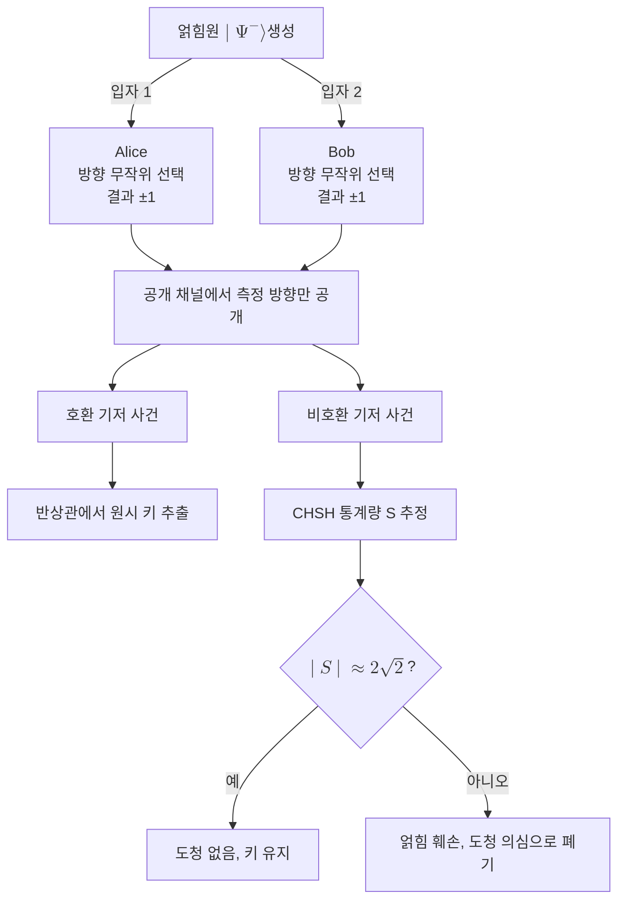

# E91 Protocol

> E91은 Ekert가 1991년 제안한 얽힘 기반 양자 키 분배 프로토콜로, 최대 얽힘 쌍을 나눠 가진 두 주체가 측정 상관에서 키를 얻고 [[Bell Inequality (CHSH)|벨 부등식]] 검사로 도청을 검출한다.

## 핵심
E91의 출발점은 상태를 미리 준비해 보내는 대신 얽힘을 자원으로 분배하는 데 있다. 광원이 [[Bell States|벨 상태]] 같은 최대 얽힘 쌍을 만들어 한 입자는 Alice에게, 다른 입자는 Bob에게 보낸다. 표준 형태에서 분배되는 상태는 스핀 단일항이다.

$$ \lvert \Psi^{-} \rangle = \frac{1}{\sqrt{2}}\big( \lvert 01 \rangle - \lvert 10 \rangle \big) $$

Alice와 Bob은 각자 광자가 도착할 때마다 미리 정한 측정 방향(기저) 집합에서 하나를 무작위로 고른다. 측정 결과는 각각 $\pm 1$ 두 값을 갖는다. 전송이 끝난 뒤 두 사람은 공개 채널에서 자신이 어떤 방향으로 측정했는지만 공개하고, 그 조합에 따라 측정값을 두 용도로 나눈다.

### 호환 기저는 키, 비호환 기저는 벨 검사
같은(호환) 방향으로 측정한 사건에서 최대 얽힘 쌍은 완전한 반상관을 준다. 단일항 상태에서 두 사람이 같은 방향으로 측정하면 결과가 항상 반대로 나오므로, 한쪽이 비트를 반전시키는 약속만 두면 두 사람은 동일한 무작위 비트를 공유한다. 이 사건들이 모여 원시 키(raw key)가 된다.

반면 서로 다른(비호환) 방향 조합으로 측정한 사건은 키에 쓰지 않고 따로 모아 [[Bell Inequality (CHSH)|CHSH]] 조합량 $S$를 추정하는 데 쓴다. Alice의 두 방향을 $A, A'$, Bob의 두 방향을 $B, B'$라 할 때 통계량은 다음과 같다.

$$ S = E(A,B) - E(A,B') + E(A',B) + E(A',B') $$

여기서 $E$는 두 결과의 곱에 대한 기댓값, 곧 상관계수다. 측정 방향을 적절히 고르면 방해받지 않은 최대 얽힘 쌍은 Tsirelson 한계 $\lvert S \rvert = 2\sqrt{2}$에 도달한다. 측정값이 고전적 상관, 곧 국소 숨은변수만으로 설명된다면 $S$는 $\lvert S \rvert \le 2$를 넘지 못한다.

### 보안이 비국소성에 묶인다
E91의 핵심 통찰은 보안 근거를 측정 상관의 비국소성 자체에 두는 데 있다. 도청자 Eve가 키 정보를 얻으려고 채널에 개입하면 Alice와 Bob이 공유한 [[Quantum Entanglement|얽힘]]이 깨진다. 얽힘이 약해질수록 비호환 기저 표본에서 추정한 $S$가 $2\sqrt{2}$에서 멀어지고, 충분히 개입하면 고전 한계 $2$ 아래로 떨어진다. 따라서 두 사람은 추정한 $S$가 양자 한계 근처에 있는지를 확인하는 것만으로 키의 안전성을 보증할 수 있다. Eve가 얻은 정보의 양이 벨 위반의 감소량과 직접 연결되기 때문이다. 얽힘의 일부일처성에 따라 Eve가 상관을 훔치는 만큼 정당한 두 사람의 상관이 줄어든다는 것이 이 보증의 물리적 뿌리다.

이 구조는 상태를 미리 준비해 보내는 [[BB84 Protocol|BB84]]의 준비-측정형과 대비되는 얽힘 기반형이다. BB84가 비가환 기저에 비트를 실어 측정 교란으로 도청을 탐지한다면, E91은 얽힘 쌍을 분배해 벨 위반의 보존으로 도청을 탐지한다. 두 관점은 여러 경우에 동등함이 알려져 있다. 광원이 단일항을 보내고 Alice가 한쪽을 측정하는 행위는 Bob에게 가는 입자를 특정 기저의 상태로 준비해 보내는 것과 통계적으로 같은 효과를 내기 때문이다. 이런 의미에서 E91은 [[BB84 Protocol|BB84]]의 얽힘 기반 재구성으로도 읽힌다.

## 흐름

## 왜 중요한가
E91은 키 분배의 보안을 도청 모형 하나하나가 아니라 벨 부등식 위반이라는 검증 가능한 물리 사실에 연결했다는 점에서 전환점이 되었다. 측정값이 양자 한계에 가까운 비국소 상관을 보이는 한, 그 상관은 미리 짜놓은 고전적 합의로 만들어질 수 없으므로 제3자가 복제해 가질 수도 없다. 이 발상은 측정 장치의 내부 구조를 신뢰하지 않고 오직 관측한 $S$ 값만으로 안전성을 끌어내는 [[Device-Independent Cryptography|장치 독립 QKD]]로 가는 길을 열었다. 즉 E91은 얽힘 기반 QKD의 원형이자, 보안 가정을 장치에서 떼어내 물리 법칙으로 옮기려는 흐름의 출발점이다.

## 연결
- [[Quantum Key Distribution]] E91이 속하는 상위 개념이자 얽힘 기반형의 대표 사례
- [[BB84 Protocol]] 준비-측정형과 대비되는 얽힘 기반형이며 여러 경우 동등함이 알려진 짝
- [[Quantum Entanglement]] 분배되는 자원이자 도청 시 훼손되어 탐지를 가능하게 하는 비국소 상관의 원천
- [[Bell Inequality (CHSH)]] 비호환 기저 표본으로 추정한 $S$로 도청을 검출하는 보안 검사 도구
- [[Bell States]] 광원이 분배하는 최대 얽힘 쌍으로 호환 기저에서 키 비트를 주는 상태
- [[Device-Independent Cryptography]] 관측한 $S$만으로 장치를 불신해도 보안을 보증하는 E91의 확장 방향
