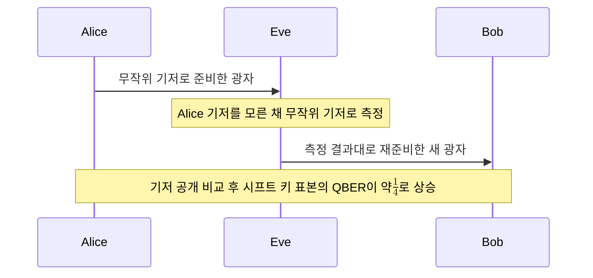

# Intercept-Resend Attack

> 가로채기-재전송 공격은 도청자 Eve가 전송 중인 각 광자를 자신이 고른 기저로 측정한 뒤 그 결과대로 새 광자를 Bob에게 보내는 가장 단순한 개별 도청 전략이다.

## 핵심
이 공격에서 Eve는 Alice가 보낸 광자를 채널 중간에서 가로채 즉시 측정하고, 측정으로 얻은 비트값을 같은 기저의 상태로 다시 준비하여 Bob에게 전달한다. 자신이 본 결과를 그대로 흉내 내 보내므로 Bob은 광자가 도착한 사실만으로는 도청 여부를 알 수 없다.

문제는 Eve가 Alice의 기저 선택을 모른다는 점이다. [[BB84 Protocol|BB84]]에서 Alice는 직교 기저 $Z = \{\lvert 0 \rangle, \lvert 1 \rangle\}$와 대각 기저 $X = \{\lvert + \rangle, \lvert - \rangle\}$ 중 하나를 매번 무작위로 고른다. 이 두 기저는 [[Conjugate Coding|켤레 기저]] 관계라서 서로의 상태를 동시에 확정값으로 구별할 수 없다. Eve가 무작위로 기저를 고르면 평균 절반의 광자를 틀린 기저로 측정하게 되고, 그때마다 광자 상태를 비가역적으로 교란한다. 예를 들어 Alice가 $\lvert 0 \rangle$을 보냈는데 Eve가 $X$ 기저로 측정하면 결과는 $\lvert + \rangle$ 또는 $\lvert - \rangle$로 무작위 붕괴하고, Eve가 재전송한 상태를 Bob이 원래의 $Z$ 기저로 측정하면 $\tfrac{1}{2}$ 확률로 $\lvert 1 \rangle$이 나와 오류가 발생한다.

오류율을 정량화하면 다음과 같다. Eve가 틀린 기저로 측정할 확률은 $\tfrac{1}{2}$이고, 그렇게 교란된 광자에서 Bob의 비트가 Alice와 어긋날 확률 또한 $\tfrac{1}{2}$이다. Alice와 Bob의 기저가 일치해 [[Basis Sifting|시프트]] 후 살아남은 비트만 보더라도, 도입되는 오류율은

$$
\mathrm{QBER}_{\text{IR}} = P(\text{틀린 기저}) \cdot P(\text{비트 오류} \mid \text{틀린 기저}) = \frac{1}{2}\cdot\frac{1}{2} = \frac{1}{4}
$$

이다. 즉 시프트 키에 약 $25\%$의 [[Quantum Bit Error Rate (QBER)|QBER]]이 나타난다. 이 값은 Eve가 모든 광자를 가로채는 완전 도청 기준이며, Eve가 비율 $f$만 가로채면 기여 오류율은 $f \cdot \tfrac{1}{4}$로 비례해 줄어든다.

## 흐름

## 왜 중요한가
가로채기-재전송 공격은 BB84 보안 직관을 정량적으로 출발시키는 가장 기본적인 사례다. 도청이 흔적을 남길 수밖에 없다는 양자 키 분배의 핵심 주장을 구체적 숫자로 보여 준다. Eve가 가로챈 광자를 완벽히 복제해 하나는 보관하고 하나는 통과시키는 전략이 있었다면 흔적 없이 도청할 수 있겠지만, [[No-Cloning Theorem]]이 미지의 양자 상태의 완전 복제를 금지하므로 그런 우회로는 막혀 있다. 결국 Eve는 측정에 의존할 수밖에 없고, [[Conjugate Coding|켤레 기저]]로 부호화된 상태를 틀린 기저로 측정하는 순간 교란이 발생한다.

따라서 Alice와 Bob은 공개 채널에서 시프트 키의 일부 표본을 비교해 [[Quantum Bit Error Rate (QBER)|QBER]]을 추정하고, 그 값이 임계값을 넘으면 도청을 의심해 세션을 폐기한다. 실제 BB84 보안 증명은 이보다 일반적인 집단 공격과 결맞음 공격까지 다루지만, 가로채기-재전송이 만드는 $25\%$라는 수치는 QBER 임계값 설정과 도청 탐지의 직관적 기준선으로 쓰인다.

## 연결
- [[BB84 Protocol]] 이 공격이 표적으로 삼는 프로토콜이자 QBER 탐지가 작동하는 무대
- [[Quantum Bit Error Rate (QBER)]] 공격이 시프트 키에 유발하는 약 $25\%$ 오류율로 도청을 정량 탐지하는 지표
- [[No-Cloning Theorem]] 흔적 없는 완벽 복제 도청을 금지해 Eve를 교란성 측정으로 몰아넣는 근거
- [[Conjugate Coding]] 켤레 기저 부호화 때문에 틀린 기저 측정이 상태를 교란한다는 메커니즘의 토대
