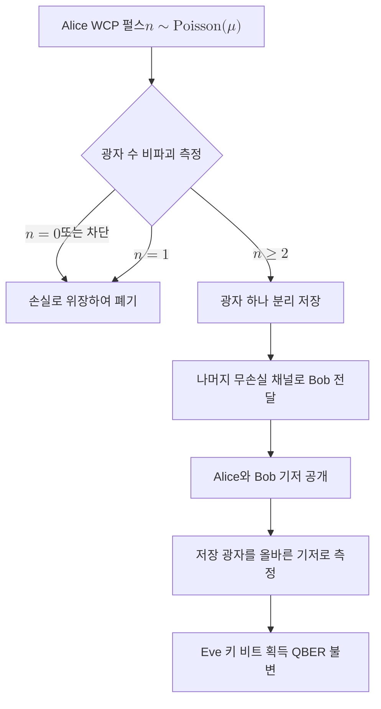

# Photon Number Splitting Attack

> 광자 수 분할(PNS) 공격은 약한 결맞음 펄스로 구현한 [[BB84 Protocol|BB84]]에서 한 펄스에 광자가 둘 이상 실리는 다광자 사건을 노려, Eve가 광자 하나를 빼돌려 [[Quantum Bit Error Rate (QBER)|QBER]] 증가 없이 키 정보를 얻는 공격이다.

## 핵심
PNS 공격의 출발점은 광원의 비이상성이다. BB84의 보안 증명은 펄스마다 정확히 한 개의 광자가 한 비트를 운반하는 결정적 단일 광자원을 가정한다. 그러나 결정적 단일 광자원은 실무에서 구현이 어렵고, 대부분의 구현은 감쇠한 레이저 펄스, 곧 약한 결맞음 펄스(Weak Coherent Pulse, WCP)를 광자 운반체로 쓴다. 결맞음 상태의 광자 수는 결정적이지 않고 푸아송 분포를 따르므로, 평균 광자 수가 1보다 한참 작아도 일부 펄스는 광자를 둘 이상 담는다.

평균 광자 수를 $\mu$라 할 때 한 펄스가 정확히 $n$개의 광자를 담을 확률은 다음과 같다.

$$ P(n \mid \mu) = e^{-\mu}\,\frac{\mu^{n}}{n!}. $$

펄스에 광자가 하나라도 있다는 조건에서 다광자일 확률은

$$ P(n \ge 2 \mid n \ge 1) = \frac{1 - e^{-\mu}(1+\mu)}{1 - e^{-\mu}} \approx \frac{\mu}{2} \quad (\mu \ll 1) $$

로, $\mu$에 거의 비례한다. 다광자 펄스는 같은 비트와 같은 기저를 담은 동일 편광의 광자를 여럿 운반하므로, 이를 가르는 것은 [[No-Cloning Theorem|복제 불가 정리]]를 위반하지 않는다. Eve가 원본 미지 상태를 복제하는 것이 아니라, 이미 존재하는 동일한 광자 중 하나를 물리적으로 분리해 가져가기 때문이다.

공격 자체는 광자 수에 비파괴적인 측정과 빔 분할로 이루어진다. Eve는 각 펄스의 광자 수를 비파괴적으로 세고, 다광자 펄스에서 광자 하나를 떼어 자신의 양자 메모리에 저장한 뒤 나머지를 손실이 거의 없는 이상적 채널로 Bob에게 전달한다. 단일 광자 펄스는 통째로 차단해 정상 채널 손실인 것처럼 위장한다. 사후에 Alice와 Bob이 측정 기저를 공개하면, Eve는 저장해 둔 광자를 올바른 기저로 측정해 비트 값을 얻는다. Bob이 받는 광자는 Alice가 보낸 그대로이므로 도청은 오류 흔적을 남기지 않고, 따라서 [[Quantum Bit Error Rate (QBER)|QBER]]이 거의 증가하지 않는다. 도청 탐지를 QBER에만 의존하는 한 이 공격은 보이지 않는다.

## 흐름

## 왜 중요한가
PNS 공격은 이상적 BB84 보안 증명과 실제 광학 구현 사이의 간극을 드러낸 대표 사례다. 증명이 가정한 단일 광자원과 실제로 쓰이는 약한 결맞음 펄스의 차이가 곧장 측면 누설로 이어졌다. 그 효과는 단순한 비트 누설을 넘어 시스템 성능 자체를 갉아먹는다. Eve가 다광자 펄스를 전부 가로채고 단일 광자 펄스를 손실로 위장해 차단하면, 안전하게 키로 증류할 수 있는 비밀 키율과 안전 전송 거리가 심각하게 줄어든다. 채널 손실이 커질수록 정당한 단일 광자 수신은 급감하지만 다광자 누설은 그대로 남기 때문에, 일정 거리 이상에서는 비밀 키율이 0으로 무너진다.

이 위협은 곧 대응의 동기가 되었다. 평균 광자 수가 서로 다른 미끼 펄스를 섞어 보내 다광자 사건의 통계적 흔적을 직접 관측하는 [[Decoy-State BB84]]가 그 해법으로, PNS 공격을 가정한 보수적 키율 산정을 실제 채널 손실에 맞춘 현실적 산정으로 끌어올렸다. PNS 공격을 이해하는 것은 [[Quantum Key Distribution|QKD]]의 보안이 프로토콜 논리뿐 아니라 광원과 검출기 같은 물리 구현의 비이상성까지 함께 고려해야 성립함을 보여 준다.

## 연결
- [[BB84 Protocol]] PNS 공격이 노리는 표적 프로토콜이며, 약한 결맞음 펄스로 구현될 때 다광자 누설이 생긴다
- [[Decoy-State BB84]] 미끼 펄스로 다광자 사건을 통계적으로 노출시켜 PNS 공격을 무력화하는 직접적 대응책
- [[Quantum Key Distribution|QKD]] PNS 공격이 비밀 키율과 안전 전송 거리를 제한하는 상위 키 분배 틀
- [[Quantum Bit Error Rate (QBER)|QBER]] PNS 공격이 이 지표를 거의 건드리지 않아 QBER 단독 탐지로는 잡히지 않음
- [[No-Cloning Theorem|복제 불가 정리]] 동일 광자를 분리하는 PNS는 미지 상태 복제가 아니어서 이 정리를 위반하지 않음
