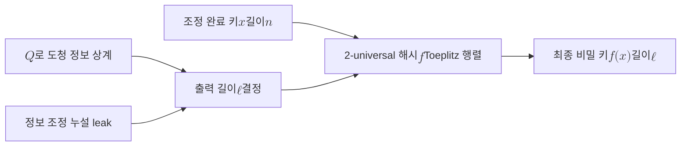

# Privacy Amplification

> 비밀성 증폭은 조정을 마친 키에서 Eve가 측정과 공개 누설로 얻었을 부분 정보를 제거하기 위해, 보편 해시 함수로 더 짧지만 정보이론적으로 안전한 최종 비밀 키를 추출하는 키 증류의 마지막 단계다.

## 핵심
[[Information Reconciliation|정보 조정]]을 끝낸 시점에서 Alice와 Bob은 동일한 비트열을 공유하지만, 이 키는 아직 완전히 비밀이 아니다. 양자 채널에서의 도청과 조정 과정의 공개 토의를 거치며 Eve가 부분 정보를 누적했기 때문이다. 비밀성 증폭은 이 부분 정보를 짜내, 출력 키에 대한 Eve의 정보가 무시할 수준이 되도록 키를 압축한다.

핵심 도구는 보편 해시(universal hashing)다. Alice와 Bob은 조정된 $n$비트 키 $x$에 2-universal 해시 함수족에서 무작위로 고른 $f$를 적용해 $\ell$비트 출력 $f(x)$를 얻는다. 실용 QKD에서는 곱셈을 빠르게 처리하는 Toeplitz 행렬 해시를 흔히 쓴다. 함수 선택에 쓰인 시드는 공개되어도 무방하며, Eve가 입력 분포를 부분적으로만 알 때 해시 출력이 균일분포와 거의 구별되지 않음을 보장하는 것이 leftover hash lemma다.

leftover hash lemma는 출력 길이를 입력의 잔여 불확실성, 곧 Eve 관점에서의 최소 엔트로피(min-entropy) $H_\infty(X \mid E)$에 묶는다. 출력 키와 균일분포 사이의 통계적 거리는 다음으로 상계된다.

$$ \Delta\big(f(X),\, U_\ell\big) \le \tfrac{1}{2}\sqrt{2^{\,\ell - H_\infty(X \mid E)}} $$

따라서 $\ell$을 $H_\infty(X \mid E)$보다 보안 여유만큼 작게 잡으면 이 거리가 지수적으로 작아져, Eve의 정보가 사실상 사라진다.

남는 문제는 추출 가능한 비밀 비트의 양을 추정하는 것이다. 직관적으로 최종 키 길이는 조정된 키 길이에서 Eve가 도청으로 얻었을 정보량과 정보 조정에서 공개로 누설된 양을 뺀 만큼이다. 도청 정보량은 주로 [[Quantum Bit Error Rate (QBER)|QBER]] $Q$로 상계하며, BB84에서 단일 비트당 Eve 정보의 한계는 이진 엔트로피 $h(Q)$로 표현된다. 한 줄로 정리하면 다음과 같다.

$$ \ell \approx n\big(1 - h(Q)\big) - \text{leak}, \qquad h(p) = -p\log_2 p - (1-p)\log_2(1-p) $$

여기서 $\text{leak}$은 [[Information Reconciliation]]에서 공개된 패리티나 신드롬 비트의 총량이다. $Q$가 커질수록 $h(Q)$가 커져 추출 가능한 비밀 비트가 줄고, 특정 임계값을 넘으면 $\ell$이 0 이하가 되어 키 생성을 포기한다.

## 흐름

## 왜 중요한가
비밀성 증폭은 QKD가 약속한 무조건적 보안이 실제로 달성되는 지점이다. 앞선 단계들은 동일한 키 확보와 오류 추정까지만 책임지며, Eve의 잔여 정보를 실제로 제거하는 일은 이 단계가 맡는다. 보안 근거가 공격자의 연산 한계가 아니라 leftover hash lemma라는 정보이론 정리에 있으므로, 충분한 양자 컴퓨터가 등장해도 이 단계의 안전성은 흔들리지 않는다.

절차상 위치도 분명하다. [[Information Reconciliation]]로 Alice와 Bob의 키를 일치시킨 직후, 그리고 그 키를 암호 통신에 실제로 쓰기 직전에 수행한다. 조정에서 누설된 양과 QBER로 가늠한 도청량을 모두 반영해 출력 길이를 정하므로, 키 증류 파이프라인의 보안 회계를 마무리하는 단계라 할 수 있다.

## 연결
- [[Quantum Key Distribution]] 이 단계가 속한 키 증류 파이프라인의 상위 개념
- [[BB84 Protocol]] 비밀성 증폭을 마지막 단계로 포함하는 대표 준비-측정형 프로토콜
- [[Information Reconciliation]] 바로 앞 단계이자, 여기서 공개된 누설량이 최종 키 길이 계산의 입력
- [[Quantum Bit Error Rate (QBER)|QBER]] Eve의 도청 정보량을 상계해 추출 가능한 비밀 비트를 정하는 지표
