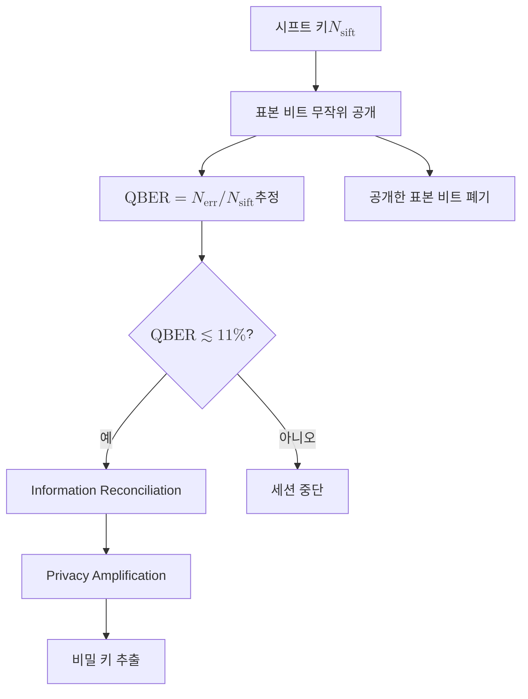

# Quantum Bit Error Rate (QBER)

> QBER은 시프트 키에서 Alice와 Bob의 비트가 불일치하는 비율로, 채널 잡음과 도청을 합산해 측정하며 QKD의 도청 탐지와 키 증류 가능 여부를 가르는 핵심 지표다.

## 핵심
QBER은 시프팅을 거쳐 남은 시프트 키 안에서 두 주체의 비트가 서로 다른 위치의 비율로 정의한다. 시프트 키의 길이를 $N_{\text{sift}}$, 그중 불일치 비트 수를 $N_{\text{err}}$라 하면

$$ \mathrm{QBER} = \frac{N_{\text{err}}}{N_{\text{sift}}}. $$

오류의 원천은 크게 둘이다. 검출기 암계수, 정렬 오차, 채널 잡음 같은 물리적 잡음과 [[Intercept-Resend Attack|가로채기-재전송]]을 비롯한 도청 행위다. 두 주체는 둘을 분리해 측정할 방법이 없으므로 보안 분석에서는 보수적으로 관측된 모든 오류를 Eve 탓으로 간주한다. 즉 측정된 QBER 전체가 도청자에게 누설되었을 정보의 상한을 정하는 데 쓰인다.

QBER은 [[BB84 Protocol|BB84]]의 매개변수 추정 단계에서 통계로 얻는다. [[Basis Sifting|기저 시프팅]]으로 약 절반의 키를 추린 뒤, 그 시프트 키 일부를 무작위로 골라 인증된 공개 채널에서 비트값을 직접 대조한다. 불일치 비율로 QBER을 추정하고, 이 비교에 쓴 비트는 노출되었으므로 최종 키에서 폐기한다. 표본이 클수록 추정이 정밀해지지만 그만큼 버리는 키가 늘어나는 절충이 있다.

### 임계값
추정한 QBER을 보안 임계값과 비교해 키 증류를 진행할지 결정한다.

- 단순 가로채기-재전송 공격은 모든 광자를 가로챌 경우 시프트 키에 약 $25\%$의 QBER을 유발한다. Eve가 평균 절반의 광자를 틀린 기저로 측정하고, 그 결과를 재전송하면 Bob의 측정에서 다시 절반이 어긋나기 때문이다.
- 일방향 키 증류를 가정한 [[BB84 Protocol|BB84]]의 보안 임계는 약 $11\%$다. 이는 일방향 정보 조정과 비밀성 증폭으로 추출 가능한 비밀 키율이 0이 되는 Shor-Preskill 한계에 해당한다.

QBER이 임계값 아래면 [[Information Reconciliation|정보 조정]]으로 잔여 오류를 공개 정정하고 [[Privacy Amplification|비밀성 증폭]]으로 Eve의 부분 정보를 압축해 제거함으로써 비밀 키를 추출한다. 임계값 위면 도청이 의심되므로 키를 버리고 세션을 중단한다.

## 흐름

## 왜 중요한가
QBER은 양자암호가 도청을 사후 통계로 탐지하는 정량 기준이다. 고전 통신은 잡음과 도청을 원리적으로 구분할 수 없지만, QKD에서는 측정 교란과 복제 불가가 도청에 필연적 흔적을 남기므로 오류율 상승 자체가 도청의 신호가 된다. 동시에 QBER은 추출 가능한 비밀 키율을 직접 좌우한다. 오류율이 높을수록 정보 조정에 더 많은 공개 정보가 들고 비밀성 증폭에서 더 많은 키를 짜내야 하므로, 비밀 키율은 QBER이 보안 임계로 다가갈수록 0으로 수렴한다. 이런 의미에서 QBER은 QKD 한 세션이 안전한지, 그리고 얼마나 효율적인지를 한 수치로 요약하는 운영 지표다.

## 연결
- [[BB84 Protocol]] QBER을 매개변수 추정 단계에서 측정해 보안 임계와 비교하는 모(母) 프로토콜
- [[Basis Sifting]] QBER 추정의 입력이 되는 시프트 키를 만들어 내는 직전 단계
- [[Intercept-Resend Attack]] 약 $25\%$의 QBER을 유발하는 대표적 도청 전략이자 임계값 직관의 근거
- [[Information Reconciliation]] QBER이 임계값 아래일 때 잔여 오류를 공개 정정하는 다음 단계
- [[Privacy Amplification]] 측정된 QBER로 상한이 정해진 Eve의 정보를 제거해 비밀 키를 정제하는 단계
