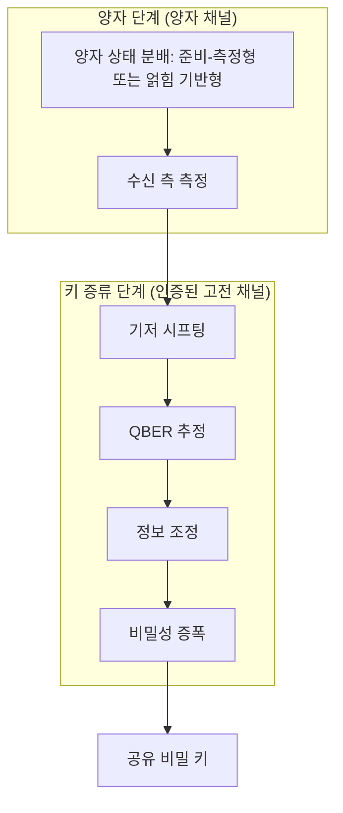

# Quantum Key Distribution

> QKD는 양자역학 법칙을 이용해 멀리 떨어진 두 주체가 도청자의 존재 아래에서도 공유 비밀 키를 안전하게 합의하는 기법군이다.

## 핵심
QKD의 목표는 공개망을 사이에 둔 두 정당한 주체 Alice와 Bob이 도청자 Eve가 있어도 둘만 아는 대칭 비밀 키를 만들어 내는 것이다. 보안의 근거는 계산 난이도 가정이 아니라 두 가지 물리 법칙에 있다. 첫째, 미지의 양자 상태를 측정하면 그 측정이 상태를 교란한다. 둘째, [[No-Cloning Theorem|복제 불가 정리]]에 따라 미지 상태를 완벽히 복제해 둘 수 없다. 따라서 Eve가 전송 중인 양자 신호를 가로채 정보를 빼내려는 시도는 필연적으로 통계적 흔적을 남기고, 그 흔적이 도청을 탐지 가능하게 만든다. 이 보안은 Eve의 계산 능력이 아무리 크더라도 깨지지 않는다는 의미에서 무조건적, 즉 정보이론적이다. 특정 수학 문제의 풀이 난이도에 안전성을 거는 계산 복잡도 기반 암호와는 보안의 출처 자체가 다르다.

QKD 프로토콜은 양자 상태를 어떻게 준비하고 다루느냐에 따라 크게 두 계열로 나뉜다. 준비-측정형(prepare-and-measure)은 Alice가 무작위 기저로 상태를 준비해 보내고 Bob이 측정하는 방식으로, [[BB84 Protocol]]과 [[B92 Protocol]]이 대표 사례다. 얽힘 기반형(entanglement-based)은 얽힌 입자쌍을 두 주체에게 분배해 상관된 측정 결과로부터 키를 끌어내는 방식이며 [[E91 Protocol]]이 대표 사례다. 어느 계열이든 키를 곧바로 얻는 것이 아니라, 양자 신호를 분배한 뒤 인증된 고전 채널에서 후처리를 거쳐 키를 정제한다.

분배 이후의 후처리는 키 증류(key distillation)라 부르며 보통 다음 단계로 이어진다. [[Basis Sifting|기저 시프팅]]으로 사용한 기저가 일치한 위치의 비트만 남기고, 남은 키 일부를 표본으로 비교해 [[Quantum Bit Error Rate (QBER)|QBER]]을 추정하며, [[Information Reconciliation|정보 조정]]으로 채널 잡음과 도청에서 비롯한 잔여 오류를 공개 정정하고, 마지막으로 [[Privacy Amplification|비밀성 증폭]]으로 Eve가 얻었을 부분 정보를 압축해 제거한다. 각 단계의 내부는 별도 개념 노트로 분리해 다룬다.

## 흐름

## 지표와 한계
QKD 시스템의 성능과 안전성은 몇 가지 지표로 평가한다. 비밀 키율(secret key rate)은 단위 시간 또는 단위 펄스당 추출 가능한 안전한 키 비트량으로, 증류로 살아남는 비율을 반영한다. [[Quantum Bit Error Rate (QBER)|QBER]]은 시프트 키에서 관측되는 오류 비율로, 채널 잡음과 도청을 함께 반영하며 임계값을 넘으면 키를 폐기한다. 전송 거리는 광섬유나 자유공간 채널의 손실에 묶인다. 손실이 거리 $L$ 에 대해 지수적으로 누적되어 채널 투과율이 대략

$$ \eta(L) = 10^{-\alpha L / 10} $$

로 감소하므로, 단일 광자 수준의 신호가 거리에 따라 급격히 약해진다. 이 손실은 비밀 키율의 상한을 거리에 따라 떨어뜨리고, 신호를 그대로 증폭할 수 없는 양자 신호의 특성상 고전 통신처럼 중계기로 단순 증폭하기도 어렵다. 장거리 확장은 [[Quantum Repeater|양자 중계기]]나 위성 링크 같은 별도 수단을 요구한다.

전제 조건 하나를 분명히 해야 한다. QKD는 양자 채널과 함께 인증된 고전 채널을 반드시 전제한다. 후처리의 모든 공개 토론은 이 고전 채널에서 이루어지는데, 인증이 없으면 Eve가 양쪽 모두를 가장하는 중간자 공격으로 두 개의 독립된 키를 각각 합의해 버릴 수 있다. 따라서 QKD가 보장하는 것은 인증된 채널이 주어졌을 때의 비밀성이며, 인증 자체는 QKD 바깥에서 사전 공유 비밀이나 다른 수단으로 확보해야 한다.

## 왜 중요한가
QKD는 키 분배의 안전성을 사람이 푼 수학 문제의 난이도가 아니라 자연 법칙에 두는 접근이다. 도청을 사전에 차단하려 하기보다, 도청이 일어나면 그 흔적이 측정 통계에 반드시 드러나게 만들어 사후에 탐지 가능하게 한다는 점이 고전 키 분배와 근본적으로 다르다. 도청이 검출되면 두 주체는 그 키를 버리고 다시 시도하면 되므로, 노출된 키가 그대로 쓰일 위험을 원리적으로 제거한다. 이 발상을 최초로 구체화한 사례가 [[BB84 Protocol]]이며, 이후 얽힘 기반 방식과 다양한 변형으로 확장되며 양자암호라는 분야 전체의 출발점이 되었다.

## 연결
- [[BB84 Protocol]] QKD를 최초로 구체화한 준비-측정형 사례
- [[B92 Protocol]] 두 비직교 상태만으로 구성한 준비-측정형 변형
- [[E91 Protocol]] 얽힘 분배와 상관 측정으로 키를 끌어내는 얽힘 기반형 사례
- [[No-Cloning Theorem]] 미지 상태를 복제해 둘 수 없게 하는 도청 탐지의 물리적 근거
- [[Quantum Bit Error Rate (QBER)]] 도청과 잡음을 함께 반영하는 핵심 안전성 지표
- [[Basis Sifting]] 기저 일치 위치만 남겨 시프트 키를 만드는 증류 첫 단계
- [[Information Reconciliation]] 공개 채널에서 잔여 오류를 정정하는 증류 단계
- [[Privacy Amplification]] Eve의 부분 정보를 압축해 제거하는 증류 마지막 단계
- [[Quantum Repeater]] 직접 전송의 거리 한계를 넘어 QKD를 장거리로 확장하는 인프라
