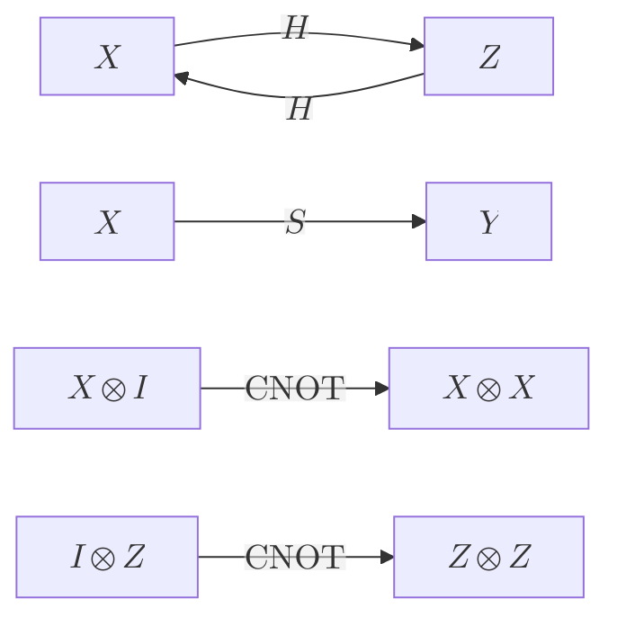

# Clifford Group

> 클리퍼드 군 $\mathcal{C}_n$은 켤레변환으로 파울리 군을 자기 자신에게 사상하는 유니터리들의 군, 곧 파울리 군의 정규화군이다.

## 핵심
$n$큐비트 클리퍼드 군은 켤레변환이 [[Pauli Group|파울리 군]] $\mathcal{P}_n$을 보존하는 유니터리 전체로 정의된다.

$$ \mathcal{C}_n = \{ U \in U(2^n) : U \mathcal{P}_n U^\dagger = \mathcal{P}_n \} $$

여기서 $U \mathcal{P}_n U^\dagger = \mathcal{P}_n$은 임의의 파울리 연산자 $P \in \mathcal{P}_n$에 대해 켤레변환 결과 $U P U^\dagger$가 다시 어떤 파울리 연산자가 된다는 뜻이다. 군론의 언어로 말하면 $\mathcal{C}_n$은 유니터리 군 $U(2^n)$ 안에서 $\mathcal{P}_n$의 정규화군이며, 전역 위상을 무시하면 클리퍼드 연산은 파울리 군 위의 자기동형으로 작용한다. 이 성질 덕분에 클리퍼드 연산은 상태 벡터를 직접 추적할 필요 없이 [[Pauli Matrices|파울리 연산자]]가 어디로 옮겨 가는지만으로 완전히 기술된다. 이것이 [[Heisenberg Representation|하이젠베르크 묘사]]에 따른 안정자 형식론의 출발점이다.

클리퍼드 군은 단 세 종류의 게이트로 생성된다. 단일 큐비트 [[Hadamard Gate|하다마드 게이트]] $H$와 위상 게이트 $S = \mathrm{diag}(1, i)$, 그리고 두 큐비트 [[CNOT Gate|CNOT 게이트]]가 그것이다. 이들이 파울리 생성원을 어떻게 옮기는지는 켤레변환 규칙으로 정리된다.

$$ H X H^\dagger = Z, \quad H Z H^\dagger = X, \quad S X S^\dagger = Y, \quad S Z S^\dagger = Z $$

$$ \mathrm{CNOT}\,(X \otimes I)\,\mathrm{CNOT}^\dagger = X \otimes X, \quad \mathrm{CNOT}\,(I \otimes Z)\,\mathrm{CNOT}^\dagger = Z \otimes Z $$

각 생성원의 작용은 파울리 연산자를 다른 파울리 연산자로 보내므로, 이들의 임의 곱으로 만들어지는 모든 회로 역시 파울리 군을 보존한다. 따라서 클리퍼드 회로의 효과는 생성원이 정한 파울리 사상들을 차례로 병합한 결과로 환원된다.

## 흐름
파울리 연산자가 생성원을 거쳐 어떻게 옮겨 가는지를 켤레변환의 흐름으로 표현하면 다음과 같다.

## 왜 중요한가
클리퍼드 군의 결정적 한계와 효용은 [[Gottesman-Knill Theorem|고트스만-닐 정리]]가 함께 규정한다. 안정자 상태에서 시작해 클리퍼드 게이트만 적용하고 파울리 기저로 측정하는 계산은 고전 컴퓨터로 다항 시간에 시뮬레이션된다. $2^n$ 차원의 상태 벡터를 추적하는 대신 안정자군의 생성원 $n$개만 갱신하면 충분하기 때문이다. 이 정리는 동전의 양면을 보여 준다. 한편으로 클리퍼드 연산은 효율적으로 추적되므로 [[Stabilizer Code|안정자 부호]]에서 상태 준비, [[Syndrome Measurement|신드롬 측정]], 오류 추적 같은 무거운 작업을 고전적으로 다룰 길을 연다. 다른 한편으로 클리퍼드 회로만으로는 [[Quantum Supremacy|양자 우월성]]에 도달할 수 없고 보편 양자 계산도 이루지 못한다.

내결함성 관점에서 클리퍼드 군이 특별한 까닭은 여러 부호에서 논리 클리퍼드 연산이 [[Transversal Gate|횡단 게이트]]로 구현되기 때문이다. 블록의 큐비트마다 게이트를 독립적으로 적용하는 횡단 구현은 단일 물리 결함이 블록 안에서 번지지 못하게 막으므로 내결함성과 자연스럽게 맞물린다. 다만 [[Eastin-Knill Theorem|이스틴-닐 정리]]에 따라 어떤 부호도 보편 게이트 집합 전체를 횡단으로 제공하지는 못한다. 클리퍼드 군은 보편 집합이 아니므로 여기에 비클리퍼드 자원을 더해야 보편성이 채워진다. 그 자원은 보통 $T = \mathrm{diag}(1, e^{i\pi/4})$ 게이트나 동등한 마법 상태로 공급되며, 잡음 섞인 마법 상태를 정제하는 [[Magic State Distillation|마법 상태 증류]]가 내결함성 경로에서 비클리퍼드 게이트를 안전하게 주입하는 표준 수단이 된다. 정리하면 클리퍼드 군은 안정자 형식론의 골격을 효율적으로 떠받치되, 그 골격 위에서 진정한 양자 계산이 돌아가려면 군 바깥의 자원이 반드시 보태져야 한다.

## 연결
- [[Pauli Group]] 클리퍼드 군이 켤레변환으로 보존하는 대상이며, 클리퍼드 군은 그 정규화군이다
- [[Pauli Matrices]] 켤레변환 규칙으로 옮겨지는 기본 연산자로 클리퍼드 작용을 기술하는 기준
- [[Hadamard Gate]] 위상 게이트 $S$, CNOT과 함께 클리퍼드 군을 생성하는 단일 큐비트 게이트
- [[CNOT Gate]] 두 큐비트 얽힘을 만드는 생성원으로 단일 큐비트 클리퍼드와 결합해 군 전체를 만든다
- [[Stabilizer Code]] 클리퍼드 연산이 상태 준비와 측정을 효율적으로 떠받치는 부호 형식론
- [[Transversal Gate]] 여러 부호에서 논리 클리퍼드 연산이 횡단으로 구현되어 내결함성과 맞물리는 지점
- [[Magic State Distillation]] 클리퍼드만으로 모자란 보편성을 비클리퍼드 자원으로 채우는 정제 기법
- [[Gottesman-Knill Theorem]] 클리퍼드 회로가 고전적으로 효율 시뮬레이션됨을 보장해 군의 한계와 효용을 동시에 규정한다
