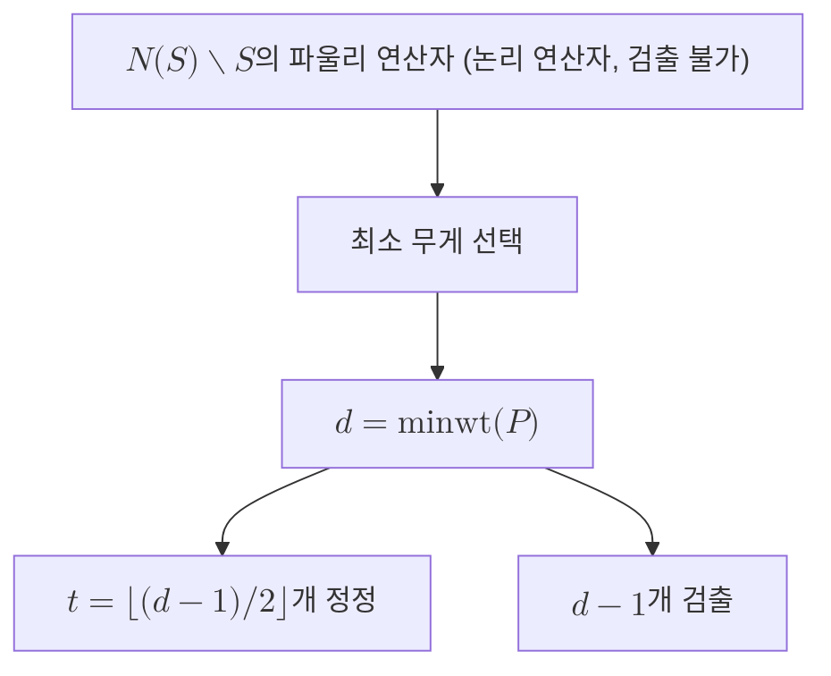

# Code Distance

> 부호 거리 $d$는 부호가 검출하지 못한 채 논리 정보를 손상시키는 가장 가벼운 비자명 오류의 무게이며, 부호의 오류 정정 능력을 결정하는 단일 정수다.

## 핵심
부호 거리는 어떤 양자 오류정정 부호가 얼마나 강한지를 한 숫자로 압축한 양이다. 직관은 단순하다. 오류가 가벼울수록 부호가 알아채기 쉽고, 무거울수록 알아채기 어렵다. 거리는 부호가 끝내 알아채지 못하고 논리 상태를 바꿔 버리는 오류 중에서 가장 가벼운 것의 무게다. 여기서 무게(weight)는 [[Pauli Group]] 원소에서 항등 인자 $I$가 아닌 자리의 개수, 즉 실제로 큐비트를 건드리는 위치의 수를 뜻한다. 예를 들어 $X \otimes I \otimes Z$의 무게는 2다.

[[Stabilizer Code|안정자 부호]]에서는 이 직관이 정확한 군론적 정의로 바뀐다. 안정자군을 $S$, 그 정규화군(normalizer)을 $N(S)$라 하면, $N(S) \setminus S$에 속하는 파울리 연산자가 바로 논리 연산자다. 이들은 안정자와 교환하므로 신드롬을 일으키지 않아 검출되지 않지만, $S$에 속하지 않으므로 부호 공간 안에서 논리 상태를 실제로 변환한다. 거리는 이 위험한 원소들의 최소 무게로 정의된다.

$$ d = \min_{P \in N(S) \setminus S} \mathrm{wt}(P) $$

거리가 정해지면 정정과 검출 능력이 곧바로 따라 나온다. 거리 $d$인 부호는

$$ t = \left\lfloor \frac{d-1}{2} \right\rfloor $$

개까지의 오류를 정정하고, $d - 1$개까지의 오류를 검출한다. 부호 매개변수를 $[[n, k, d]]$로 적을 때 $n$은 물리 큐비트 수, $k$는 보호되는 논리 큐비트 수, 그리고 $d$가 바로 이 거리다. 거리를 키운다는 것은 두 부호 상태를 가르는 파울리 연산자가 더 많은 큐비트를 동시에 망가뜨려야만 한다는 뜻이고, 그런 무거운 오류일수록 물리적으로 드물게 일어난다.

거리가 검출과 정정 능력으로 이어지는 이유는 [[Knill-Laflamme Conditions|닐 라플람 조건]]으로 정당화된다. 무게가 $t$ 이하인 두 오류의 곱이 만들어내는 모든 연산자가 부호 공간에서 구별 가능하면 그 오류들을 정정할 수 있는데, 이 구별 가능성이 깨지기 시작하는 경계가 정확히 거리 $d$에서 나타난다.

## 구조

## 왜 중요한가
거리는 부호의 품질을 비교하는 공통 척도다. 같은 물리 큐비트 수 $n$으로 더 큰 $d$를 얻는 부호가 더 좋은 부호이며, 부호 설계와 [[Decoder|디코더]] 성능 평가가 모두 이 값을 기준으로 이루어진다. 보호되는 정보 한 덩어리가 곧 [[Logical Qubit|논리 큐비트]]이고, 거리는 그 논리 큐비트가 한 번에 얼마나 큰 충격을 견디는지를 말해 준다.

[[Surface Code|표면 부호]]에서는 거리에 특히 선명한 기하학적 의미가 생긴다. 표면 부호의 논리 연산자는 격자를 가로지르는 오류 사슬로 나타나므로, 거리는 한쪽 경계에서 반대쪽 경계까지를 잇는 가장 짧은 사슬의 길이와 같다. 격자를 키워 거리를 늘리면 그만큼 긴 오류 사슬이 우연히 동시에 발생해야 논리 오류가 일어나고, 물리 오류율이 임계값 아래에 있는 한 논리 오류율은 거리에 대해 지수적으로 감소한다. 이 지수적 억제가 결함 허용 양자컴퓨팅이 거리를 핵심 자원으로 다루는 이유이며, 큰 거리는 곧 더 깊은 회로를 안전하게 실행할 수 있는 여유로 환산된다.

## 연결
- [[Stabilizer Code]] 거리를 $N(S) \setminus S$의 최소 무게로 정의하는 군론적 틀을 제공
- [[Pauli Group]] 무게의 정의가 되는 항등 아닌 인자의 수가 여기서 나옴
- [[Knill-Laflamme Conditions]] 거리가 정정과 검출 능력으로 이어지는 근거를 제공
- [[Logical Qubit]] 거리가 한 번에 견디는 충격의 크기를 규정하는 보호 대상
- [[Surface Code]] 거리를 격자를 가로지르는 최단 오류 사슬 길이로 실현하고 논리 오류율을 지수적으로 억제
- [[Decoder]] 거리를 기준으로 성능과 임계값이 평가되는 복호 절차
- [[Syndrome Measurement]] 거리가 약속한 보호 한계를 반복 측정의 신뢰성으로 실제 달성하게 만드는 추출 단계
