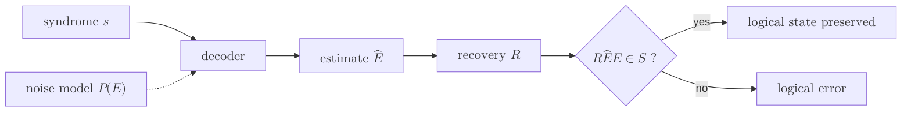

# Decoder

> 신드롬을 입력으로 받아, 그 신드롬을 설명하는 가장 그럴듯한 오류 또는 그것을 되돌릴 회복 연산을 추정해 내는 고전 알고리즘.

## 핵심

복호기는 양자 오류정정에서 고전 컴퓨터가 맡는 두뇌에 해당한다. [[Syndrome Measurement|신드롬 측정]]이 손상된 부호 상태에서 뽑아낸 비트열 $\mathbf{s} \in \{0,1\}^{n-k}$를 받아, 실제로 일어났을 법한 오류 $\hat{E}$를 추정하고 그것을 상쇄할 회복 연산 $R$을 출력한다. 회복이 성공했다는 것은 $R\hat{E}$를 합쳐 적용한 결과가 원래 논리 상태를 보존한다는 뜻이며, 그러려면 $R E$가 부호공간을 벗어나지 않는 안정자 원소가 되어야 한다.

복호가 단순한 역연산이 아닌 이유는 [[Stabilizer Code|안정자 부호]]의 퇴화에 있다. 신드롬은 $n-k$비트뿐이라 $2^{n-k}$가지만 구별하는데, 가능한 파울리 오류는 그보다 훨씬 많으므로 같은 신드롬을 남기는 오류가 여럿 존재한다. 어떤 오류 $E$와 동일한 신드롬을 내는 오류 전체는 다음 잉여류로 적힌다.

$$
E \cdot \mathcal{S} = \{\, E g \mid g \in \mathcal{S} \,\}, \qquad \mathcal{S} = \langle g_1, \dots, g_{n-k} \rangle
$$

여기서 핵심은 같은 신드롬을 내더라도 그 오류들이 항상 논리적으로 동등하지는 않다는 점이다. 한 신드롬에 묶인 후보들은 다시 논리 연산자 $\bar{L}$에 의해 서로 다른 부류로 갈라진다. 안정자 $\mathcal{S}$만큼 차이 나는 두 오류는 정정 후 같은 논리 상태를 주므로 안전하지만, 논리 연산자만큼 차이 나는 두 오류는 부호 상태를 다른 논리값으로 옮겨 버린다. 따라서 복호기의 진짜 과제는 단일 오류를 콕 집어내는 것이 아니라, 신드롬과 양립하는 여러 논리 동치류 가운데 확률이 가장 높은 부류를 고르는 것이다.

이상적인 기준이 최대우도 복호다. 오류 모형이 주어졌을 때 각 논리류 $\ell$의 사후확률을 모두 더해 비교하고, 그 합이 최대인 류를 선택한다.

$$
\hat{\ell} = \arg\max_{\ell} \;\sum_{E \in \ell \cdot \mathcal{S}} P(E \mid \mathbf{s})
$$

이 최적 복호는 일반적으로 계산이 어려워 큰 부호에서는 그대로 쓰기 힘들다. 그래서 실용 복호기는 류 전체의 확률을 합산하는 대신, 신드롬과 양립하는 단일 오류 가운데 무게가 가장 작은 것을 찾는 식으로 근사한다. 독립적이고 작은 오류율을 가정하면 무게가 낮은 오류일수록 확률이 높기 때문이다. [[Minimum-Weight Perfect Matching|최소 무게 완전 매칭]] 복호기와 [[Union-Find Decoder|유니온 파인드]] 복호기가 이 근사 노선의 대표 사례이며, 전자는 정확도를, 후자는 거의 선형에 가까운 속도를 무기로 삼는다.

## 흐름

## 왜 중요한가

복호기는 오류정정의 성패를 결정하는 마지막 관문이다. [[Code Distance|부호 거리]] $d$는 부호가 원리적으로 막아 낼 수 있는 오류 한계를 약속하지만, 그 한계를 실제로 끌어내는 것은 복호기의 정확도다. 같은 표면 부호라도 어떤 복호기를 쓰느냐에 따라 논리 오류율이 달라지고, 오류율이 임계점 아래로 떨어지는 문턱값 자체가 복호 성능에 좌우된다. 복호기가 약하면 부호를 아무리 키워도 보호가 개선되지 않는다.

더 까다로운 제약은 시간이다. 신드롬은 측정 라운드마다 끊임없이 쏟아지는데, 복호가 측정 주기를 따라잡지 못하면 처리되지 않은 신드롬이 쌓이고 그 사이 새 오류가 누적되어 백로그가 발산한다. 이 때문에 복호기는 단지 정확하기만 해서는 안 되고, 한 주기 안에 끝나는 지연(latency)과 들어오는 신드롬을 소화하는 처리량(throughput)을 동시에 만족해야 한다. 초전도 큐비트의 측정 주기가 마이크로초 단위라는 점을 생각하면, 복호는 사실상 실시간 고전 연산 문제가 되며 [[Surface Code|표면 부호]] 기반 결함 허용 양자 컴퓨팅의 실제 병목으로 떠오른다. 정확도와 속도 사이의 이 긴장이 매칭 계열, 유니온 파인드, 신경망 복호, 재구성 가능 하드웨어 복호 같은 다양한 설계가 공존하는 이유다.

## 연결

- [[Syndrome Measurement]] 복호기의 입력인 신드롬 비트열을 비파괴로 생성하는 선행 단계
- [[Stabilizer Code]] 안정자와 논리 연산자의 구조가 복호 문제의 퇴화와 동치류를 규정하는 대수적 토대
- [[Minimum-Weight Perfect Matching]] 신드롬 결함을 짝지어 최소 무게 오류를 찾는 표면 부호의 대표 복호기
- [[Union-Find Decoder]] 거의 선형 시간으로 동작해 실시간 제약을 겨냥한 고속 근사 복호기
- [[Code Distance]] 부호가 약속한 보호 한계를 복호기의 정확도가 실제로 달성하게 만드는 척도
- [[Surface Code]] 반복 신드롬 측정 위에서 실시간 복호가 결함 허용을 떠받치는 대표 부호
