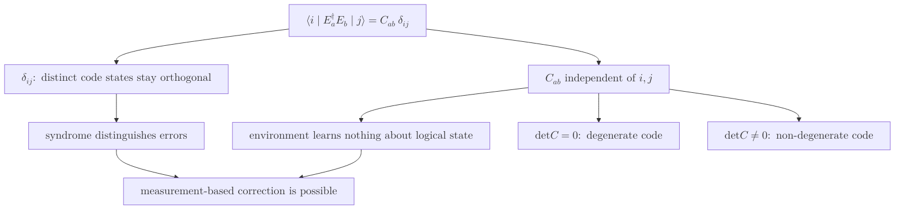

# Knill-Laflamme Conditions

> 어떤 부호공간이 주어진 오류 집합 $\{E_a\}$를 정정할 수 있는지를 판정하는 필요충분조건으로, 부호공간 사영 연산자 $P$에 대해 $P E_a^\dagger E_b P = C_{ab}\, P$가 성립하는 것을 요구한다.

## 핵심

[[Quantum Error Correction|양자 오류정정]]에서 가장 먼저 답해야 할 질문은 어떤 부호가 어떤 오류를 정정할 수 있는가다. Knill과 Laflamme는 이 물음에 대수적 판정 기준을 주었다. 부호공간을 그 위로 사영하는 연산자를 $P$라 하고, 정정하려는 오류들을 연산자 집합 $\{E_a\}$로 모으면, 이 부호가 해당 오류들을 정정할 수 있을 필요충분조건은 다음과 같다.

$$
P\, E_a^\dagger E_b\, P = C_{ab}\, P
$$

여기서 $C_{ab}$는 인덱스 $a, b$에만 의존하는 어떤 에르미트 행렬의 성분이다. 부호공간의 정규직교 기저 $\{\lvert i \rangle\}$를 잡아 다시 쓰면 조건의 의미가 더 또렷해진다.

$$
\langle i \lvert E_a^\dagger E_b \rvert j \rangle = C_{ab}\, \delta_{ij}
$$

이 한 줄에는 서로 얽힌 두 요구가 동시에 담겨 있다.

### 구별 가능성: 오류가 부호 상태를 갈라 놓는다

우변의 크로네커 델타 $\delta_{ij}$가 첫째 요구를 담당한다. $i \neq j$이면 행렬요소가 $0$이므로, 서로 다른 부호 기저 상태 $\lvert i \rangle$와 $\lvert j \rangle$는 어떤 오류를 받더라도 겹치지 않는 부분공간으로 옮겨 간다. 즉 오류 $E_a$와 $E_b$가 적용된 상태들의 집합이 직교성을 유지하므로, 손상된 상태를 측정해 어떤 오류가 일어났는지 진단하고 되돌릴 여지가 생긴다. 이것이 [[Stabilizer Code|안정자 부호]]의 신드롬 측정이 작동하는 정보론적 근거다.

### 정보 보존: 환경은 논리 정보를 알지 못한다

행렬 $C_{ab}$가 인덱스 $i, j$에 무관하다는 사실이 둘째 요구를 담당한다. 오류 연산자들 사이의 중첩 $\langle i \lvert E_a^\dagger E_b \rvert j \rangle$가 어느 부호 상태에 작용했는지와 무관하게 같은 값 $C_{ab}$로 나온다는 것은, 오류를 일으킨 환경이 부호화된 논리 상태에 대해 아무런 정보도 얻지 못함을 뜻한다. 만약 $C_{ab}$가 $i, j$에 따라 달라진다면 환경은 그 차이를 통해 논리 진폭을 엿보게 되고, 그만큼 양자 정보는 손상된다. 환경이 논리 정보를 전혀 모른다는 이 조건이 바로 측정으로 오류만 빼내면서 정보는 온전히 남겨 둘 수 있게 하는 핵심이다.

두 요구를 하나로 묶으면 이렇게 말할 수 있다. 정정 가능한 오류는 부호 상태를 구별 가능한 부분공간으로 보내면서도, 그 부분공간들 안에서 논리 정보의 상대적 구조를 똑같이 보존해야 한다.

## 흐름

## 퇴화와 비퇴화

행렬 $C_{ab}$의 특이성 여부가 부호를 두 종류로 가른다. $C_{ab}$가 가역이면, 즉 $\det C \neq 0$이면 서로 다른 오류 $E_a$와 $E_b$가 부호 상태를 모두 선형독립인 별개의 부분공간으로 보내고 저마다 고유한 신드롬을 남긴다. 이런 부호를 비퇴화(non-degenerate) 부호라 한다. 반대로 $C_{ab}$가 특이행렬이면, 즉 $\det C = 0$이면 서로 다른 오류들이 부호공간 위에서 같은 효과를 내어 동일한 신드롬을 공유한다. 이런 부호가 퇴화(degenerate) 부호다. 퇴화 부호에서는 신드롬이 같은 여러 오류를 굳이 구별할 필요가 없고 그중 아무 복원 연산이나 적용해도 같은 논리 상태로 되돌아가므로, 같은 자원으로 더 많은 오류를 견디는 효율이 가능해진다. [[Surface Code|표면 부호]] 같은 위상 부호가 대표적인 퇴화 부호다.

## 거리와의 관계

오류 집합을 [[Pauli Matrices|파울리 연산자]]의 곱으로 잡으면 조건이 부호의 무게 구조와 직접 연결된다. 곱 $E_a^\dagger E_b$ 역시 파울리 연산자이고, 그 무게는 단위 연산자가 아닌 자리의 개수다. 거리 $d$인 부호는 무게 $d-1$ 이하의 모든 파울리 곱 $E_a^\dagger E_b$에 대해 Knill-Laflamme 조건을 만족한다는 것으로 특징지어진다. 무게가 $d$ 미만인 한 어떤 오류 쌍도 논리 상태를 누설하지 않으므로, 이 한계가 바로 [[Code Distance|부호 거리]]의 정의가 된다. 거리 $d$인 부호는 무게 $t = \lfloor (d-1)/2 \rfloor$ 이하의 오류를 정정할 수 있다. 안정자 언어로 보면 거리는 어떤 안정자에도 속하지 않으면서 모든 안정자와 교환하는 최소 무게 논리 연산자의 무게와 같으며, 이는 [[Stabilizer Code|안정자 부호]]에서 정규화 부분군과 안정자의 차집합 $N(S) \setminus S$의 최소 무게로 재서술된다.

## 왜 중요한가

Knill-Laflamme 조건은 양자 오류정정의 가능성 자체를 정의하는 기준이다. 특정 부호와 특정 오류 모형을 놓고 정정 가능한지 따질 때, 복원 회로를 일일이 설계해 보지 않고도 이 조건의 성립 여부만으로 판정이 끝난다. 새 부호를 설계하거나 거리를 계산할 때 검증의 출발점이 바로 이 조건이며, [[Stabilizer Code|안정자 형식론]]은 이 조건을 파울리 군의 교환 관계로 번역해 다루기 쉬운 대수 문제로 바꾼다.

조건의 깊은 의의는 [[No-Cloning Theorem|복제 불가 정리]]와의 양립에 있다. 복제 불가 정리는 미지의 양자 상태를 베껴 다수결로 고치는 고전적 전략을 봉쇄한다. 그렇다면 정보를 잃지 않고 어떻게 오류를 고칠 수 있는가. Knill-Laflamme 조건의 둘째 부분이 그 답을 준다. 환경이 논리 정보에 대해 아무것도 알아내지 못한다는 요구는 곧 오류 과정이 양자 정보를 외부로 복제하거나 누설하지 않는다는 뜻이다. 정보가 새어 나가지 않았기 때문에 [[Quantum Measurement|측정]]으로 오류만 진단해도 논리 상태가 [[Quantum Measurement|붕괴]]하지 않고, 같은 이유로 환경이 상태의 사본을 들고 달아나는 일도 일어나지 않는다. 정보 비누설이라는 하나의 요구가 정정 가능성과 복제 불가를 동시에 떠받친다. 이렇게 보면 양자 오류정정이 가능하다는 사실과 양자 상태를 복제할 수 없다는 사실은 모순이 아니라 같은 동전의 양면이다.

## 연결

- [[Quantum Error Correction]] 이 조건이 정정 가능성의 일반 판정 기준으로 봉사하는 상위 분야
- [[Stabilizer Code]] Knill-Laflamme 조건을 파울리 군의 교환 관계로 재서술해 대수적으로 검사하는 형식론
- [[Code Distance]] 무게 $d-1$ 이하 모든 파울리 곱이 조건을 만족한다는 것으로 거리를 정의하는 직접적 연결
- [[No-Cloning Theorem]] 환경이 논리 정보를 얻지 못한다는 둘째 조건이 복제 불가와 양립하며 같은 원리를 공유
- [[Quantum Measurement]] 정보가 누설되지 않기에 오류만 측정해도 논리 상태가 붕괴하지 않음
- [[Pauli Matrices]] 오류 집합을 이루는 곱 $E_a^\dagger E_b$의 무게로 조건과 거리를 잇는 기본 연산자
- [[Surface Code]] $C_{ab}$가 특이행렬이 되는 퇴화 부호의 대표 사례
