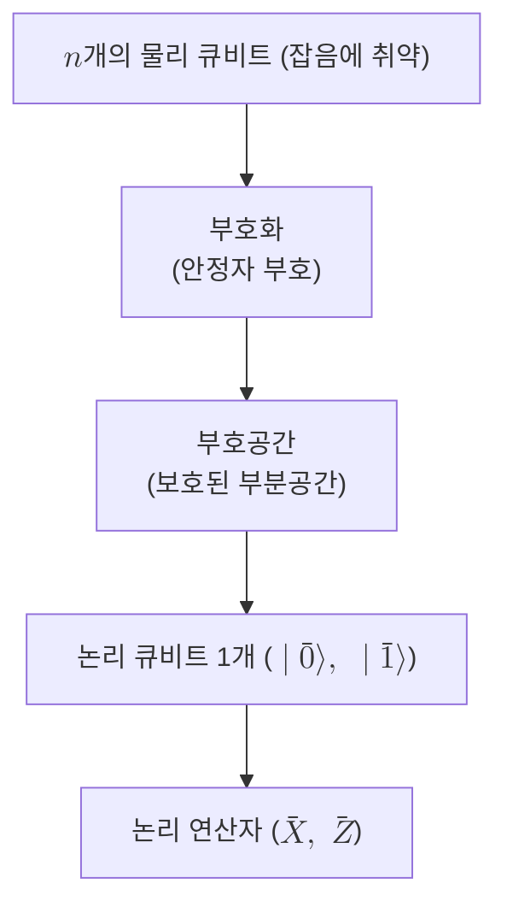

# Logical Qubit

> 다수의 물리 큐비트에 중복 부호화되어 잡음에 견디도록 추상화된 큐비트로, 부호공간 위에 작용하는 논리 연산자 $\bar{X}$와 $\bar{Z}$로 그 상태가 규정된다.

## 핵심
논리 큐비트는 단일한 물리적 실체가 아니라 여러 [[Qubit|물리 큐비트]]가 함께 떠받치는 추상화이다. 물리 큐비트는 [[Quantum Decoherence|결어긋남]]과 게이트 불완전성 탓에 본질적으로 잡음에 취약하므로, 그 자체로는 긴 계산을 버티지 못한다. 그래서 [[Quantum Error Correction|양자 오류정정]]은 하나의 큐비트가 담는 정보를 $n$개의 물리 큐비트가 펼치는 거대한 힐베르트 공간의 작은 부분공간에 펼쳐 둔다. 이 보호된 부분공간을 부호공간이라 부르고, 그 위에서 정보를 담는 단위가 바로 논리 큐비트이다.

핵심은 논리 상태를 물리 큐비트 하나하나의 상태로 읽지 않는다는 점이다. 거리 $d$인 부호에서 단일 물리 큐비트를 들여다보아도 논리적 정보는 거의 드러나지 않으며, 정보는 여러 큐비트에 걸친 상관관계에 비국소적으로 저장된다. 이 부분공간 위에서 마치 보통 큐비트의 파울리처럼 행동하는 두 연산자가 논리 연산자 $\bar{X}$와 $\bar{Z}$이다. 이들은 부호공간을 부호공간으로 보내면서 두 논리 기저상태를 다음과 같이 다룬다.

$$ \bar{X}\,\lvert \bar{0} \rangle = \lvert \bar{1} \rangle, \qquad \bar{Z}\,\lvert \bar{0} \rangle = \lvert \bar{0} \rangle, \quad \bar{Z}\,\lvert \bar{1} \rangle = -\lvert \bar{1} \rangle $$

논리 연산자는 보통 여러 물리 큐비트에 걸친 파울리 연산자의 곱으로 실현된다. 예를 들어 가장 단순한 거리 3 반복 부호에서는 세 물리 큐비트에 작용하는 $\bar{X} = X_1 X_2 X_3$ 형태로 정의할 수 있다. 어떤 연산이 부호공간 안에서 두 논리 기저를 실제로 뒤섞으려면 그만큼 많은 물리 큐비트를 동시에 건드려야 하며, 이를 이루는 가장 짧은 연산자의 무게가 [[Code Distance|부호 거리]] $d$이다. 작은 국소 잡음이 논리 정보를 함부로 바꾸지 못하는 이유가 여기에 있다.

## 구조
물리 큐비트 다발에서 보호된 논리 큐비트가 떠오르는 추상화의 층위는 다음과 같다.

## 왜 중요한가
양자 알고리즘이 가정하는 큐비트는 사실상 논리 큐비트이다. 실제 하드웨어가 내놓는 물리 큐비트는 오류율 $p$가 너무 높아서, 깊은 회로를 그대로 돌리면 잡음에 묻혀 버린다. 논리 큐비트의 가치는 물리 오류율 $p$와 논리 오류율 $p_L$ 사이의 관계에서 드러난다. 물리 오류율이 부호의 임계값 $p_{\mathrm{th}}$보다 낮은 영역에서는 거리 $d$를 키울수록 논리 오류율이 지수적으로 억눌린다.

$$ p_L \sim \left( \frac{p}{p_{\mathrm{th}}} \right)^{\lfloor (d+1)/2 \rfloor} $$

이 식은 임계값 아래에서 한 가지를 약속한다. 물리 게이트 충실도가 일정 수준을 넘으면, 더 정밀한 물리 큐비트를 만드는 대신 물리 큐비트를 더 많이 묶어 거리를 늘리는 것만으로 원하는 만큼 낮은 논리 오류율에 도달할 수 있다는 점이다. 이것이 [[Fault-Tolerant Quantum Computation|내결함성 양자계산]]을 떠받치는 임계값 정리의 핵심 동력이며, 임계값 위에서는 같은 식이 거꾸로 작동해 거리를 키울수록 오히려 상태가 더 빨리 망가진다.

대가는 부호화 오버헤드이다. 하나의 고품질 논리 큐비트는 보통 수백에서 수천 개의 물리 큐비트를 요구한다. [[Surface Code|표면 부호]]가 보호해 내는 대상이 바로 이 논리 큐비트이며, 표면 부호의 거리 확장과 임계값 돌파가 의미를 갖는 까닭도 결국 더 안정적인 논리 큐비트를 얻기 위함이다. 이 때문에 하드웨어의 진전은 단순한 물리 큐비트 수가 아니라, 거리를 키울 때 논리 오류율이 실제로 내려가는 논리 큐비트 한 개를 만들어 내는지로 가늠한다.

## 연결
- [[Qubit]] 논리 큐비트가 추상화로 흉내 내는 이상적 정보 단위이자, 다수가 모여 논리 큐비트를 떠받치는 물리적 기반
- [[Quantum Error Correction]] 물리 큐비트 다발을 부호공간으로 부호화해 논리 큐비트를 만들어 내는 일반 기법
- [[Stabilizer Code]] 부호공간과 논리 연산자 $\bar{X}$, $\bar{Z}$를 안정자 형식론으로 규정하는 대표적 부호 틀
- [[Surface Code]] 평면 격자 위 국소 안정자 측정으로 논리 큐비트를 실제로 보호해 내는 유력한 부호
- [[Code Distance]] 논리 연산자를 이루는 가장 짧은 오류 사슬의 무게로, 논리 오류율의 지수적 억제를 지배하는 매개변수
- [[Fault-Tolerant Quantum Computation]] 임계값 아래에서 논리 큐비트를 키워 임의로 긴 계산을 신뢰성 있게 수행하는 상위 목표
- [[Quantum Threshold Theorem]] 논리 오류율의 지수적 억제가 자원 측면에서 감당 가능함을 보증하는 상위의 약속
