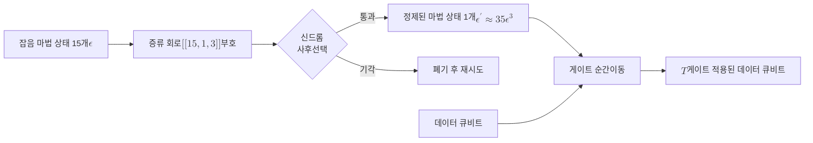

# Magic State Distillation

> 잡음 섞인 비클리퍼드 자원 상태 여러 개를 안정자 연산만으로 정제해 소수의 고충실도 마법 상태로 끌어올리는 절차로, 내결함성 양자 계산에서 비클리퍼드 게이트를 안전하게 공급하는 표준 수단이다.

## 핵심
마법 상태란 클리퍼드 연산만으로는 만들 수 없는 단일 큐비트 자원 상태를 가리킨다. 대표적으로 $T$ 게이트에 대응하는

$$ \lvert T \rangle = \frac{1}{\sqrt 2}\bigl(\lvert 0 \rangle + e^{i\pi/4}\lvert 1 \rangle\bigr) $$

와 한 축에 대한 마법 상태인

$$ \lvert H \rangle = \cos\frac{\pi}{8}\,\lvert 0 \rangle + \sin\frac{\pi}{8}\,\lvert 1 \rangle $$

이 쓰인다. 이런 상태가 한 개라도 완벽하게 주어지면 게이트 순간이동(gate teleportation)을 통해 비클리퍼드 게이트를 임의의 데이터 큐비트에 작용시킬 수 있다. 마법 상태와 데이터 큐비트를 [[CNOT Gate|CNOT 게이트]]로 얽고 측정한 뒤, 측정 결과에 따라 클리퍼드 보정만 가하면 $T$ 게이트와 같은 효과가 데이터 큐비트에 남는다. 곧 자원 상태 하나가 비클리퍼드 게이트 한 번으로 소비된다.

문제는 물리적으로 준비한 마법 상태가 잡음에 오염되어 있다는 점이다. [[Transversal Gate|횡단 게이트]]로 깔끔하게 보호되는 클리퍼드 연산과 달리, 마법 상태 자체는 부호의 자연스러운 보호를 받지 못하고 직접 준비하는 과정에서 비교적 큰 오류율을 안고 들어온다. 마법 상태 증류는 바로 이 오염된 상태들을 정제한다. 핵심 아이디어는 짧은 거리의 [[Stabilizer Code|안정자 부호]], 예컨대 $[[15,1,3]]$ 리드-뮬러 부호를 증류 회로로 활용하는 것이다. 잡음 섞인 마법 상태 여러 개를 부호의 논리 상태 준비와 신드롬 측정에 투입하고, 신드롬이 깨끗하게 나온 경우만 사후선택(postselection)으로 남긴다. 남은 출력 한 개는 입력보다 훨씬 낮은 오류율을 가진 마법 상태가 된다.

15-to-1 프로토콜이 표준 예다. 입력 마법 상태 15개를 소비해 출력 1개를 얻으며, 입력 오류율을 $\epsilon$이라 할 때 출력 오류율 $\epsilon'$은 입력의 거듭제곱으로 억제된다.

$$ \epsilon' \approx 35\,\epsilon^{3} $$

세제곱 의존성은 부호 거리 $d = 3$에서 비롯한다. 오류 무게가 1이나 2인 경우는 사후선택으로 걸러지고, 출력 오류로 살아남으려면 적어도 무게 3의 오류가 동시에 발생해야 하기 때문이다. 이 억제 관계가 성립하려면 입력 오류율이 어떤 임계값보다 작아야 한다. $\epsilon' < \epsilon$이 되는 정제 가능 영역의 경계는 위 식에서 $35\,\epsilon^2 < 1$, 곧 대략 $\epsilon < 1/\sqrt{35} \approx 0.17$로 주어진다. 입력이 이 경계 안쪽에 있으면 증류를 반복할수록 오류율이 가파르게 떨어지고, 경계 바깥에 있으면 증류가 오히려 상태를 나쁘게 만든다. 표준 마법 상태들이 정제 가능한 영역의 한계는 [[Stabilizer Code|안정자]] 형식론과 마법 상태가 만드는 기하학적 다면체로 정밀하게 특징지어진다.

목표 오류율이 매우 낮으면 증류를 여러 번 거치도록 쌓는다. 한 라운드의 출력이 다음 라운드의 입력이 되며, 세제곱 억제가 라운드마다 누적되어 오류율이 $\epsilon, \epsilon^3, \epsilon^9, \dots$의 속도로 내려간다.

## 흐름
잡음 섞인 자원 상태가 증류 회로를 거쳐 고충실도 마법 상태로 정제되고, 이후 게이트 순간이동으로 데이터 큐비트에 비클리퍼드 게이트를 주입하는 과정은 다음과 같다.

## 왜 중요한가
마법 상태 증류는 내결함성 양자 계산에서 보편성을 확보하는 결정적 다리다. [[Clifford Group|클리퍼드 군]]만으로 구성한 계산은 [[Gottesman-Knill Theorem|고트스만-닐 정리]]에 따라 고전 컴퓨터로 효율적으로 시뮬레이션되므로, 클리퍼드 연산은 그 자체로는 양자적 우위를 주지 못한다. 게다가 [[Eastin-Knill Theorem|이스틴-닐 정리]]는 어떤 안정자 부호도 보편 게이트 집합 전체를 횡단으로 제공하지 못한다고 못박는다. 따라서 횡단으로 보호되는 클리퍼드 연산만으로는 보편 집합에 한 조각이 비며, 그 빈자리를 $T$ 게이트 같은 비클리퍼드 연산이 채워야 한다. 마법 상태 증류는 잡음 섞인 자원으로부터 이 비클리퍼드 연산을 임의로 낮은 오류율로 공급함으로써 [[Fault-Tolerant Quantum Computation|내결함성 양자 계산]]을 보편 계산으로 끌어올린다. Bravyi와 Kitaev의 정식화는 이상적인 클리퍼드 연산과 잡음 섞인 보조 상태(noisy ancilla)만 있으면 보편 계산이 가능함을 보였고, 이 결과가 증류를 내결함성 설계의 표준 구성요소로 만들었다.

실무적 함의는 자원 오버헤드에 집중된다. 증류는 정제된 마법 상태 하나를 만들기 위해 잡음 상태 다수를 소비하고, 깊은 목표 정밀도를 위해 여러 라운드를 쌓으므로, 마법 상태 공장(magic state factory)은 내결함성 양자컴퓨터의 물리 큐비트와 시간 자원의 큰 몫을 차지한다. 표면 부호 기반 추정에서 마법 상태 공장이 전체 칩 면적의 상당 부분을 점유하는 일이 흔하며, 이 비용이 [[Quantum Threshold Theorem|양자 임계 정리]]가 약속하는 점근적 효율성과 실제 자원 예산 사이의 간극을 만든다. 그래서 증류 비용을 낮추는 연구, 예컨대 출력 수를 늘리는 다대다 증류나 부호 거리를 키운 고차 프로토콜, 그리고 격자 수술 기반의 효율적 주입 방식이 활발히 진행된다. 증류 오버헤드를 줄이는 것은 곧 실용적 내결함성 양자컴퓨터의 규모를 줄이는 일과 직결된다.

## 연결
- [[Clifford Group]] 마법 상태 증류가 메우는 보편성의 빈자리를 정의하는 군이며, 증류 회로 자체는 안정자 연산만으로 구성된다
- [[Transversal Gate]] 클리퍼드는 횡단으로 보호되지만 이스틴-닐 정리로 비클리퍼드는 횡단이 불가능해 증류가 대안 경로가 된다
- [[Stabilizer Code]] 15-to-1 같은 증류 프로토콜이 사후선택의 골격으로 활용하는 짧은 거리 부호
- [[Fault-Tolerant Quantum Computation]] 증류가 비클리퍼드 게이트를 안전하게 주입해 보편 내결함성 계산을 완성하는 상위 맥락
- [[Quantum Threshold Theorem]] 임계 정리의 점근적 효율성과 증류 공장의 실제 자원 오버헤드 사이 간극을 드러내는 비교 대상
