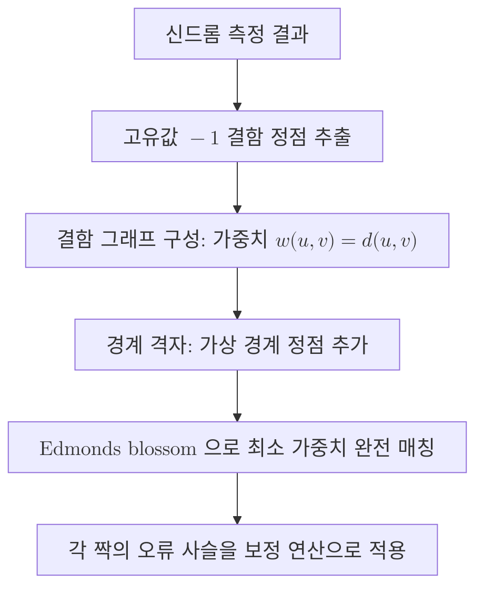

# Minimum-Weight Perfect Matching

> 표면 부호 신드롬에서 고유값 $-1$이 관측된 결함들을 그래프의 정점으로 놓고, 결함들을 쌍으로 짝지을 때 짝짓기 비용의 총합을 최소화하는 짝을 찾아 오류 사슬을 추정하는 복호 방식.

## 핵심

최소 가중치 완전 매칭(MWPM) 복호의 출발점은 [[Surface Code|표면 부호]]에서 단일 오류가 만드는 흔적의 기하학적 성질이다. [[Syndrome Measurement|신드롬 측정]]으로 각 안정자 생성원의 고유값을 읽으면 대부분 $+1$이 나오지만, 오류가 지나간 자리에서는 $-1$이 나타난다. 이렇게 $-1$이 관측된 안정자 위치를 결함(defect) 또는 신드롬 정점이라 부른다. 핵심 관찰은 격자 위에서 단일 비트반전($X$) 오류나 단일 위상반전($Z$) 오류가 항상 결함을 정확히 두 개씩, 즉 오류 사슬의 양 끝점에 만든다는 사실이다. 따라서 여러 오류가 겹쳐 일어나도 점화되는 결함은 언제나 짝수 개이며, 같은 종류의 오류가 만든 결함들은 사슬의 끝점들로서 서로 연결된다.

이 관찰이 복호를 짝짓기 문제로 환원한다. $X$형 오류와 $Z$형 오류를 각각 별도의 격자 위에서 다루면, 복호기는 관측된 결함 집합을 보고 어떤 결함과 어떤 결함이 같은 오류 사슬의 양 끝이었는지를 추정하면 된다. 두 결함 $u$와 $v$를 잇는 가장 그럴듯한 오류 사슬의 길이를 두 정점 사이의 거리 $d(u, v)$로 정의하고, 이를 짝짓기 비용으로 삼는다. 격자에서 이 거리는 보통 두 결함을 잇는 최단 경로(taxicab 거리)로 주어진다. 독립적인 비트반전 확률 $p$가 작을 때 길이 $\ell$의 오류 사슬이 일어날 확률은 대략 $p^{\ell}(1-p)^{\cdots}$에 비례하므로 사슬이 짧을수록 더 그럴듯하다. 결함 전체를 짝지을 때 비용의 총합을 최소화하면, 곧 가장 확률이 높은 오류 형태를 고르는 일이 된다.

$$
\hat{M} = \arg\min_{M \in \mathcal{M}} \sum_{(u, v) \in M} w(u, v),
\qquad w(u, v) = d(u, v)
$$

여기서 $\mathcal{M}$은 결함 정점 집합 위의 모든 완전 매칭(모든 정점이 정확히 한 번 짝지어지는 짝짓기)의 모임이고, 가중치 $w$는 두 결함을 잇는 가장 짧은 오류 사슬의 길이다. 가중치를 음의 로그 가능도 $w(u, v) = -\log p_{uv}$로 두면 비용 최소화가 곧 최대 가능도 추정과 일치한다. 이렇게 고른 매칭 $\hat{M}$의 각 짝에 대응하는 오류 사슬을 모으면 추정 오류가 되고, 그 보정 연산을 가해 신드롬을 지운다.

이 문제를 다항 시간에 정확히 푸는 도구가 에드먼즈 블로섬(Edmonds blossom) 알고리즘이다. 일반 그래프의 최소 가중치 완전 매칭은 이분 그래프가 아니어서 홀수 길이 순환(블로섬)이 증대 경로 탐색을 방해하는데, 에드먼즈는 이 홀수 순환을 하나의 슈퍼 정점으로 수축했다가 다시 펼치는 기법으로 다항 시간 해법을 제시했다. 정점 수 $n$에 대해 대략 $O(n^3)$ 규모로 동작한다. 이 때문에 MWPM 복호기를 블로섬 복호기(Blossom decoder)라고도 부른다.

## 흐름

경계가 있는 격자에서는 한 가지 처리가 더 필요하다. 결함이 홀수 개로 보이거나 오류 사슬의 한쪽 끝이 부호 경계에 닿는 경우, 그 결함은 격자 내부의 다른 결함이 아니라 경계 자체와 짝지어진다. 이를 표현하기 위해 각 경계마다 가상 경계 정점(virtual boundary vertex)을 두고, 실제 결함과 경계 정점 사이의 거리를 가장 가까운 경계까지의 사슬 길이로 정의한다. 경계 정점끼리는 비용 $0$으로 자유롭게 짝지어 두어 매칭이 항상 완전해지도록 만든다. 이렇게 하면 경계로 흘러 나간 오류 사슬도 동일한 짝짓기 틀 안에서 일관되게 다뤄진다.

## 왜 중요한가

MWPM은 표면 부호 복호의 사실상 표준 기준선이다. 임계값(threshold) 근처에서 좋은 정확도를 주며, 독립 오류 모형에서 최대 가능도에 가까운 추정을 다항 시간에 제공한다는 점이 강력하다. 표면 부호가 양자 오류정정의 주류 후보로 자리잡은 데에는 이렇게 효율적이면서도 정확한 복호기가 존재한다는 사실이 큰 몫을 했다. 신드롬 측정으로 뽑아낸 이산적 결함 정보를 그래프 문제로 옮겨, 잘 연구된 고전 조합 최적화 알고리즘으로 처리할 수 있게 한 것이 이 방식의 우아함이다.

한계도 분명하다. $O(n^3)$ 규모의 비용은 [[Code Distance|부호 거리]]가 커져 격자가 넓어질수록, 그리고 결함이 많아질수록 빠르게 무거워진다. 결함 허용 양자 컴퓨팅은 매 신드롬 측정 라운드마다 복호를 마이크로초 단위로 따라잡아야 하는데, 측정 오류까지 반영한 시공간(3차원) 결함 그래프 위에서 블로섬 알고리즘을 실시간으로 돌리는 일은 대규모에서 계산 부담이 된다. 이 때문에 정확도를 약간 양보하는 대신 거의 선형에 가까운 시간으로 동작하는 [[Union-Find Decoder|유니온 파인드 복호기]]가 실시간 복호의 대안으로 부상했다. 유니온 파인드는 결함 주위로 영역을 키워 병합하는 방식으로 매칭을 근사하며, MWPM에 견줄 만한 임계값을 훨씬 낮은 비용으로 달성한다. 결국 MWPM은 정확도의 기준점이자 다른 복호기를 평가하는 잣대로, 유니온 파인드를 비롯한 빠른 복호기는 그 정확도를 가능한 한 보존하면서 실시간성을 확보하려는 시도로 이해할 수 있다.

## 연결

- [[Surface Code]] MWPM이 복호 타겟으로 삼는 위상 부호, 단일 오류가 결함 쌍을 만드는 성질이 짝짓기 환원의 전제
- [[Syndrome Measurement]] 고유값 $-1$ 결함 정점이라는 MWPM의 입력을 생성하는 선행 단계
- [[Decoder]] 신드롬에서 정정 연산을 추정하는 복호기 일반론, MWPM은 그 구체적 한 구현
- [[Union-Find Decoder]] 정확도를 약간 양보하고 거의 선형 시간으로 매칭을 근사하는 빠른 대안 복호기
- [[Code Distance]] 격자 크기와 보호 한계를 정하는 척도, 커질수록 MWPM의 계산 비용이 무거워지는 원인
