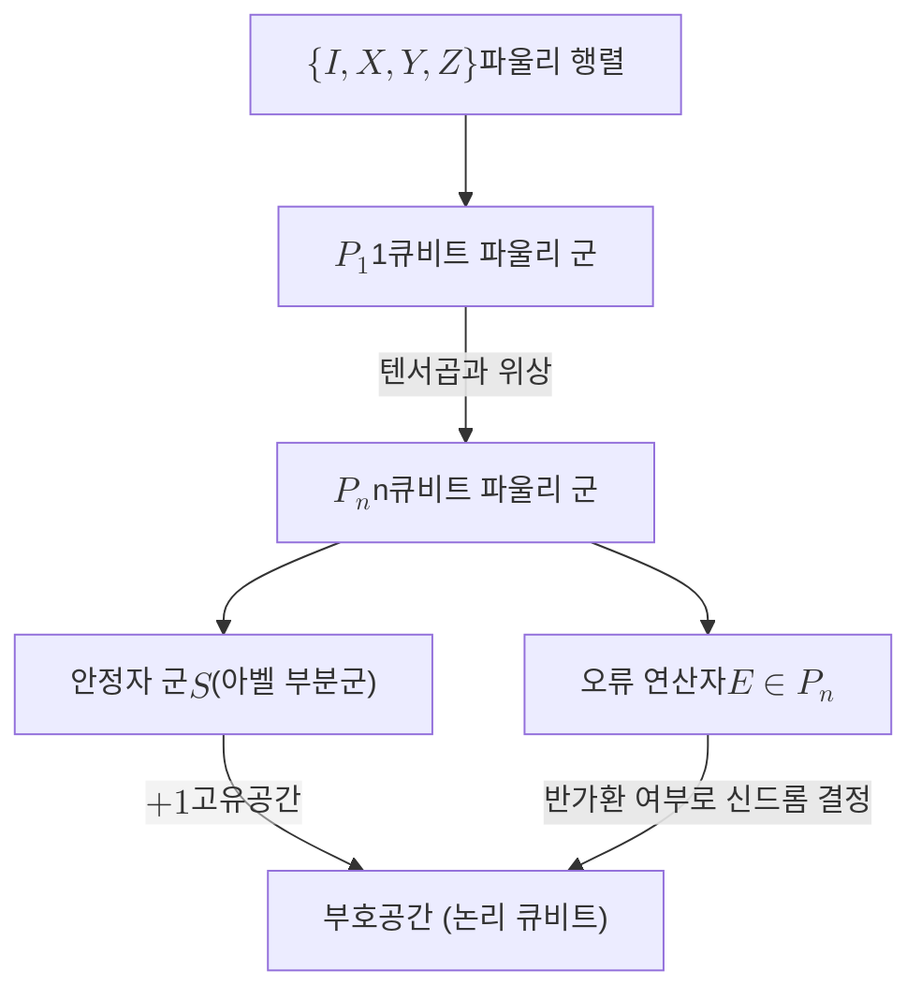

# Pauli Group

> 파울리 군 $\mathcal{P}_n$은 $n$개 큐비트에 작용하는 파울리 연산자들의 텐서곱에 위상 인자를 붙여 군을 이룬 유한군으로, 안정자 형식론에서 부호와 오류를 함께 기술하는 대수적 토대다.

## 핵심
1큐비트 파울리 군 $\mathcal{P}_1$은 [[Pauli Matrices|파울리 행렬]] $\{I, X, Y, Z\}$에 위상 $\{\pm 1, \pm i\}$를 곱한 16개 원소로 이루어진다. 위상까지 포함하는 이유는 곱셈에 대해 닫힌 군을 만들기 위해서다. 예를 들어 $XY = iZ$, $YX = -iZ$처럼 두 파울리의 곱은 다른 파울리에 $\pm i$ 위상이 붙어 나오므로, 위상 인자가 없으면 집합이 곱셈에 대해 닫히지 않는다. 따라서 $\mathcal{P}_1$은 다음 생성원으로 정의된다.

$$ \mathcal{P}_1 = \langle X, Y, Z \rangle = \{\, \alpha\, P : \alpha \in \{\pm 1, \pm i\},\ P \in \{I, X, Y, Z\} \,\} $$

$n$큐비트로 확장하면 파울리 군 $\mathcal{P}_n$은 각 큐비트에 작용하는 파울리 행렬의 텐서곱에 전역 위상 하나를 붙인 집합이 된다.

$$ \mathcal{P}_n = \{\, \alpha\, P_1 \otimes P_2 \otimes \cdots \otimes P_n : \alpha \in \{\pm 1, \pm i\},\ P_j \in \{I, X, Y, Z\} \,\} $$

원소 수는 큐비트마다 $\{I, X, Y, Z\}$ 네 가지 선택이 독립적이므로 $4^n$가지의 텐서곱에 위상 4가지를 곱한 $4 \cdot 4^n$이다.

이 군의 두 가지 핵심 성질이 [[Stabilizer Code|안정자 형식론]] 전체를 떠받친다.

첫째, 모든 원소는 제곱이 $\pm I$다. 위상을 뗀 텐서곱 $P = P_1 \otimes \cdots \otimes P_n$은 각 인자가 $P_j^2 = I$를 만족하므로 $P^2 = I$이고, 위상 $\alpha$가 붙으면 $(\alpha P)^2 = \alpha^2 I = \pm I$가 된다. 이는 파울리 연산자가 에르미트이거나 반에르미트이고 고유값이 $\pm 1$ 또는 $\pm i$로 제한된다는 뜻이며, 안정자 원소를 측정 가능한 관측량으로 다루는 근거가 된다.

둘째, $\mathcal{P}_n$의 임의의 두 원소는 가환이거나 반가환이다. 두 텐서곱 $P, Q$를 큐비트별로 비교하면, 같은 위치에서 두 파울리가 서로 다르고 둘 다 항등이 아닌 자리마다 반가환이 한 번씩 누적된다. 그런 자리의 개수가 짝수면 전체가 가환 $PQ = QP$이고, 홀수면 전체가 반가환 $PQ = -QP$다. 중간값이 없다는 이 깔끔한 이분법이 안정자 군을 모순 없이 정의하고 [[Syndrome Measurement|신드롬 측정]]으로 오류를 분류할 수 있게 만든다.

세 번째로 자주 쓰이는 양은 무게(weight)다. 파울리 원소의 무게는 항등이 아닌 텐서 인자의 개수, 즉 $P_j \neq I$인 큐비트의 수다. 예를 들어 $X \otimes I \otimes Z$의 무게는 2다. 무게는 오류가 실제로 건드리는 큐비트의 개수를 세므로, [[Code Distance|부호 거리]]를 정의할 때 핵심 척도로 쓰인다. 부호 거리는 부호공간을 보존하면서도 논리 상태를 바꾸는 비자명한 파울리 연산자의 최소 무게로 정의된다.

## 구조
파울리 군 안에서 안정자 군과 오류 연산자가 어떻게 자리 잡는지를 그림으로 정리하면 다음과 같다.

안정자 군 $\mathcal{S}$는 $\mathcal{P}_n$의 부분군 중에서 모든 원소가 서로 가환이고 $-I$를 포함하지 않는 아벨 부분군이다. 이 부분군의 공통 $+1$ 고유공간이 부호공간이 되고, 그 안에 논리 큐비트가 부호화된다. 한편 채널에서 발생하는 오류도 임의의 유니터리가 아니라 $\mathcal{P}_n$의 원소 $E$로 모형화한다. 오류 $E$가 안정자 생성원 $g_i$와 가환인지 반가환인지가 신드롬 비트 하나하나를 결정하므로, 가환과 반가환의 이분 구조가 곧 오류 진단의 언어가 된다.

## 왜 중요한가
파울리 군은 양자 오류정정을 다루기 쉬운 대수 문제로 바꾸는 환원의 출발점이다. 일반적인 양자 오류는 연속적인 유니터리 잡음이지만, 파울리 군이 큐비트 연산자 공간의 기저를 이루기 때문에 임의의 단일 큐비트 오류를 $\{I, X, Y, Z\}$의 선형결합으로 전개할 수 있다. [[Syndrome Measurement|신드롬 측정]]이 이 중첩을 특정 파울리 오류로 사영시키므로, 연속 오류를 정정하는 문제가 이산적인 파울리 오류 집합을 정정하는 문제로 환원된다. 이것이 양자 오류정정을 유한한 절차로 만드는 핵심 통찰이다.

또한 파울리 군은 $2^n \times 2^n$ 유니터리 행렬을 일일이 다루는 대신 군 원소의 가환 관계만으로 상태와 연산을 추적하게 해 준다. 이 효율은 [[Clifford Group|클리퍼드 군]]과 결합할 때 더욱 분명해진다. 클리퍼드 군은 켤레변환으로 $\mathcal{P}_n$을 자기 자신으로 보내는 유니터리들의 군이고, 그 정규화자 구조 덕분에 안정자 회로는 고전 컴퓨터로 효율적으로 시뮬레이션된다(고테스만-크닐 정리). 안정자 부호의 부호화, 신드롬 추출, 논리 연산이 모두 이 틀 안에서 기술되므로, 파울리 군은 표면 부호를 비롯한 거의 모든 실용적 [[Quantum Error Correction|양자 오류정정]] 구성의 공통 언어다.

## 연결
- [[Pauli Matrices]] 파울리 군의 생성 재료가 되는 1큐비트 기본 행렬. 텐서곱과 위상으로 군을 이루는 출발점
- [[Stabilizer Code]] 파울리 군의 아벨 부분군인 안정자로 부호공간을 정의하는 형식론. 이 노트의 직접적 응용처
- [[Clifford Group]] 켤레변환으로 파울리 군을 보존하는 유니터리 군. 파울리 군의 정규화자이자 안정자 회로의 게이트 집합
- [[Code Distance]] 부호공간을 보존하는 비자명 파울리 연산자의 최소 무게로 정의되는 거리. 파울리 무게 개념의 직접적 쓰임
- [[Syndrome Measurement]] 오류와 안정자 생성원의 가환 또는 반가환 관계를 측정해 신드롬을 얻는 절차
- [[Quantum Error Correction]] 파울리 군이 공통 언어를 제공하는 상위 이론. 연속 오류를 이산 파울리 오류로 환원하는 토대
