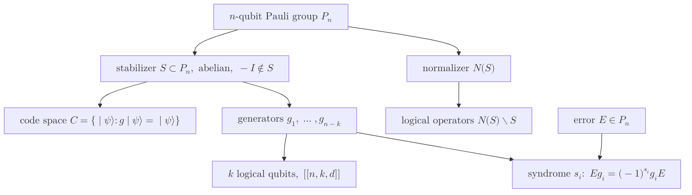

# Stabilizer Code

> $n$큐비트 파울리 군의 아벨 부분군 $S$가 규정하는 양자 오류정정 부호로, 부호공간을 $S$의 모든 생성원이 고정하는 $+1$ 동시 고유공간으로 정의해 상태를 직접 추적하지 않고 연산자만으로 부호를 다룬다.

## 핵심

안정자 부호는 부호공간을 상태 벡터의 명시적 목록이 아니라 그것을 불변으로 두는 연산자 집합으로 기술한다. 출발점은 $n$큐비트 [[Pauli Group]] $\mathcal{P}_n$이며, 안정자 군 $S$는 그 부분군으로서 두 조건을 만족한다. 첫째 $S$는 아벨 군이어서 임의의 두 원소가 교환한다. 둘째 $-I \notin S$이어서 자명하지 않은 동시 고유공간이 존재한다. 이때 부호공간은 $S$의 모든 원소가 고유값 $+1$로 고정하는 상태들의 집합으로 정의된다.

$$
C = \{\, \lvert \psi \rangle : g\lvert \psi \rangle = \lvert \psi \rangle,\ \forall g \in S \,\}
$$

$S$가 독립적인 생성원 $g_1, \dots, g_{n-k}$로 생성되면 각 생성원이 힐베르트 공간을 절반으로 가르므로 부호공간의 차원은 $2^{n-k}$가 되고, 따라서 $k$개의 [[Logical Qubit]]를 부호화한다. 정정 가능한 오류의 무게를 규정하는 [[Code Distance]] $d$를 함께 적어 부호를 $[[n,k,d]]$로 표기한다.

오류 검출의 메커니즘은 파울리 연산자 사이의 교환 관계에 있다. 두 파울리 연산자는 항상 교환하거나 반교환하므로, 오류 $E \in \mathcal{P}_n$와 각 생성원 $g_i$의 관계는 부호 $s_i \in \{0, 1\}$로 깔끔하게 압축된다.

$$
E g_i = (-1)^{s_i}\, g_i E
$$

$E$가 어떤 $g_i$와 반교환하면($s_i = 1$) 손상된 상태 $E\lvert \psi \rangle$는 그 생성원의 고유값을 $-1$로 뒤집으므로, $g_i$를 측정하면 $-1$이 관측되어 오류가 드러난다. 모든 생성원에 대한 부호 패턴 $\mathbf{s} = (s_1, \dots, s_{n-k})$이 곧 신드롬이며, [[Syndrome Measurement]]는 부호화된 정보 자체를 읽지 않은 채 이 패턴만 추출한다. 측정이 상태를 붕괴시키지 않는 이유는 생성원들이 서로 교환할 뿐 아니라 논리 정보를 담은 연산자와도 교환하도록 군이 짜여 있기 때문이다. 안정자가 모두 [[Pauli Matrices]]의 텐서곱으로 구성되고 생성원이 서로 교환한다는 사실이 이 비파괴 측정을 가능하게 한다.

논리 연산자는 부호공간을 보존하면서 그 안의 상태를 비자명하게 변환하는 연산자다. 이는 $S$의 정규화 부분군 $N(S) = \{\, P \in \mathcal{P}_n : P S P^{\dagger} = S \,\}$ 가운데 $S$ 자신을 제외한 잉여류, 즉 $N(S) \setminus S$의 원소에서 나온다. $N(S)$에 속한 연산자는 모든 안정자와 교환하므로 부호공간을 밖으로 내보내지 않으며, 그중 $S$에 없는 원소는 부호공간 안에서 논리 큐비트에 비자명하게 작용한다. 이 구조 덕분에 논리 게이트의 설계가 군론적 조작으로 환원되고, 특히 [[Clifford Group]] 연산은 안정자 생성원을 다른 안정자로 옮기는 정규화 사상이어서 효율적으로 추적된다.

## 구조

## 왜 중요한가

안정자 형식론은 양자 오류정정을 다루기 어려운 상태 벡터 추적에서 군론과 선형대수의 문제로 바꾸어 놓았다. 부호 하나를 정의하고 분석하는 데 지수 크기의 상태가 아니라 $n-k$개의 생성원만 다루면 충분하므로, 부호 설계, 신드롬 해석, 논리 연산자 식별이 모두 다루기 쉬운 대수 조작이 된다. 정정 능력의 판정 또한 [[Knill-Laflamme Conditions]]을 안정자 언어로 재서술해 오류 집합과 $N(S) \setminus S$의 무게 관계로 간결하게 표현된다.

실용적 의의는 오늘날 사용되는 거의 모든 부호가 이 틀에 들어온다는 점이다. 첫 양자 부호인 Shor 부호, CSS 구조의 대표인 Steane 부호, 격자 위 위상 부호인 [[Surface Code]]가 모두 안정자 부호의 특수 사례이며, 변수 노드와 검사 노드의 희소 구조를 안정자에 부여한 [[LDPC Codes]] 또한 같은 형식론에 속한다. 따라서 안정자 형식론은 개별 부호를 넘어 [[Quantum Error Correction]] 전반을 서술하는 공통 언어로 기능한다. 더불어 이 형식론은 Gottesman-Knill 정리를 통해 클리퍼드 회로가 고전 컴퓨터로 효율적으로 시뮬레이션됨을 보이는 토대가 되어, 양자 우월성이 어디에서 비롯되는지를 가르는 경계선을 그리는 데도 쓰인다.

## 연결

- [[Pauli Group]] 안정자 군이 그 안의 아벨 부분군으로 정의되는 모군
- [[Clifford Group]] 안정자 생성원을 다른 안정자로 옮기는 정규화 사상으로 논리 클리퍼드 연산을 효율 추적
- [[Logical Qubit]] 생성원이 $n-k$개일 때 부호공간이 부호화하는 $k$개의 논리 단위
- [[Syndrome Measurement]] 생성원과의 교환 패턴을 비파괴로 추출해 오류를 검출하는 절차
- [[Code Distance]] 정정 가능한 오류 무게를 규정하는 $[[n,k,d]]$의 $d$
- [[Knill-Laflamme Conditions]] 안정자 언어로 재서술되는 오류정정 가능성의 일반 판정 기준
- [[Surface Code]] 위상 격자 위에 정의된 안정자 부호의 대표 사례
- [[Pauli Matrices]] 모든 안정자 생성원을 이루는 단일 큐비트 텐서곱 성분
- [[Quantum Error Correction]] 안정자 형식론이 공통 언어로 봉사하는 상위 분야
- [[LDPC Codes]] 희소 검사 구조를 안정자에 부여한 부호족으로 안정자 부호의 한 갈래
