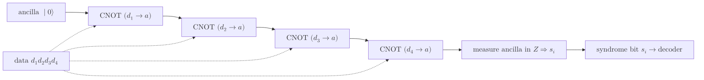

# Syndrome Measurement

> 부호화된 정보를 직접 읽어 붕괴시키지 않고 안정자 생성원만을 측정해, 일어난 오류의 흔적인 신드롬 비트열을 얻어 내는 양자 오류정정의 핵심 절차.

## 핵심

신드롬 측정의 출발점은 모순처럼 보이는 요구다. 오류가 일어났는지는 알아내야 하지만, 동시에 [[Quantum Measurement]]의 사영 효과로 논리 정보가 담긴 중첩과 얽힘을 붕괴시켜서는 안 된다. 안정자 형식론은 이 둘을 분리하는 방법을 제공한다. 데이터 큐비트의 상태 $\lvert \psi \rangle$를 직접 관측하는 대신, [[Stabilizer Code|안정자 부호]]의 생성원 $g_1, \dots, g_{n-k}$를 관측 가능량으로 삼아 그 고유값만을 읽는다. 부호공간의 모든 상태는 정의상 모든 생성원의 $+1$ 고유공간에 놓이므로, 오류가 없을 때 생성원 측정은 항상 $+1$을 돌려주며 상태를 전혀 건드리지 않는다.

오류가 검출되는 원리는 [[Pauli Group|파울리 군]] 원소 사이의 교환 관계에 있다. 두 파울리 연산자는 언제나 교환하거나 반교환하므로, 오류 $E \in \mathcal{P}_n$와 각 생성원 $g_i$의 관계는 단일 비트로 압축된다.

$$
E\, g_i = (-1)^{s_i}\, g_i\, E,\qquad s_i \in \{0, 1\}
$$

여기서 $s_i = 0$이면 $E$가 $g_i$와 가환이고, $s_i = 1$이면 반가환이다. 손상된 상태 $E\lvert \psi \rangle$에 $g_i$를 작용시키면 다음이 성립한다.

$$
g_i\,(E\lvert \psi \rangle) = (-1)^{s_i}\, E\, g_i \lvert \psi \rangle = (-1)^{s_i}\, E\lvert \psi \rangle
$$

즉 손상된 상태는 여전히 $g_i$의 고유상태이되 고유값이 $(-1)^{s_i}$로 바뀐다. 따라서 $g_i$를 측정해 $+1$을 얻으면 $s_i = 0$, $-1$을 얻으면 $s_i = 1$로 기록되고, 모든 생성원에 대한 결과를 모은 비트열 $\mathbf{s} = (s_1, \dots, s_{n-k})$가 곧 신드롬이다. 결정적으로 이 측정은 $E\lvert \psi \rangle$가 이미 생성원의 고유상태라는 사실에 기대므로, 고유값을 확정할 뿐 부호공간 안의 중첩을 무너뜨리지 않는다. 이것이 신드롬 측정을 비파괴 측정으로 만드는 본질이다.

신드롬이 알려 주는 것은 어떤 오류가 일어났는지가 아니라 오류가 속한 후보 부류뿐이라는 점도 중요하다. $n-k$비트의 신드롬은 $2^{n-k}$가지를 구별할 뿐이어서, 서로 다른 여러 오류가 동일한 신드롬을 남길 수 있다. 무게가 작은 오류가 더 그럴듯하다는 가정 아래 신드롬으로부터 실제 오류를 추정하고 정정 연산을 고르는 일은 [[Decoder|복호기]]의 몫이며, 신드롬 측정은 복호기에 넘길 입력을 만들어 내는 단계에 해당한다.

## 구조

생성원을 직접 측정하기는 어려우므로, 실제로는 측정 보조(ancilla) 큐비트를 데이터 큐비트와 얽은 뒤 보조만 측정한다. 가장 단순한 형태는 보조를 $\lvert 0 \rangle$로 준비하고, 생성원이 작용하는 각 데이터 큐비트와 [[CNOT Gate|CNOT]] 또는 통제 파울리 게이트로 얽은 다음 계산 기저로 보조를 읽는 회로다. 아래는 무게 4의 $Z$형 생성원 $g = Z_1 Z_2 Z_3 Z_4$를 추출하는 회로의 흐름이다.

보조 큐비트는 네 데이터 큐비트의 $Z$ 패리티를 한데 모으며, 최종 측정값이 그 패리티의 짝홀에 따라 $s_i$를 준다. $X$형 생성원을 측정할 때는 보조를 $\lvert + \rangle$로 준비하고 통제 방향을 바꾸거나 아다마르를 끼워 같은 원리를 적용한다. 측정 후 보조 큐비트는 버리거나 재초기화하므로 데이터에는 패리티 정보만 남고 개별 큐비트의 상태는 노출되지 않는다.

## 왜 중요한가

신드롬 측정은 양자 오류정정이 작동하기 위한 전제다. 정정하려면 먼저 무엇이 잘못되었는지 알아야 하지만, 순진하게 데이터를 읽으면 보호하려던 논리 정보가 그 즉시 파괴된다. 안정자 생성원만 비파괴로 측정한다는 발상이 이 딜레마를 풀어, 논리 상태를 온전히 둔 채 오류의 디지털 지문만 뽑아내도록 한다. 이 덕분에 연속적인 양자 오류조차 신드롬이라는 이산적인 비트열로 환원되어, 고전적 복호 알고리즘으로 처리할 수 있게 된다.

실제 하드웨어에서는 측정 회로 자체와 보조 큐비트도 오류를 일으킨다. 단발 측정으로 얻은 신드롬은 데이터 오류와 측정 오류를 구별하지 못하므로, 내결함성을 확보하려면 같은 생성원을 여러 라운드에 걸쳐 반복 측정하고 시간 축으로 누적된 신드롬 변화를 함께 복호한다. [[Surface Code|표면 부호]]의 시공간 복호가 바로 이 반복 신드롬 측정 기록 위에서 동작하며, 측정의 신뢰성과 빈도가 [[Code Distance|부호 거리]]가 약속하는 보호 한계를 실제로 달성할 수 있는지를 좌우한다. 따라서 신드롬 측정은 부호의 정의와 복호기 사이를 잇는 다리이자, 결함 허용 양자 컴퓨팅의 반복되는 심장 박동에 해당한다.

## 연결

- [[Stabilizer Code]] 측정 대상이 되는 생성원을 규정하는 부호 정의, 신드롬 측정이 그 위에서 동작
- [[Pauli Group]] 오류와 생성원의 교환 또는 반교환 관계가 신드롬 비트를 결정하는 대수적 토대
- [[Quantum Measurement]] 사영 측정의 일반 원리를 생성원에 적용해 비파괴 관측을 실현
- [[CNOT Gate]] 보조 큐비트와 데이터 큐비트를 얽어 패리티를 추출하는 추출 회로의 기본 게이트
- [[Decoder]] 추출된 신드롬을 입력으로 받아 실제 오류와 정정 연산을 추정하는 후속 단계
- [[Surface Code]] 반복 신드롬 측정과 시공간 복호로 결함 허용을 달성하는 대표 부호
- [[Code Distance]] 반복 측정의 신뢰성이 실제로 도달할 수 있게 만드는 보호 한계의 척도
