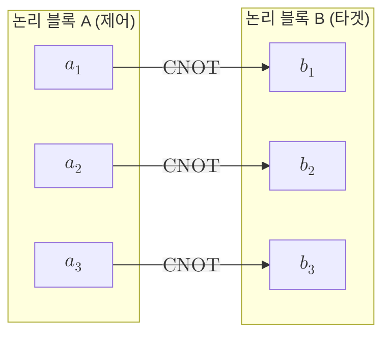

# Transversal Gate

> 하나의 논리 연산을 부호 블록 안 큐비트마다 물리 게이트를 따로 적용해 구현하되 같은 블록의 큐비트들끼리는 절대 상호작용시키지 않는 방식이다.

## 핵심

횡단 게이트는 [[Logical Qubit|논리 큐비트]] 하나에 가하는 연산을 부호 블록을 이루는 물리 큐비트 각각에 대한 독립적인 물리 게이트의 모음으로 분해한다. 핵심 제약은 게이트가 같은 블록 안의 서로 다른 데이터 큐비트를 묶지 않는다는 점이다. 단일 큐비트 논리 게이트라면 블록의 $n$개 큐비트마다 동일한 물리 게이트 $U$를 따로 거는 형태가 된다.

$$ \bar{U} = U^{\otimes n} = U_1 \otimes U_2 \otimes \cdots \otimes U_n $$

두 논리 큐비트 사이의 게이트도 마찬가지로 정의된다. 첫 블록의 $i$번째 큐비트와 둘째 블록의 $i$번째 큐비트만 짝지어 물리 두 큐비트 게이트를 걸고, 서로 다른 짝끼리는 연결하지 않는다. 예를 들어 두 블록 사이의 논리 CNOT은 같은 위치의 물리 큐비트 쌍마다 물리 CNOT을 거는 방식으로 구현된다.

$$ \overline{\mathrm{CNOT}} = \prod_{i=1}^{n} \mathrm{CNOT}_{a_i \to b_i} $$

여기서 $a_i$는 제어 블록의 $i$번째 큐비트, $b_i$는 타겟 블록의 $i$번째 큐비트다. 어느 경우든 한 블록 내부의 큐비트들은 서로 만나지 않으며, 게이트는 블록을 가로질러 같은 자리의 큐비트끼리만 작동한다. 이 구조가 곧 "횡단"이라는 이름의 뜻이다.

## 구조

블록 내부에서는 게이트가 큐비트를 묶지 않고 블록 사이에서만 같은 위치끼리 짝지어 작동하는 모습을 보이면 다음과 같다.

## 왜 중요한가

횡단 구현이 결함 허용적인 까닭은 오류가 번지는 경로를 구조적으로 차단하기 때문이다. 물리 게이트가 한 큐비트에서 결함을 일으켜도, 그 게이트는 같은 블록의 다른 데이터 큐비트와 닿지 않으므로 결함이 블록 안에서 이웃으로 확산되지 못한다. 블록당 결함이 하나로 묶이면 부호의 [[Code Distance|부호 거리]]가 감당하는 범위 안에 머물고, 이후 [[Syndrome Measurement|신드롬 측정]]과 정정으로 회복된다. 이렇게 한 결함이 한 블록의 한 자리에만 영향을 남기는 성질이 [[Fault-Tolerant Quantum Computation|결함 허용 양자 계산]]이 요구하는 오류 비확산의 가장 단순하고 강력한 실현이다.

많은 [[Stabilizer Code|안정자 부호]], 특히 CSS 부호에서는 [[Clifford Group|클리퍼드 게이트]]의 일부가 자연스럽게 횡단으로 구현된다. 예컨대 Steane 부호에서 논리 $\bar{X}$, $\bar{Z}$, $\bar{H}$, 그리고 두 블록 사이의 논리 CNOT이 모두 물리 게이트를 큐비트마다 거는 횡단 형태로 얻어진다. 이는 클리퍼드 연산이 [[Pauli Group|파울리 군]]을 켤레변환으로 보존한다는 성질과 CSS 구조가 잘 맞물린 결과다.

그러나 횡단성만으로 보편 양자 계산을 완성할 수는 없다. [[Eastin-Knill Theorem|아이스틴-닐 정리]]는 비자명한 국소 오류를 검출하는 어떤 부호도 보편 게이트 집합 전체를 횡단 게이트로 구현할 수 없음을 증명한다. 직관적으로 횡단 게이트 전체는 이산적인 유한군을 이루는 데 그쳐서, 연속적인 회전을 임의 정밀도로 근사하는 보편성을 채우지 못한다. 따라서 어떤 부호를 고르더라도 보편성에 필요한 마지막 조각, 보통 비클리퍼드 게이트인 $T = \mathrm{diag}(1, e^{i\pi/4})$에 해당하는 연산은 횡단으로 얻을 수 없다. 이 간극을 메우는 표준 수단이 [[Magic State Distillation|마법 상태 증류]]다. 잡음 섞인 마법 상태를 정제해 고품질로 만든 뒤 게이트 순간이동으로 주입하면, 횡단 클리퍼드 골격 위에 비횡단 자원으로 보편성을 채울 수 있다. 정리하면 횡단 게이트는 결함 허용 계산의 값싸고 안전한 기본 골격이지만, 그 골격만으로는 보편성에 닿지 못하며 마법 상태 같은 외부 자원이 반드시 보태져야 한다.

## 연결
- [[Fault-Tolerant Quantum Computation]] 블록 내 오류 비확산이라는 결함 허용성의 핵심 요건을 횡단 구조가 가장 단순하게 만족시킨다
- [[Stabilizer Code]] 횡단 게이트가 논리 연산으로 작동하는 부호 형식론의 토대이며 특히 CSS 부호에서 잘 맞물린다
- [[Clifford Group]] 많은 CSS 부호에서 클리퍼드 게이트 일부가 횡단으로 구현되어 결함 허용 골격을 이룬다
- [[Magic State Distillation]] 횡단으로 얻을 수 없는 비클리퍼드 게이트를 주입해 보편성을 채우는 비횡단 자원
- [[Logical Qubit]] 횡단 게이트가 작용하는 대상으로 부호 블록이 인코딩하는 단위
- [[Eastin-Knill Theorem]] 어떤 부호도 보편 게이트 집합 전체를 횡단으로 제공할 수 없음을 규정하는 근본 한계
- [[Code Distance]] 한 블록에 묶인 단일 결함이 정정 가능 범위 안에 머무는지를 정하는 척도
