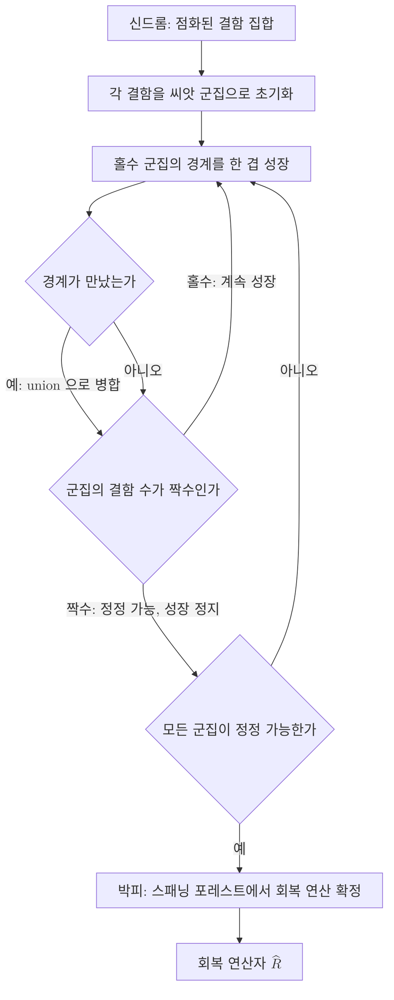

# Union-Find Decoder

> 점화된 결함 주위로 군집(cluster)을 키우다가 군집이 짝수 개의 결함을 품어 정정 가능해지는 순간 그 안에서 회복 연산을 확정하는, 서로소 집합 자료구조로 구동되는 거의 선형 시간 복호기.

## 핵심

유니온-파인드 복호기는 [[Syndrome Measurement|신드롬 측정]]이 내놓은 결함 점화 패턴을 받아, 그 결함들을 짝지어 없앨 오류 사슬을 추정하는 [[Decoder|복호기]]다. 핵심 발상은 정확한 짝짓기를 처음부터 계산하는 대신, 결함을 둘러싼 영역을 조금씩 키워 정정이 가능한 단위로 묶고 그 단위 안에서 국소적으로 회복을 정하는 데 있다. [[Surface Code|표면 부호]]의 복호 그래프에서 점화된 안정자 정점을 결함이라 부르며, 복호기의 목표는 이 결함 집합을 모두 상쇄하는 오류 추정을 고르는 것이다.

알고리즘은 두 단계로 나뉜다. 첫 단계인 군집 성장에서는 점화된 각 결함을 씨앗으로 삼아 군집을 만들고, 군집의 경계를 한 겹씩 바깥으로 확장한다. 두 군집의 경계가 만나면 즉시 하나로 [[Disjoint-Set Union|병합]]한다. 군집이 짝수 개의 결함을 포함하면 그 군집은 내부만으로 모든 결함을 짝지어 없앨 수 있으므로 정정 가능(even cluster)으로 표시하고 성장을 멈춘다. 홀수 개의 결함을 가진 군집만 계속 자라며, 모든 군집이 정정 가능해질 때까지 이 과정을 반복한다. 둘째 단계인 박피(peeling)에서는 각 군집이 덮은 영역에서 스패닝 포레스트를 만든 뒤 잎에서 안쪽으로 훑어 내려가며 실제 회복 연산을 선형 시간에 확정한다.

군집의 성장과 병합을 효율적으로 만드는 장치가 바로 서로소 집합(disjoint set) 자료구조다. 각 군집은 하나의 집합으로 표현되고, 두 군집의 병합은 union 연산, 어떤 정점이 속한 군집의 대표를 찾는 일은 find 연산에 대응한다. 경로 압축과 랭크 기준 병합을 함께 쓰면 한 연산의 분할 상환 비용이 역아커만 함수 $\alpha(n)$에 비례하며, 이 함수는 현실의 모든 $n$에서 사실상 상수다. 결함과 정점의 개수가 $n$일 때 전체 복호의 시간 복잡도는 다음과 같이 거의 선형이 된다.

$$
T(n) = O\!\left(n\,\alpha(n)\right)
$$

여기서 $\alpha(n)$이 극도로 느리게 증가하므로 실용적으로는 $O(n)$에 근접한다. 이 점이 정확한 짝짓기를 푸는 [[Minimum-Weight Perfect Matching|최소 무게 완전 매칭]]과 본질적으로 갈리는 지점이다. 최소 무게 완전 매칭은 모든 결함 쌍 사이의 최단 거리를 고려해 전역 최적해를 찾으므로 정확도는 높지만, 일반적인 구현의 비용이 결함 개수에 대해 다항식 차수로 늘어난다. 유니온-파인드는 전역 최적 대신 국소적으로 자란 군집 안의 짝짓기로 근사하여, 약간의 정확도를 내주는 대신 압도적인 속도를 얻는다.

## 흐름

## 왜 중요한가

표면 부호로 결함 허용 양자 컴퓨팅을 실현하려면 복호기가 실시간 제약을 견뎌야 한다. [[Surface Code|표면 부호]]는 수 마이크로초 단위의 짧은 주기로 [[Syndrome Measurement|신드롬]]을 거듭 측정하므로, 측정 라운드가 쌓이는 속도보다 복호가 느리면 처리할 신드롬이 무한정 밀려나는 역추적 문제(backlog problem)가 생긴다. [[Decoder|복호기]]에 요구되는 처리량은 곧 부호 거리와 큐비트 수에 따라 가파르게 커지므로, 정확하지만 느린 방법만으로는 대규모 부호의 실시간 복호를 감당하기 어렵다.

유니온-파인드 복호기는 이 처리량 병목을 푸는 가장 실용적인 후보 가운데 하나다. 거의 선형 시간이라는 복잡도는 부호가 커져도 복호 비용이 다루기 쉬운 속도로만 증가함을 뜻하고, 알고리즘의 국소성과 단순한 자료구조 덕분에 FPGA나 ASIC 같은 전용 하드웨어로 옮겨 병렬화하기에도 유리하다. 정확도를 약간 양보하는 트레이드오프가 있지만, 임계 오류율의 손실이 크지 않다고 보고되어 많은 경우 속도 이득이 그 손실을 상쇄한다. 결과적으로 유니온-파인드는 정확도의 [[Minimum-Weight Perfect Matching|최소 무게 완전 매칭]]과 속도의 실시간 복호 사이에서 균형점을 제시하며, 표면 부호를 실제 장치에서 굴리기 위한 복호 계층의 핵심 선택지로 자리 잡았다.

## 연결

- [[Decoder]] 신드롬을 회복 연산으로 옮기는 일반 복호기 문제, 유니온-파인드는 그 한 구현이자 처리량 제약에 대한 응답
- [[Minimum-Weight Perfect Matching]] 더 정확하지만 느린 짝짓기 기반 복호기, 정확도와 속도의 트레이드오프에서 비교 기준
- [[Surface Code]] 유니온-파인드가 주로 적용되는 위상 부호이자 실시간 복호 요구가 발생하는 무대
- [[Syndrome Measurement]] 군집 성장의 입력이 되는 결함 점화 패턴을 만들어 내는 선행 단계
- [[Disjoint-Set Union]] 군집의 병합과 대표 탐색을 거의 상수 시간에 처리해 거의 선형 복잡도를 떠받치는 자료구조
