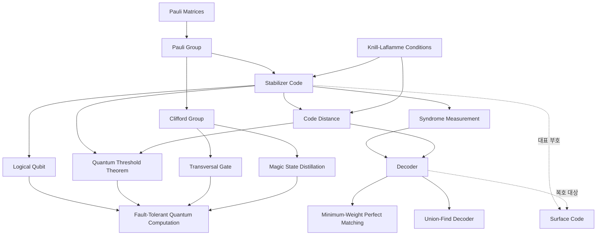

# 양자 오류정정 문서화

> 양자 오류정정의 안정자 형식론, 복호기, 내결함성 계층을 원자적 개념 노트들로 분해해 문서화하는 프로젝트 허브다.

## 개요
[[MOC - Quantum Error Correction|양자 오류정정 MOC]]는 부호화의 일반 이론과 대표 부호까지 진입점을 제공하지만, 그 사이를 잇는 안정자 형식론의 핵심 개념과 신드롬을 해석하는 복호 절차, 그리고 논리 큐비트를 실제 계산으로 끌어올리는 내결함성 계층이 아직 빈칸으로 남아 있다. 실제로 [[Surface Code]] 노트는 [[Stabilizer Code]], [[Logical Qubit]], [[복호 알고리즘]] 같은 선링크를 이미 걸어 두었으나 대상 노트가 없어 고리가 끊겨 있다. 이 프로젝트는 그 빈칸을 메우는 것을 타겟으로 삼는다.

작업 결과물인 개념 노트는 진행 중에는 `Drafts/`에서 초안으로 다듬고, evergreen에 가까워지면 `3 - Resources/Quantum-Error-Correction/`로 추출한다. 핵심 논문을 graphify로 변환한 다이제스트와 출처 발췌는 `Research/`에 fleeting 노트로 둔다. 모든 노트는 [[MOC - Quantum Error Correction]]에 매달아 고아 노트를 만들지 않는다.

- 목표: 안정자 형식론, 복호기, 내결함성 세 계층의 누락 개념을 원자적 노트 14개로 완성한다.
- 범위: 안정자 부호와 그 구성 요소, 신드롬에서 오류를 추정하는 복호기, 임계값 정리와 내결함성 게이트 자원.
- 비범위: Shor 부호와 Steane 부호 같은 구체적 부호 사례 묶음은 후속 프로젝트로 분리한다. 양자 LDPC 심화도 [[LDPC Codes]] 확장 작업으로 따로 둔다.
- 마감: 미정.

## 산출물 (계획 노트)
각 항목은 단일 개념 노트 하나로 작성한다. 선링크로 작성 지점을 미리 남겨 둔다.

### 안정자 형식론 코어
- [x] [[Stabilizer Code]] 파울리 부분군의 +1 고유공간으로 부호공간을 정의하는 일반 틀
- [x] [[Pauli Group]] 안정자와 오류를 모두 담는 파울리 연산자들의 군
- [x] [[Clifford Group]] 파울리 군을 보존하는 유니터리 군과 안정자 상태 조작
- [x] [[Logical Qubit]] 다수 물리 큐비트에 부호화된 추상 큐비트와 논리 연산자
- [x] [[Syndrome Measurement]] 정보를 붕괴시키지 않고 안정자만 측정해 오류 흔적을 얻는 절차
- [x] [[Code Distance]] 논리 연산자의 최소 무게로 정의되는 오류정정 능력 척도
- [x] [[Knill-Laflamme Conditions]] 오류 집합을 정정 가능하게 하는 필요충분조건

### 복호기
- [x] [[Decoder]] 신드롬에서 가장 그럴듯한 오류와 회복 연산을 추정하는 고전 알고리즘
- [x] [[Minimum-Weight Perfect Matching]] 결함을 그래프로 짝지어 오류 사슬을 찾는 표준 복호기
- [x] [[Union-Find Decoder]] 거의 선형 시간으로 동작해 실시간 복호에 맞는 군집 성장 복호기

### 내결함성 계층
- [x] [[Quantum Threshold Theorem]] 임계값 아래에서 임의 길이 계산을 가능케 하는 정리
- [x] [[Fault-Tolerant Quantum Computation]] 오류가 연쇄 증식하지 않도록 논리 큐비트 위에서 계산하는 틀
- [x] [[Transversal Gate]] 블록별 독립 적용으로 단일 결함의 확산을 막는 논리 게이트
- [x] [[Magic State Distillation]] 잡음 섞인 비클리퍼드 자원 상태를 정제해 보편 계산을 여는 기법

### 기반 의존 (기존 노트, 링크만 사용)
- [[Quantum Error Correction]] 중복 부호화로 논리 큐비트를 보호하는 일반 이론
- [[Surface Code]] 이 프로젝트의 개념들이 한데 결합되는 대표 안정자 부호
- [[Pauli Matrices]] 안정자와 오류 연산자를 구성하는 기본 행렬
- [[No-Cloning Theorem]] 고전식 복사를 막아 오류정정 접근을 다르게 만드는 한계
- [[Quantum Decoherence]] 오류정정이 맞서는 잡음의 근원
- [[Hadamard Gate]], [[CNOT Gate]] 클리퍼드 군과 신드롬 추출 회로를 이루는 기본 게이트
- [[Quantum Measurement]] 신드롬 측정과 닐-라플람 조건의 바탕

## 의존 구조


## 작성 규칙 (일관성 게이트)
이 프로젝트의 모든 산출 노트는 다음을 지켜 일관성을 유지한다.

- 유형: 모두 `type: concept`. 한 노트 한 개념(원자성).
- 도메인: `domain: quantum-error-correction`로 통일한다.
- 태그: 안정자 계열은 `qec/stabilizer`, 표면 부호 복호는 `qec/surface-code`를 기본에 두고 교차 개념은 `concept/*`로 단다.
- 상위: `up: "[[MOC - Quantum Error Correction]]"`로 매단다.
- 본문: 한 문장 정의로 시작하고 핵심, 왜 중요한가, 연결 순서로 쓴다. 수식은 LaTeX, 도식은 Mermaid.
- 기호: em dash와 가운뎃점과 화살표 기호를 본문에 쓰지 않는다. 흐름이 필요하면 Mermaid로 옮긴다.
- 배치: 완성 노트는 `3 - Resources/Quantum-Error-Correction/`로 옮긴다. 프로젝트 폴더에는 초안만 둔다.
- 작성은 `vault-concept-author`에 위임하고, 핵심 논문은 `vault-paper-grapher`로 그래프화해 `Research/`에 근거를 남긴다.

## 연구 근거 (Research)
핵심 1차 논문 3편을 graphify 지식 그래프로 변환해 `Research/`에 다이제스트를 남겼다. 세 계층의 근거를 각각 뒷받침한다.

- [[@Gottesman1997 - Stabilizer Codes 다이제스트]] 안정자 형식론 코어의 정의 네 축(아벨 부분군, +1 고유공간, $[[n,k,d]]$, $N(S)/S$ 논리 연산자). 그래프 102노드
- [[@DennisKitaev2002 - Topological Quantum Memory 다이제스트]] 복호기 계층의 결함 짝짓기와 임계값을 랜덤 본드 이징 모형 상전이로 사상. 그래프 43노드
- [[@BravyiKitaev2005 - Magic States 다이제스트]] 내결함성 계층의 마법 상태 주입과 증류 가능 영역 경계. 그래프 39노드

그래프 원본은 `_Meta/graphify/`의 `qec-stabilizer-gottesman`, `qec-topological-memory`, `qec-magic-states`에 있다.

## 진행 현황
산출물 14개 모두 초안 집필을 마쳤다(`Drafts/`). evergreen에 가까워지면 `3 - Resources/Quantum-Error-Correction/`로 추출하며, 추출된 노트는 아래 Dataview로 자동 집계된다.

```dataview
TABLE status, confidence, updated FROM "3 - Resources/Quantum-Error-Correction"
WHERE type = "concept" SORT updated DESC
```

## 연결
- [[MOC - Quantum Error Correction]] 이 프로젝트 결과물이 매달리는 도메인 지도
- [[Quantum Error Correction]] 프로젝트가 구체화하는 부호화 일반 이론
- [[Surface Code]] 안정자, 신드롬, 복호, 거리 개념이 한데 결합되는 대표 사례
- [[No-Cloning Theorem]] 고전식 중복화를 막아 양자 오류정정을 다르게 만드는 근본 한계
