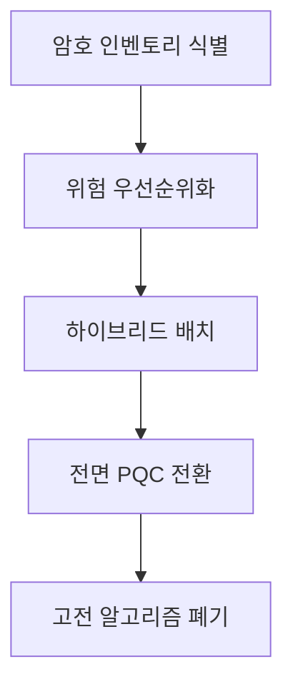

# PQC 전이 감시

> 양자 내성 암호로의 전이를 지속적으로 책임지고 관리하는 영역. 표준 동향, 알고리즘 선택, 하이브리드 배치, 암호 인벤토리, 암호 민첩성을 일정 수준 이상으로 유지한다.

이 영역은 마감이 있는 프로젝트가 아니라 끝나지 않는 책임이다. 양자컴퓨터가 기존 공개키 암호를 무력화하는 시점이 언제인지 정확히 알 수 없는 상황에서, 조직이 보유한 암호 자산을 항상 전이 가능한 상태로 두는 것이 이 영역의 본질이다. 한 번 마무리하고 손을 떼는 작업이 아니라, 표준이 바뀌고 위협 추정이 갱신될 때마다 기준선을 다시 맞추는 운영 책임으로 다룬다.

## 관리 기준 (유지 표준)

이 영역이 항상 일정 수준 이상으로 유지해야 할 표준은 다음과 같다.

- 사용 중인 공개키 암호 인벤토리를 최신으로 유지한다. RSA, ECDH, ECDSA가 어디에서 어떤 형태로 쓰이는지, 키 길이와 만료 시점, 의존 라이브러리까지 추적 대상에 둔다. 무엇을 쓰는지 모르면 무엇을 바꿔야 하는지도 알 수 없다.
- NIST 표준 트랙을 추적한다. [[Kyber (ML-KEM)|FIPS 203 ML-KEM]], [[Dilithium (ML-DSA)|FIPS 204 ML-DSA]], [[SPHINCS+ (SLH-DSA)|FIPS 205 SLH-DSA]]의 확정본과 후속 매개변수, 추가 표준 초안의 진척을 정기적으로 확인한다.
- 전이기 배치는 단독 PQC가 아니라 [[Hybrid Key Exchange|하이브리드]]를 기본값으로 유지한다. 고전 알고리즘과 PQC를 병합해 어느 한쪽이 깨져도 다른 쪽이 보안을 떠받치도록 한다. 신규 PQC 알고리즘의 구현 성숙도가 충분히 검증되기 전까지 이 기본값을 고수한다.
- [[Crypto-Agility|암호 민첩성]]을 확보해 알고리즘 교체가 가능한 구조를 유지한다. 특정 알고리즘이 코드와 프로토콜에 깊이 박혀 교체 비용이 폭증하지 않도록, 암호 모듈을 추상화하고 협상 가능한 인터페이스를 둔다.
- 영지식, 영신뢰 보안 관점에서 장기 보관 데이터와 air-gapped 자산도 전이 대상에 포함한다. 지금 오가는 트래픽뿐 아니라, 오늘 수집되어 미래에 복호화될 수 있는 데이터(harvest-now-decrypt-later)까지 사정권에 둔다. 격리된 자산이라고 해서 전이 우선순위에서 빠지지 않는다.

## 현재 스냅샷 (2026-05-30 기준)

| 항목 | 상태 |
|------|------|
| FIPS 203 / 204 / 205 | 2024년 8월 확정. ML-KEM, ML-DSA, SLH-DSA로 명명 |
| HQC | 2025년 3월 다섯 번째 KEM(코드 기반)으로 선정. [[Kyber (ML-KEM)|ML-KEM]]의 수학적 백업 역할 |
| FN-DSA (Falcon) | 격자 기반 서명 표준 초안 진행 중 |
| NIST IR 8547 | RSA-2048와 ECC를 2030년 deprecated, 2035년 disallowed로 가는 전이 일정 제시 |
| NSA CNSA 2.0 | 국가안보시스템을 2035년까지 전면 PQC로 전환하는 일정 요구 |

스냅샷의 핵심 함의는 두 가지다. 첫째, 표준 KEM은 더 이상 단일점이 아니다. ML-KEM이 1순위지만 HQC가 코드 기반 백업으로 추가되어, 격자 가정 하나가 흔들려도 대체 경로가 남는다. 둘째, 규제 측의 시간표가 명확해졌다. NIST IR 8547과 CNSA 2.0이 2030년과 2035년이라는 구체적 마디를 제시하면서, 전이는 더 이상 선택이 아니라 일정이 정해진 의무가 되었다.

## 전이 파이프라인

각 단계는 한 번에 끝나지 않고 자산별로 반복된다. 가장 민감하고 수명이 긴 데이터가 파이프라인 앞단으로 당겨지고, 폐기 단계는 하이브리드 전환이 충분히 안정화된 이후에야 진입한다.

## 추적 항목

정기적으로 확인할 외부 신호는 다음과 같다.

- NIST 추가 표준과 IR 발간 동향(FN-DSA 표준화, 후속 매개변수, 신규 IR)
- TLS와 브라우저의 하이브리드 KEM 채택 현황(예: X25519MLKEM768의 기본 활성화 범위)
- HSM 벤더의 PQC 키 생성과 서명 지원 여부
- PKI와 인증서 생태계의 PQC 인증서 발급 지원
- 주요 라이브러리(OpenSSL, BoringSSL 등)의 PQC 알고리즘 안정화 단계
- 규제와 조달 요건의 PQC 의무화 시점 변화

## 검토 주기

이 영역은 마감이 아니라 검토 주기로 관리한다. 기본 주기는 분기 1회 표준 동향 점검이다. 다만 신규 FIPS나 NIST IR이 발간되면 주기와 무관하게 즉시 반영해 관리 기준과 스냅샷을 갱신한다. Areas의 속성상 "완료" 상태는 없으며, 기준선이 현실과 벌어지지 않도록 유지하는 것이 목표다.

## 연결

- [[MOC - Post-Quantum Cryptography]] 이 영역이 속한 도메인 지도
- [[양자 위협 정세 감시]] 전이 시급성(Y 항)을 산정하는 위협 측 영역
- [[Hybrid Key Exchange]] 전이기 기본 배치 방식
- [[Crypto-Agility]] 알고리즘 교체 가능성을 보장하는 설계 원칙
- [[Kyber (ML-KEM)]] 전이 1순위 KEM 표준
- [[BB84 QKD 문서화]] 계산 난해성과 다른 물리 기반 대안 경로(참고)
