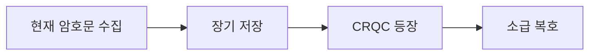

# 양자 위협 정세 감시

> 암호를 위협하는 양자컴퓨터 능력의 발전(CRQC)과 그 도래 시점, Harvest-Now-Decrypt-Later 노출 창을 지속적으로 평가하고 갱신하는 책임 영역.

이 영역은 마감이 정해진 일회성 작업이 아니라, 암호 위협에 대한 현재 그림을 항상 최신으로 유지해야 하는 지속적 책임이다. 위협의 핵심 질문은 두 가지다. 암호학적으로 유의미한 양자컴퓨터, 즉 CRQC(Cryptographically Relevant Quantum Computer)는 언제 등장하는가, 그리고 지금 우리가 보내는 데이터는 그 시점에 얼마나 노출되어 있는가. 이 두 질문에 대한 답을 끊임없이 갱신하는 것이 이 영역이 지켜야 할 표준이다.

## 관리 기준 (유지 표준)

위협 노출을 판단하는 핵심 도구는 Mosca 부등식이다. 자산이 위험에 노출되는 조건은 다음과 같이 표현된다.

$$ X + Y > Z $$

여기서 $X$는 데이터가 비밀로 유지되어야 하는 기간(보안 수명)이고, $Y$는 조직이 PQC로 전이하는 데 걸리는 기간이며, $Z$는 CRQC가 등장하기까지 남은 기간이다. $X + Y > Z$가 성립하면, 전이를 지금 시작하더라도 이미 늦은 것이다. 보호해야 할 데이터가 여전히 비밀이어야 하는 동안 CRQC가 먼저 도착하기 때문이다.

이 영역이 유지해야 할 표준은 세 변수를 각각 살아 있게 관리하는 것이다.

- $X$ 산정 유지: 주요 자산마다 보안 수명을 산정하고 갱신한다. 자산의 성격이 바뀌면 $X$도 바뀐다.
- $Y$ 추정 연동: PQC 전이에 걸리는 기간 추정은 [[PQC 전이 감시]]와 연동해 받는다. 대응 측의 진척이 곧 $Y$다.
- $Z$ 추정 갱신: CRQC까지 남은 기간 추정은 [[양자 하드웨어 로드맵 추적]]의 하드웨어 진전에 따라 갱신한다.

## 위협 메커니즘

CRQC가 암호를 무너뜨리는 경로는 크게 두 갈래다.

- [[Shor's Algorithm|쇼어 알고리즘]]: RSA, ECDH, ECDSA, DH 같은 공개키 암호를 다항 시간에 파훼한다. 이들의 보안 근거가 정수 인수분해와 이산로그 문제의 난해성에 있는데, 쇼어 알고리즘이 두 문제를 모두 효율적으로 푼다. 결과적으로 현재 공개키 암호 계열은 사실상 전멸한다.
- [[Grover's Algorithm|그로버 알고리즘]]: 대칭키와 해시의 보안 강도를 제곱근만큼 약화한다. 비정렬 탐색을 $O(\sqrt{N})$에 수행하므로, AES-128은 약 64비트 수준의 안전성으로 떨어진다. 따라서 AES-256 사용이 권장되고, 해시는 출력 길이를 두 배로 키워 충돌 저항을 보존하는 식으로 대응한다. 공개키처럼 전멸하지는 않고 강도 약화에 그친다는 점이 쇼어와 다르다.

CRQC가 실제로 위 공격을 수행하려면 한꺼번에 여러 조건을 갖춰야 한다. 수천 개 규모의 논리 큐비트, 충분히 낮은 논리 오류율, 그리고 깊은 회로를 끝까지 실행할 수 있는 결맞음과 오류정정 능력이 동시에 필요하다. 어느 하나라도 부족하면 암호 파훼에 이르지 못한다.

## Harvest Now, Decrypt Later

[[Harvest Now Decrypt Later|지금 수집해 나중에 복호]] 위협은 CRQC가 아직 없어도 이미 작동하는 소급 공격이다. 공격자는 현재 오가는 암호문을 수집해 그대로 저장해 둔다. 그리고 CRQC가 등장한 이후에 저장해 둔 암호문을 소급해 복호한다. 즉 오늘의 비밀이 미래의 능력으로 깨진다.

이 때문에 보안 수명이 긴 비밀일수록 지금 이 순간 이미 위협받는다. 국가기밀, 의료 기록, 장기 신원 자격처럼 수십 년 단위로 비밀이어야 하는 자산은 $X$가 크고, Mosca 부등식에서 가장 먼저 노출 조건을 충족한다. 이는 영신뢰(Zero-Trust)와 격리 우선 보안 원칙과도 직결된다. 신뢰를 전제하지 않고 데이터의 전 수명 주기에 걸친 노출을 가정해야, 오늘 수집되어 미래에 복호될 가능성을 설계 단계에서 차단할 수 있다.

## 노출 창

수집에서 소급 복호까지 이어지는 시간 흐름은 다음과 같다.

수집과 저장은 이미 일어나고 있고, 복호만 CRQC의 도래를 기다린다. 노출 창은 수집 시점에 열리며, 자산의 보안 수명이 끝나기 전에 CRQC가 도착하면 닫히지 못한다.

## 현재 스냅샷 (2026-05-30 기준)

CRQC는 아직 도래하지 않았다. 현재는 NISQ(Noisy Intermediate-Scale Quantum) 단계이며, 논리 큐비트는 초기 실증 수준에 머문다. 암호 파훼에 필요한 규모와 오류율에는 크게 못 미친다.

전문가 설문의 중앙 추정은 대략 2030년대 중후반에서 2040년대에 걸쳐 분포하지만, 추정 사이의 편차가 크고 불확실성이 높다. 그래서 이 노트의 신뢰도를 medium으로 둔다. 이런 불확실성 때문에 $Z$는 하나의 점추정이 아니라 분포로 다루어야 하고, 위험 판단에서는 분포의 보수적인 쪽(이른 도래 시나리오)을 기준으로 산정하는 것이 안전하다.

## 검토 주기

정기 점검은 반기 1회로 한다. 그 사이라도 주요 하드웨어 마일스톤이 발표되면 즉시 $Z$를 재평가한다. 논리 큐비트 수의 도약, 오류정정 임계값 돌파, 결함 허용 시연 같은 사건이 트리거다. 이런 트리거는 [[양자 하드웨어 로드맵 추적]]에서 들어오므로, 그 추적 영역이 이 영역의 비정기 점검을 촉발한다.

## 연결
- [[MOC - Post-Quantum Cryptography]] 이 영역이 속한 도메인 지도
- [[PQC 전이 감시]] Mosca 부등식의 $Y$(전이 기간)를 담당하는 대응 측 영역
- [[양자 하드웨어 로드맵 추적]] $Z$(CRQC 시점) 추정의 입력을 제공
- [[Shor's Algorithm]] 공개키를 무너뜨리는 핵심 위협
- [[Harvest Now Decrypt Later]] CRQC 이전에도 작동하는 소급 위협
- [[No-Cloning Theorem]] 물리 기반 키 분배가 위협에 다르게 대응하는 근거(대비 참고)
