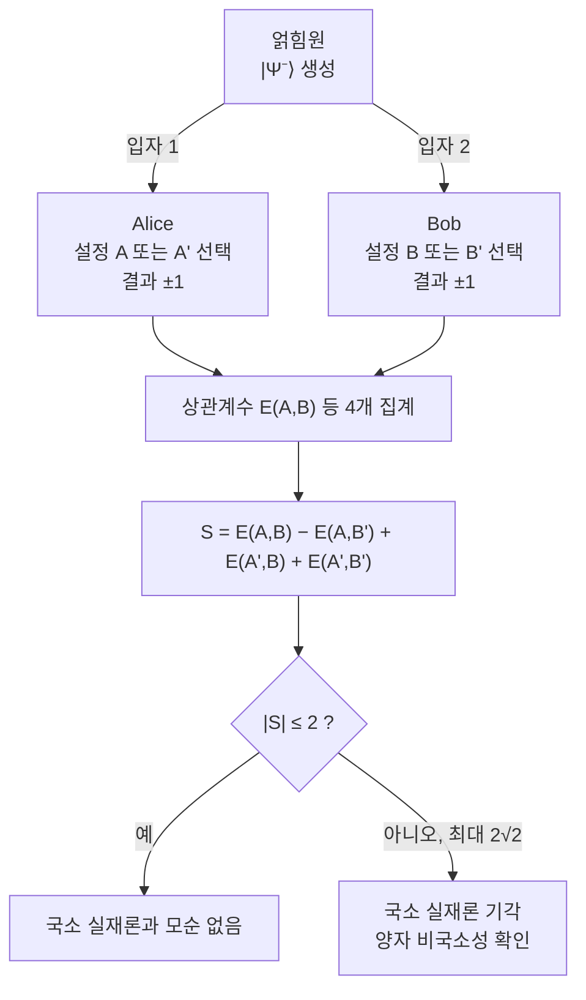

# Bell Inequality (CHSH)

> 국소 숨은변수 이론이 만족해야 하는 상관 부등식 $\lvert S \rvert \le 2$를 양자역학이 위반함으로써, 자연이 국소 실재론으로 설명될 수 없음을 실험으로 판별하는 정리다.

## 핵심
벨 부등식은 직접 측정 가능한 양으로 형이상학적 가정을 시험한다. 두 입자가 멀리 떨어진 두 관측자 Alice와 Bob에게 분배되고, 각자는 두 측정 설정 중 하나를 고른다. Alice의 설정을 $A, A'$, Bob의 설정을 $B, B'$라 하고 각 측정의 결과는 $\pm 1$ 두 값만 갖는다고 하자. 이때 CHSH(Clauser, Horne, Shimony, Holt) 조합량을 다음과 같이 정의한다.

$$ S = E(A,B) - E(A,B') + E(A',B) + E(A',B') $$

여기서 $E(A,B)$는 두 결과의 곱 $ab$에 대한 기댓값, 즉 상관계수다.

### 국소 숨은변수의 한계
세계가 국소 실재론(locality + realism)을 따른다고 가정하자. 실재론은 측정 이전에 각 결과가 이미 어떤 숨은변수 $\lambda$로 정해져 있다는 것이고, 국소성은 한쪽의 설정 선택이 빛보다 빠르게 다른 쪽 결과에 영향을 줄 수 없다는 것이다. 그러면 결과는 자기 쪽 설정과 $\lambda$에만 의존하는 함수 $a(A,\lambda), b(B,\lambda) \in \{-1, +1\}$로 적힌다. 단일 $\lambda$에 대해 다음 항등식이 성립한다.

$$ a(A,\lambda)\,b(B,\lambda) - a(A,\lambda)\,b(B',\lambda) + a(A',\lambda)\,b(B,\lambda) + a(A',\lambda)\,b(B',\lambda) = a(\lambda)\big[ b - b' \big] + a'(\lambda)\big[ b + b' \big] $$

각 값이 $\pm 1$이므로 $b - b'$와 $b + b'$ 중 하나는 0이고 다른 하나는 $\pm 2$다. 따라서 위 조합은 항상 $\pm 2$이고, $\lambda$의 분포 $p(\lambda)$로 평균을 내면 다음 부등식을 얻는다.

$$ \lvert S \rvert = \left\lvert \int p(\lambda)\,[\cdots]\,d\lambda \right\rvert \le 2 $$

이것이 CHSH 부등식이다. 국소 실재론이 옳다면 어떤 측정 설정과 어떤 숨은변수 분포로도 $S$는 절댓값 2를 넘을 수 없다. 이 한계는 양자역학의 어떤 가정도 사용하지 않고 오직 국소성과 실재론만으로 유도된다는 점이 핵심이다.

### 양자역학의 위반과 Tsirelson 한계
양자역학은 이 부등식을 깬다. [[Bell States|벨 상태]] 가운데 하나인 최대 얽힘 상태, 곧 스핀 단일항(singlet)
$$ \lvert \Psi^{-} \rangle = \frac{1}{\sqrt{2}}\big( \lvert 01 \rangle - \lvert 10 \rangle \big) $$
를 두 관측자에게 나누고, 측정을 [[Quantum Measurement|사영 측정]]으로 보면 이 상태의 상관계수는 두 측정 방향 사이 각도 $\theta_{AB}$에 대해 $E(A,B) = -\cos\theta_{AB}$로 회전 불변하게 주어진다. 측정 방향을 한 평면 위에서 $A=0^\circ, A'=90^\circ, B=45^\circ, B'=135^\circ$로 고르면 $S$의 네 항이 모두 같은 부호로 더해지면서 다음 값에 도달한다.

$$ S = 2\sqrt{2} \approx 2.828 $$

즉 양자 상관은 고전 한계 2를 넘는다. 동시에 양자역학 안에서도 $S$는 무한정 커지지 못하고 다음 상한에서 멈춘다.

$$ \lvert S \rvert \le 2\sqrt{2} $$

이를 Tsirelson 한계(Tsirelson bound)라 부른다. 양자 상관은 고전 상관보다 강하지만 신호 전달이 불가능한 범위 안에 머무는, 고전과 비신호(no-signaling) 사이의 중간 강도를 갖는다.

## 흐름

## 왜 중요한가
벨 정리는 양자역학과 고전적 직관의 차이를 철학적 논쟁이 아니라 측정 가능한 숫자의 문제로 바꿔 놓았다. 1935년 EPR 논쟁은 양자역학이 불완전하며 숨은변수로 보완될 수 있다는 주장을 폈는데, 1964년 벨은 그런 국소 숨은변수 이론이라면 반드시 만족해야 할 부등식을 제시했다. CHSH는 그 부등식을 실제 실험에 올릴 수 있는 형태로 다듬은 것이다. 따라서 $S > 2$의 관측은 [[Quantum Entanglement|얽힘]]이 단순한 고전적 상관(미리 짜놓은 상관)이 아님을 증명하며, 국소 실재론 가운데 적어도 하나는 자연에서 성립하지 않음을 보여준다.

실험사는 이 판별을 단계적으로 닫아 왔다. 1982년 Aspect의 실험은 광자 편광 상관에서 부등식 위반을 분명히 관측했고, 측정 설정을 빠르게 전환해 국소성 가정을 강화했다. 다만 검출 효율과 국소성 같은 허점(loophole)이 남아 회의론의 여지가 있었다. 2015년에 이르러 Delft, NIST, Vienna 등의 loophole-free 실험이 검출 허점과 국소성 허점을 동시에 차단하며 위반을 확정했다. 이로써 자연이 국소 실재론적이지 않다는 결론이 실험적으로 굳어졌다.

이 위반은 단지 기초 검증에 그치지 않고 자원으로 쓰인다. $S$가 고전 한계를 넘는다는 사실 자체가 장치 내부를 신뢰하지 않고도 얽힘과 무작위성을 보증하는 근거가 되어, [[Device-Independent Cryptography|장치 독립 암호]]와 [[E91|E91 양자 키 분배]]에서 도청 탐지와 키 안전성의 토대로 활용된다.

## 연결
- [[Quantum Entanglement]] CHSH 위반이 고전 상관으로 환원되지 않는 진짜 얽힘의 존재 증거
- [[Bell States]] 부등식을 최대로 위반해 $2\sqrt{2}$에 도달시키는 최대 얽힘 상태 자원
- [[Quantum Measurement]] 측정 설정(각도) 선택과 사영 측정으로 상관계수 $E(A,B)$를 결정하는 공준
- [[Device-Independent Cryptography]] $S$ 값으로 장치 내부를 불신해도 보안을 보증하는 응용
- [[E91]] 벨 부등식 위반을 도청 탐지에 직접 이용하는 얽힘 기반 키 분배 프로토콜