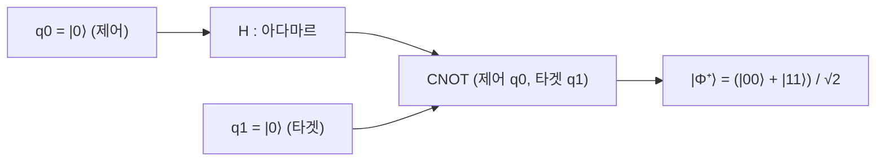

# Bell States

> 두 큐비트로 만들 수 있는 네 개의 최대 얽힘 상태로, 서로 정규직교하여 2큐비트 공간의 완전한 벨 기저를 이룬다.

## 핵심
벨 상태는 [[Tensor Product|텐서곱]]으로 결합된 2큐비트 공간 $\mathbb{C}^2 \otimes \mathbb{C}^2$에서 가장 강하게 얽힌 네 상태를 가리킨다. 각 상태는 두 [[Qubit|큐비트]]의 곱 상태로 분해할 수 없으며, 그 분해 불가능성이 곧 [[Quantum Entanglement|얽힘]]의 정의다. 네 상태는 다음과 같다.

$$ \lvert \Phi^{\pm} \rangle = \frac{1}{\sqrt{2}} \big( \lvert 00 \rangle \pm \lvert 11 \rangle \big) $$

$$ \lvert \Psi^{\pm} \rangle = \frac{1}{\sqrt{2}} \big( \lvert 01 \rangle \pm \lvert 10 \rangle \big) $$

$\Phi$ 계열은 두 큐비트가 같은 값으로, $\Psi$ 계열은 서로 반대 값으로 완벽히 상관되어 있다. 어느 상태든 첫 큐비트를 측정하면 그 즉시 둘째 큐비트의 측정 결과가 결정되며, 이 상관은 측정 기저를 어떻게 잡아도 유지된다.

### 정규직교 완전기저
네 벨 상태는 표준 내적 아래에서 서로 직교하고 각자 정규화되어 있다.

$$ \langle \Phi^{+} \lvert \Phi^{-} \rangle = 0, \qquad \langle \Phi^{+} \lvert \Psi^{+} \rangle = 0, \qquad \langle \Phi^{\pm} \lvert \Phi^{\pm} \rangle = 1 $$

따라서 $\{\, \lvert \Phi^{+} \rangle,\ \lvert \Phi^{-} \rangle,\ \lvert \Psi^{+} \rangle,\ \lvert \Psi^{-} \rangle \,\}$는 4차원 2큐비트 공간의 정규직교 기저, 즉 벨 기저(Bell basis)를 이룬다. 계산 기저 $\{\, \lvert 00 \rangle, \lvert 01 \rangle, \lvert 10 \rangle, \lvert 11 \rangle \,\}$를 곱 상태가 아닌 얽힘 상태로 갈아 끼운 셈이며, 임의의 2큐비트 상태를 벨 기저로 전개할 수 있다. 벨 기저로 측정하는 연산이 [[Quantum Teleportation|양자 원격전송]]과 얽힘 교환의 핵심 단계다.

### 최대 얽힘의 의미
벨 상태가 최대로 얽혔다는 말은 한쪽 큐비트만 떼어 본 상태가 완전히 무작위라는 뜻으로 정량화된다. 전체 $\lvert \Phi^{+} \rangle$은 순수 상태이지만, 둘째 큐비트의 자유도를 평균해 내는 [[Density Matrix|부분 대각합]]으로 첫 큐비트의 환원 밀도행렬을 구하면 최대 혼합 상태가 된다.

$$ \rho_A = \mathrm{Tr}_B \big( \lvert \Phi^{+} \rangle \langle \Phi^{+} \rvert \big) = \frac{I}{2} $$

순수도가 $\mathrm{Tr}(\rho_A^2) = 1/2$로 단일 큐비트 가능한 최솟값에 도달하므로, 부분계만 보면 정보가 전혀 없다. 모든 정보가 두 큐비트의 상관 속에만 담겨 있다는 점이 벨 상태가 얽힘 자원의 기준 단위가 되는 이유다.

## 구조
벨 상태는 [[Hadamard Gate|아다마르 게이트]]와 [[CNOT Gate|CNOT 게이트]] 두 단계로 표준적으로 생성한다. 입력 계산 기저 $\lvert 00 \rangle$에서 출발하면 $\lvert \Phi^{+} \rangle$이 나오고, 입력 두 비트를 바꾸면 나머지 세 벨 상태가 나온다.

아다마르 게이트가 제어 큐비트를 $\tfrac{1}{\sqrt{2}}(\lvert 0 \rangle + \lvert 1 \rangle)$로 중첩시킨 다음, CNOT이 그 중첩을 타겟 큐비트로 복사하듯 상관시켜 곱 상태를 얽힌 상태로 바꾼다. 입력을 $\lvert 01 \rangle, \lvert 10 \rangle, \lvert 11 \rangle$로 두면 같은 회로가 각각 $\lvert \Psi^{+} \rangle, \lvert \Phi^{-} \rangle, \lvert \Psi^{-} \rangle$을 만든다.

## 왜 중요한가
벨 상태는 양자정보의 핵심 프로토콜이 공통으로 소모하거나 검증하는 표준 자원이다. [[Quantum Teleportation|양자 원격전송]]은 송수신자가 미리 공유한 벨 쌍을 매개로 미지 큐비트 상태를 전송하고, [[Superdense Coding|초고밀도 부호화]]는 하나의 큐비트로 두 고전 비트를 보내기 위해 벨 쌍을 활용한다. 두 프로토콜 모두 벨 상태가 없으면 성립하지 않으므로, 얽힘이 통신과 계산에서 소비 가능한 자원이라는 관점을 가장 또렷하게 보여 준다.

동시에 벨 상태는 양자역학이 고전적 국소 실재론으로 환원되지 않음을 실험으로 증명하는 무대다. 벨 쌍에 대해 적절한 측정 기저를 골라 상관을 측정하면 [[Bell Inequality (CHSH)|CHSH 부등식]]의 고전 한계를 위반하며, 그 위반이 자연에 비국소 상관이 실재함을 가리킨다. 표현이 단순하면서도 최대 얽힘과 완전기저라는 성질을 모두 갖췄기 때문에, 벨 상태는 얽힘을 정의하고 다루고 검증하는 출발점 노릇을 한다.

## 연결
- [[Quantum Entanglement]] 벨 상태는 곱 상태로 분해되지 않는 얽힘의 가장 대표적인 구체 예시
- [[Tensor Product]] 벨 상태가 사는 2큐비트 공간을 구성하고 분해 불가능성으로 얽힘을 정의하는 형식
- [[Bell Inequality (CHSH)]] 벨 쌍의 측정 상관이 고전 한계를 위반함을 보여 비국소성을 검증하는 부등식
- [[Qubit]] 벨 상태를 이루는 두 양자정보 단위이자 환원 밀도행렬이 최대 혼합이 되는 부분계
- [[Superdense Coding]] 벨 쌍을 인코딩 자원과 디코딩 측정 기저로 써서 큐비트 하나로 두 고전 비트를 보내는 프로토콜
