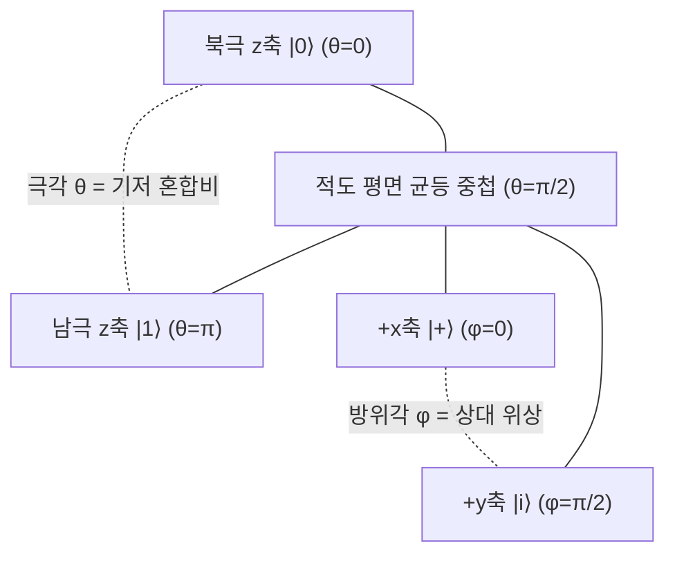

# Bloch Sphere

> 단일 큐비트의 상태를 3차원 단위구의 점으로 대응시키는 기하학적 표현으로, 순수 상태는 구면 위에, 혼합 상태는 구 내부(블로흐 공)에 놓인다.

## 핵심
[[Qubit|큐비트]]의 순수 상태는 두 진폭 사이의 정규화와 전역 위상까지 고려하면 두 개의 실수 매개변수만으로 적힌다. 전역 위상 $e^{i\gamma}$는 어떤 관측가능량에 대해서도 통계를 바꾸지 못하므로 물리적으로 무의미하고, 따라서 진폭 한 쌍이 가진 네 개의 실수 자유도(복소수 두 개) 중에서 정규화 조건 하나와 전역 위상 하나를 떼어내면 실수 두 개가 남는다. 이 두 매개변수를 극각 $\theta$와 방위각 $\varphi$로 잡으면 순수 상태를 다음과 같이 표준형으로 쓸 수 있다.

$$ \lvert \psi \rangle = \cos\frac{\theta}{2} \lvert 0 \rangle + e^{i\varphi} \sin\frac{\theta}{2} \lvert 1 \rangle $$

여기서 $\theta \in [0, \pi]$와 $\varphi \in [0, 2\pi)$는 정확히 3차원 단위구의 구면 좌표이며, 이로써 큐비트의 순수 상태 전체가 단위구의 표면과 일대일로 대응한다. 대응하는 데카르트 좌표는 블로흐 벡터 $\vec r = (\sin\theta\cos\varphi,\ \sin\theta\sin\varphi,\ \cos\theta)$로 주어진다.

극각 $\theta$는 두 기저 상태의 혼합 비율을 정한다. 북극 $\theta = 0$은 $\lvert 0 \rangle$, 남극 $\theta = \pi$는 $\lvert 1 \rangle$에 대응하며, 이 두 극점이 계산 기저의 직교 상태다. 주목할 점은 힐베르트 공간에서 직교하는 두 상태($\langle 0 \vert 1 \rangle = 0$)가 블로흐 구에서는 마주 보는 대척점, 즉 사이각 $180^\circ$로 나타난다는 사실이다. 구의 사이각은 힐베르트 공간 사이각의 두 배가 된다.

적도($\theta = \pi/2$)는 두 기저가 같은 무게로 섞인 균등 중첩 상태들의 자리이며, 방위각 $\varphi$가 두 진폭 사이의 상대 위상을 매긴다. 예컨대 $\varphi = 0$은 $\lvert + \rangle = \tfrac{1}{\sqrt{2}}(\lvert 0 \rangle + \lvert 1 \rangle)$, $\varphi = \pi$는 $\lvert - \rangle = \tfrac{1}{\sqrt{2}}(\lvert 0 \rangle - \lvert 1 \rangle)$에 해당한다. 측정 통계는 같지만 상대 위상이 다른 이 상태들이 적도 위에서 서로 다른 경도의 점으로 구별된다는 점이 핵심이다.

혼합 상태까지 포함하려면 구면을 넘어 내부를 채운 [[Density Matrix|밀도 행렬]]로 넘어간다. 단일 큐비트의 밀도 행렬은 블로흐 벡터로 다음과 같이 전개된다.

$$ \rho = \frac{1}{2}\left( I + \vec r \cdot \vec\sigma \right) = \frac{1}{2}\left( I + r_x \sigma_x + r_y \sigma_y + r_z \sigma_z \right) $$

여기서 $\vec\sigma = (\sigma_x, \sigma_y, \sigma_z)$는 [[Pauli Matrices|파울리 행렬]]이다. $\rho$가 양의 준정부호이며 대각합이 1인 유효한 상태가 되려면 $\lvert \vec r \rvert \le 1$이어야 한다. 이때 블로흐 벡터의 길이가 상태의 순수도를 직접 가늠한다. $\lvert \vec r \rvert = 1$이면 구면 위의 순수 상태이고, $\lvert \vec r \rvert < 1$이면 구 내부의 혼합 상태이며, 중심 $\vec r = 0$은 $\rho = \tfrac{1}{2} I$인 최대 혼합 상태로 어떤 기저로 측정해도 결과가 완전히 무작위다. 순수도 $\mathrm{Tr}(\rho^2) = \tfrac{1}{2}(1 + \lvert \vec r \rvert^2)$로 표면에서 1, 중심에서 $1/2$가 된다. 이렇게 채워진 단위 공 전체를 블로흐 공(Bloch ball)이라 부른다.

블로흐 표현의 또 다른 힘은 동역학을 회전으로 그려 준다는 데 있다. 단일 큐비트에 작용하는 [[Unitary Evolution|유니터리 연산]]은 블로흐 구를 원점을 중심으로 강체 회전시키는 변환과 정확히 대응한다. 임의의 유니터리는 어떤 단위 회전축 $\hat n$과 회전각 $\alpha$에 대해 $U = e^{-i\,\alpha\,(\hat n \cdot \vec\sigma)/2}$ 꼴로 쓰이고, 이는 블로흐 벡터를 축 $\hat n$ 둘레로 각 $\alpha$만큼 돌린다. 파울리 행렬 $\sigma_x, \sigma_y, \sigma_z$가 각각 $x, y, z$축 회전의 생성원(generator) 역할을 하며, 예컨대 $\sigma_x$는 $x$축, $\sigma_z$는 $z$축 둘레의 회전을 만든다. 게이트를 행렬로 외우는 대신 어느 축을 얼마나 돌리는지로 직관화할 수 있어 회로 설계와 분석에 유용하다.

## 구조

## 왜 중요한가
블로흐 구는 추상적인 복소 진폭 쌍을 눈으로 볼 수 있는 기하 대상으로 바꿔, 큐비트 이론의 직관을 떠받치는 표준 그림이다. 직교가 대척점으로 나타나고, 중첩이 위도와 경도로 분해되며, 게이트가 회전이 되고, 노이즈가 벡터를 중심으로 끌어당기는 수축으로 보인다. 덕분에 [[Quantum Decoherence|결깨짐]]과 완화 과정도 블로흐 벡터의 짧아짐과 축 정렬로 시각화되어, $T_1$과 $T_2$ 같은 잡음 파라미터의 기하적 의미가 분명해진다. 다만 이 그림이 깔끔하게 닫히는 것은 단일 큐비트에 한정된다. 두 큐비트 이상의 얽힘은 4차원 이상의 복소 공간에 살기 때문에 단일 구로 완전히 담기지 않으며, 이 한계 자체가 얽힘이 단일 큐비트 자유도로 환원되지 않는 자원임을 역설적으로 보여 준다.

## 연결
- [[Qubit]] 블로흐 구가 시각화하는 대상인 단일 큐비트 순수 상태의 정의와 진폭 표현
- [[Pauli Matrices]] 밀도 행렬 전개의 기저이자 구의 세 회전축을 생성하는 연산자 집합
- [[Density Matrix]] 구면 위 순수 상태를 넘어 구 내부의 혼합 상태까지 포괄하는 일반 기술 형식
- [[Unitary Evolution]] 블로흐 구의 강체 회전으로 나타나는 닫힌 단일 큐비트의 동역학
- [[Quantum Decoherence]] 결맞음 상실이 블로흐 벡터의 수축과 축 정렬로 나타나고 $T_1$과 $T_2$가 기하적 의미를 갖는 관계
