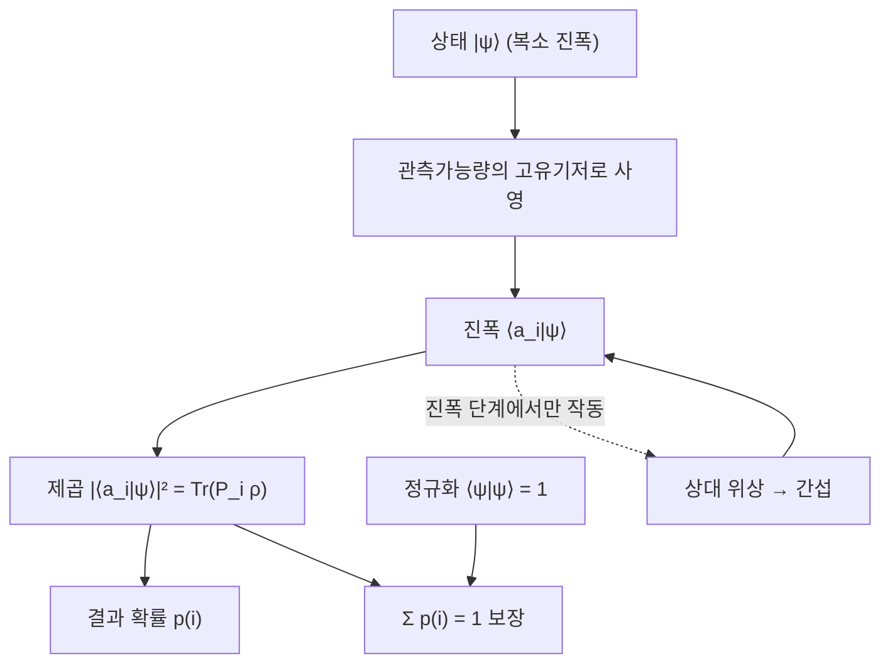

# Born Rule

> 양자 측정에서 특정 결과가 나올 확률은 해당 결과에 대응하는 진폭의 제곱 크기와 같다는 공준으로, 복소 진폭과 실제 관측 통계를 잇는 다리 역할을 한다.

## 핵심
양자역학은 상태를 복소 진폭으로 기술하지만, 실험실에서 관측되는 것은 음이 아닌 실수 확률뿐이다. Born Rule은 이 둘을 연결하는 규칙이다. 순수 상태 $\lvert \psi \rangle$를 어떤 [[Observable (Hermitian Operator)|관측가능량]]의 고유기저 $\{\lvert a_i \rangle\}$로 측정할 때, 결과 $a_i$가 나올 확률은 그 기저 성분 진폭의 제곱 크기로 주어진다.

$$ p(i) = \lvert \langle a_i \vert \psi \rangle \rvert^2 $$

여기서 $\langle a_i \vert \psi \rangle$는 상태 $\lvert \psi \rangle$를 고유벡터 $\lvert a_i \rangle$에 사영했을 때의 복소 진폭이고, 그 절댓값 제곱이 곧 확률이다. 큐비트의 중첩 $\lvert \psi \rangle = \alpha \lvert 0 \rangle + \beta \lvert 1 \rangle$에서 계산 기저로 측정하면 $p(0) = \lvert \alpha \rvert^2$, $p(1) = \lvert \beta \rvert^2$가 된다.

이 규칙이 정합적인 확률을 주는 것은 상태가 정규화되어 있기 때문이다. $\lvert \psi \rangle$가 단위 노름이면 고유기저의 완전성에 의해

$$ \sum_i p(i) = \sum_i \lvert \langle a_i \vert \psi \rangle \rvert^2 = \langle \psi \vert \psi \rangle = 1 $$

이 자동으로 성립한다. 즉 진폭이라는 복소량을 제곱하여 합이 1인 확률분포로 변환하는 것이 Born Rule의 본질이며, 이 때문에 상태 정규화 조건 $\langle \psi \vert \psi \rangle = 1$이 물리적으로 필수가 된다.

## 밀도행렬 일반형
사영 측정의 결과 $a_i$에는 그 고유공간으로의 사영 연산자 $P_i = \lvert a_i \rangle\langle a_i \rvert$가 대응한다. 이를 쓰면 순수 상태의 확률은 $p(i) = \langle \psi \vert P_i \vert \psi \rangle$로 다시 적을 수 있다. 순수 상태와 고전 혼합을 함께 포괄하는 [[Density Matrix|밀도행렬]] $\rho$로 일반화하면 Born Rule은 다음의 자취 형태가 된다.

$$ p(i) = \mathrm{Tr}(P_i \rho) $$

순수 상태 $\rho = \lvert \psi \rangle\langle \psi \rvert$를 대입하면 자취의 순환성에 의해 $\mathrm{Tr}(P_i \lvert \psi \rangle\langle \psi \rvert) = \langle \psi \vert P_i \vert \psi \rangle = \lvert \langle a_i \vert \psi \rangle \rvert^2$로 환원되어 진폭 제곱 형태와 일치한다. 이 자취 표현은 혼합 상태와 일반화된 측정(POVM)까지 자연스럽게 확장되므로, 양자정보에서 측정 확률을 다룰 때의 표준형이다.

## 위상은 어디로 가는가
진폭을 제곱하는 순간 각 성분의 전역 위상은 확률에서 사라진다. $\alpha = \lvert \alpha \rvert e^{i\phi}$이면 $\lvert \alpha \rvert^2$에 위상 $\phi$가 남지 않기 때문이다. 그렇다고 위상 정보가 물리에서 소멸하는 것은 아니다. 서로 다른 경로의 진폭이 더해질 때 그 상대 위상이 보강 간섭과 상쇄 간섭을 결정하고, 그 결과로 바뀐 진폭에 다시 Born Rule을 적용하면 위상의 흔적이 측정 통계로 드러난다. 즉 위상은 진폭이 합쳐지는 단계에서 작동하고, 제곱은 그 마지막 단계에서만 일어난다. 이 메커니즘이 [[Quantum Superposition|중첩]]의 상대 위상이 실험적으로 관측 가능한 이유이며, 측정 기저를 바꾸면 같은 상태가 다른 확률분포를 내놓는 까닭이다.

## 흐름

## 왜 중요한가
Born Rule은 양자 형식체계가 관측과 만나는 접점이다. 상태 벡터의 유니타리 발전은 결정론적이지만, 측정에서 무작위성이 들어오는 지점이 바로 이 규칙이다. 진폭의 크기를 그냥 쓰지 않고 제곱하여 쓴다는 선택은 임의의 약속이 아니다. Gleason 정리는 차원이 3 이상인 Hilbert 공간에서 사영 연산자들 위에 정의된 임의의 정합적 확률측도가 어떤 밀도행렬 $\rho$에 대해 $p(i) = \mathrm{Tr}(P_i \rho)$ 형태일 수밖에 없음을 보인다. 다시 말해 측정 결과에 합리적인 확률을 부여하려는 최소한의 요구만으로 Born Rule의 자취 형태가 거의 유일하게 강제된다.

이런 의미에서 Born Rule은 양자역학의 핵심 공준 가운데 하나로 취급되지만, Gleason 정리 덕분에 완전히 독립적인 가정이라기보다 Hilbert 공간 구조와 확률의 정합성이 함께 함의하는 결과에 가깝다. 측정 절차 전체의 동역학과 상태 붕괴는 [[Quantum Measurement]]가, 어떤 결과 집합이 가능한지를 정하는 연산자 구조는 [[Observable (Hermitian Operator)]]가 담당하고, Born Rule은 그 위에서 각 결과에 정확히 얼마의 확률을 매길지를 규정한다.

## 연결
- [[Quantum Measurement]] 측정 절차와 상태 붕괴 전체를 정식화하며, Born Rule은 그중 결과 확률을 정하는 부분을 담당
- [[Quantum Superposition]] 중첩의 복소 진폭과 상대 위상이 제곱을 거쳐 관측 확률과 간섭으로 나타나는 통로
- [[Observable (Hermitian Operator)]] 가능한 결과 집합과 고유기저, 사영 연산자 $P_i$를 제공하는 측정 대상의 구조
- [[Density Matrix]] 순수 상태와 혼합 상태를 함께 포괄하는 일반형 $p(i) = \mathrm{Tr}(P_i \rho)$의 무대
