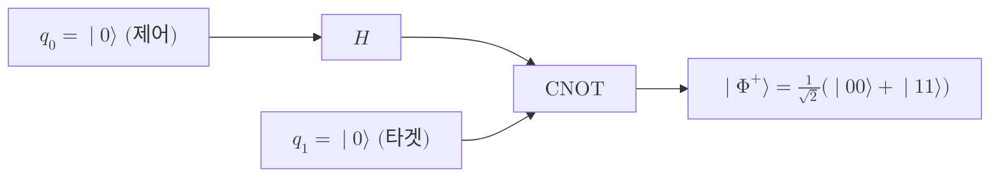

# CNOT Gate

> 제어 큐비트가 $\lvert 1 \rangle$ 일 때만 타겟 큐비트에 비트 반전 $X$ 를 가하는 2큐비트 유니터리 게이트로, 곱 상태를 얽힌 상태로 바꿀 수 있는 가장 기본적인 얽힘 생성 연산이다.

## 핵심
CNOT 게이트는 두 [[Qubit|큐비트]]에 작용하는 제어형 연산이다. 한 큐비트를 제어(control)로, 다른 큐비트를 타겟(target)으로 지정하고, 제어 큐비트가 $\lvert 1 \rangle$ 일 때에만 타겟 큐비트에 [[Pauli Matrices|파울리]] $X$ 게이트, 곧 비트 반전을 적용한다. 제어가 $\lvert 0 \rangle$ 이면 타겟은 그대로 둔다. 계산 기저에 대한 작용은 다음과 같이 정리된다.

$$ \lvert c \rangle \otimes \lvert t \rangle \ \longmapsto\ \lvert c \rangle \otimes \lvert\, t \oplus c\, \rangle $$

여기서 $c$ 는 제어 비트, $t$ 는 타겟 비트, $\oplus$ 는 모듈로 2 덧셈(XOR)이다. 계산 기저의 네 상태에 대한 사상은 다음과 같다.

$$ \lvert 00 \rangle \mapsto \lvert 00 \rangle, \quad \lvert 01 \rangle \mapsto \lvert 01 \rangle, \quad \lvert 10 \rangle \mapsto \lvert 11 \rangle, \quad \lvert 11 \rangle \mapsto \lvert 10 \rangle $$

첫 비트를 제어, 둘째 비트를 타겟으로 두고 계산 기저 $\{\lvert 00 \rangle, \lvert 01 \rangle, \lvert 10 \rangle, \lvert 11 \rangle\}$ 순서로 적으면 행렬 표현은 다음과 같다.

$$ \mathrm{CNOT} = \begin{pmatrix} 1 & 0 & 0 & 0 \\ 0 & 1 & 0 & 0 \\ 0 & 0 & 0 & 1 \\ 0 & 0 & 1 & 0 \end{pmatrix} $$

이 행렬은 실수 대칭이면서 $\mathrm{CNOT}^{\dagger}\,\mathrm{CNOT} = I$ 를 만족하는 [[Unitary Evolution|유니터리]] 연산이고, 동시에 $\mathrm{CNOT}^2 = I$ 인 대합(involution) 연산이므로 자기 자신이 역연산이다. 따라서 한 번 더 적용하면 원래 상태로 되돌아간다.

### 제어 큐비트 중첩과 얽힘
CNOT의 진가는 제어 큐비트가 계산 기저가 아니라 중첩 상태일 때 드러난다. 제어가 $\alpha \lvert 0 \rangle + \beta \lvert 1 \rangle$ 이고 타겟이 $\lvert 0 \rangle$ 이면 [[Tensor Product|텐서곱]] 상태에 CNOT을 적용한 결과는 다음과 같다.

$$ \big( \alpha \lvert 0 \rangle + \beta \lvert 1 \rangle \big) \otimes \lvert 0 \rangle \ \longmapsto\ \alpha \lvert 00 \rangle + \beta \lvert 11 \rangle $$

오른쪽 상태는 $\alpha\beta \neq 0$ 인 한 두 큐비트의 곱으로 분해되지 않으므로 [[Quantum Entanglement|얽힘]] 상태다. 이처럼 단일 큐비트 게이트만으로는 결코 만들 수 없는 얽힘을 CNOT 같은 2큐비트 게이트가 생성한다. 다만 CNOT이 무조건 얽힘을 만드는 것은 아니다. 제어가 계산 기저 상태이면 출력은 여전히 곱 상태이고, 제어가 중첩일 때에 한해 상관이 발생한다.

### 기저 의존성
CNOT은 어느 큐비트를 제어로 보느냐에 따라 역할이 갈리지만, 측정 기저를 바꾸면 제어와 타겟의 구실이 뒤바뀐다. 양변을 [[Hadamard Gate|아다마르 기저]]로 변환하면 첫 큐비트를 제어로 하던 CNOT이 둘째 큐비트를 제어로 하는 CNOT과 같아진다. 즉 다음 항등식이 성립한다.

$$ (H \otimes H)\, \mathrm{CNOT}_{1 \to 2}\, (H \otimes H) = \mathrm{CNOT}_{2 \to 1} $$

이는 제어와 타겟이 게이트의 절대적 속성이 아니라 어떤 기저에서 바라보느냐에 따라 정해지는 상대적 구실임을 보여 준다.

## 구조
벨 상태 생성 회로가 CNOT의 대표적인 쓰임이다. 입력 $\lvert 00 \rangle$ 에 [[Hadamard Gate|아다마르 게이트]]로 제어 큐비트를 중첩시킨 다음 CNOT을 적용하면 최대 얽힘 상태 $\lvert \Phi^{+} \rangle$ 이 나온다.

회로에서 검은 점이 제어 큐비트, 더하기 기호로 표시되는 표적이 타겟 큐비트를 가리킨다. 아다마르가 제어를 $\tfrac{1}{\sqrt{2}}(\lvert 0 \rangle + \lvert 1 \rangle)$ 로 펼친 뒤, CNOT이 그 중첩을 타겟에 상관시켜 곱 상태를 얽힌 [[Bell States|벨 상태]]로 바꾼다.

## 왜 중요한가
CNOT은 양자 회로 모형에서 얽힘을 만들어 내는 표준 도구다. 단일 큐비트 회전만으로는 분리 가능한 상태 공간을 벗어날 수 없으므로, 보편 양자 계산을 이루려면 두 큐비트를 엮는 게이트가 반드시 필요하다. 임의의 단일 큐비트 게이트 집합에 CNOT 하나를 더하면 보편 게이트 집합(universal gate set)이 완성되며, 이는 어떤 유니터리 연산이든 이 게이트들의 유한 조합으로 임의의 정밀도까지 근사할 수 있다는 뜻이다.

응용 측면에서도 CNOT은 거의 모든 핵심 프로토콜의 골격에 들어간다. [[Bell States|벨 상태]] 생성, 양자 원격전송에서의 얽힘 측정과 정정, 다수의 [[Quantum Error Correction|양자 오류정정]] 부호의 신드롬 추출, 그리고 가역 고전 연산을 양자 회로로 옮기는 과정 모두가 CNOT을 기본 블록으로 쓴다. 비트를 복사하는 것처럼 보이지만 임의의 미지 상태를 복제하지는 못한다는 점에서 [[No-Cloning Theorem|복제 불가 정리]]와도 자연스럽게 들어맞는다. 계산 기저의 비트는 베끼되 중첩의 진폭은 베끼지 못하고 대신 얽힘으로 바꾸기 때문이다.

## 연결
- [[Bell States]] 아다마르와 CNOT 두 단계로 벨 상태를 생성하며, CNOT이 곱 상태를 얽힌 벨 기저로 바꾸는 결정적 게이트
- [[Quantum Entanglement]] CNOT은 제어가 중첩일 때 분해 불가능한 상관을 만들어 내는 대표적 얽힘 생성 연산
- [[Unitary Evolution]] CNOT은 $\mathrm{CNOT}^{\dagger}\mathrm{CNOT}=I$ 를 만족하는 유니터리이자 자기 역연산인 가역 게이트
- [[Tensor Product]] CNOT이 작용하는 2큐비트 공간 $\mathbb{C}^2 \otimes \mathbb{C}^2$ 를 구성하는 형식
- [[Pauli Matrices]] CNOT이 제어 조건 아래 타겟에 가하는 연산이 곧 파울리 $X$ 비트 반전
- [[Qubit]] CNOT이 제어와 타겟으로 묶는 두 양자정보 단위
