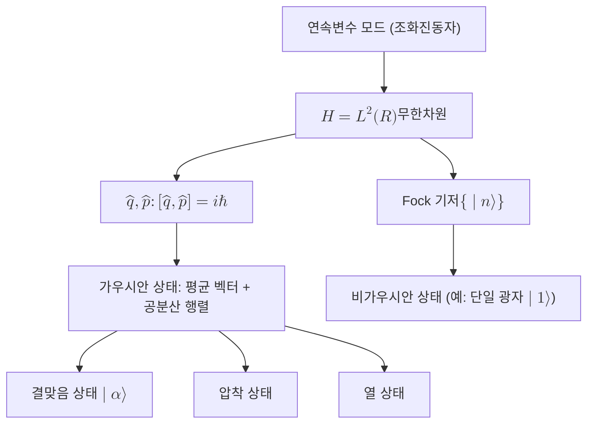

# Continuous-Variable Quantum System

> 위치나 운동량처럼 연속 스펙트럼을 갖는 정준 관측량으로 정보를 싣는 양자계로, 무한차원 힐베르트 공간 위에서 정준교환관계를 따르는 모드(mode)를 기본 단위로 한다.

## 핵심
연속변수 양자계는 [[Qubit|큐비트]]처럼 유한한 이산 기저에 정보를 담는 대신, 조화진동자 한 개에 대응하는 무한차원 [[Hilbert Space|힐베르트 공간]] $\mathcal{H} = L^2(\mathbb{R})$ 위에서 연속 값을 갖는 관측량으로 정보를 다룬다. 각 자유도를 모드라 부르며, 광학에서는 전자기장의 한 모드, 즉 정해진 주파수와 편광을 가진 빛다발이 그 물리적 실체다.

한 모드는 두 정준 관측량 $\hat{q}$(위치꼴 직교성분, position quadrature)와 $\hat{p}$(운동량꼴 직교성분, momentum quadrature)로 기술되며, 둘은 다음 정준교환관계를 만족한다.

$$ [\hat{q}, \hat{p}] = i\hbar $$

이 두 연산자는 가환이 아니므로 [[Heisenberg Uncertainty Principle|불확정성 원리]]의 직접적인 무대가 된다. $\hbar = 1$ 단위에서 표준편차의 곱은 다음 하한을 갖는다.

$$ \Delta q \, \Delta p \ge \tfrac{1}{2} $$

직교성분은 생성연산자 $\hat{a}^\dagger$와 소멸연산자 $\hat{a}$로 다시 적을 수 있다. $\hat{a} = \tfrac{1}{\sqrt{2}}(\hat{q} + i\hat{p})$이며, 광자 수 연산자는 $\hat{n} = \hat{a}^\dagger \hat{a}$이고 그 고유상태 $\lvert n \rangle$이 Fock 상태로서 셀 수 있는 무한 기저 $\{\lvert 0 \rangle, \lvert 1 \rangle, \dots\}$를 이룬다. 이 기저가 무한차원이라는 점이 큐비트 형식과 구별되는 본질이며, 이때 비로소 힐베르트 공간의 Cauchy 완비성 조건이 형식적으로 작동한다.

### 가우시안 상태와 변환
CV 양자정보에서 실용적으로 중요한 부분집합이 가우시안 상태다. 가우시안 상태는 직교성분에 대한 Wigner 준확률분포가 가우시안 형태인 상태로, 일차 모멘트(평균 벡터)와 이차 모멘트(공분산 행렬)만으로 완전히 기술된다. 진공 상태, 결맞음 상태(coherent state) $\lvert \alpha \rangle$, 압착 상태(squeezed state), 열 상태가 모두 가우시안이다. 결맞음 상태는 두 직교성분의 불확정성이 진공과 같고 균형을 이루어 고전 레이저 빛에 가장 가깝고, 압착 상태는 한 직교성분의 분산을 불확정성 한계 아래로 줄이는 대신 켤레 직교성분의 분산을 키운 상태다.

## 왜 중요한가
연속변수 접근은 광학 양자정보의 자연스러운 언어다. 측정을 위해 단일 광자 검출기 대신 효율이 높고 상온에서 동작하는 호모다인 검출(homodyne detection)을 쓸 수 있고, 가우시안 상태와 가우시안 연산만으로도 결정론적 얽힘 생성과 클러스터 상태 기반 측정형 양자계산의 자원을 갖출 수 있다. 이 때문에 대규모 광자 양자컴퓨팅의 한 갈래가 CV 인코딩을 택한다.

암호 쪽 함의도 분명하다. 결맞음 상태를 신호로 쓰고 호모다인으로 검출하는 CV 양자키분배(CV-QKD)는 표준 통신 부품과 호환되어 기존 광섬유망에 얹기 쉽다는 강점이 있고, 도청 시도가 직교성분에 노이즈를 더한다는 사실이 보안의 물리적 근거가 된다. 다만 결정적 한계도 있는데, 가우시안 상태에 가우시안 연산만으로는 보편 양자계산이나 양자오류정정의 핵심 단계를 완성할 수 없다는 점이 정리로 알려져 있다. 따라서 실제 보편 계산에는 단일 광자나 광자 수 분해처럼 비가우시안 자원을 병합해야 한다. 이 이산과 연속의 대비는 [[Qubit|큐비트]] 기반 디지털 인코딩과 CV 인코딩이 같은 양자역학 공준 위에서 서로 보완적인 두 갈래로 갈라지는 지점을 보여준다.

## 연결
- [[Hilbert Space]] 연속변수 모드는 무한차원 힐베르트 공간 $L^2(\mathbb{R})$ 위에서 정의되며, 이때 Cauchy 완비성이 본질적으로 작동한다
- [[Heisenberg Uncertainty Principle]] 비가환 직교성분 $\hat{q}$와 $\hat{p}$의 동시 정밀 결정 한계가 CV 상태와 잡음을 규정한다
- [[Qubit]] 유한차원 이산 인코딩과 대비되는 연속 무한차원 인코딩 갈래
- [[Quantum Superposition]] Fock 기저나 직교성분 고유상태의 중첩이 CV 상태 표현의 기반
