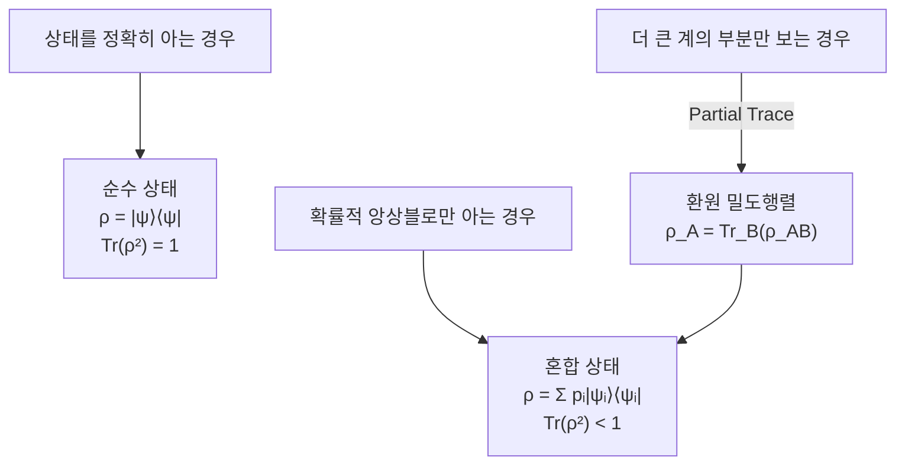

# Density Matrix

> 순수 상태뿐 아니라 통계적 앙상블로 주어지는 혼합 상태까지 하나의 연산자로 기술하는, 양자 상태의 가장 일반적인 표현이다.

## 핵심
상태 벡터 $\lvert \psi \rangle$는 계가 어떤 양자 상태에 있는지를 정확히 아는 경우, 즉 순수 상태(pure state)만을 적을 수 있다. 그러나 현실에서는 어떤 상태에 있는지 자체가 고전적 확률로만 알려진 경우가 흔하다. 계가 확률 $p_i$로 [[Qubit|순수 상태]] $\lvert \psi_i \rangle$에 있는 통계적 앙상블을 생각하면, 이 불완전한 지식까지 담는 객체가 밀도 행렬 $\rho$다.

$$ \rho = \sum_i p_i \lvert \psi_i \rangle \langle \psi_i \rvert, \qquad p_i \ge 0, \quad \sum_i p_i = 1 $$

여기서 각 $\lvert \psi_i \rangle \langle \psi_i \rvert$는 해당 상태로의 사영 연산자이며, 밀도 행렬은 이들을 고전 확률로 가중합한 것이다. 순수 상태는 항 하나만 살아남는 특수한 경우로 $\rho = \lvert \psi \rangle \langle \psi \rvert$가 된다.

밀도 행렬은 다음 세 성질을 만족하는 연산자로 공리적으로 규정할 수 있고, 거꾸로 이 세 조건을 만족하는 임의의 연산자는 어떤 물리 상태를 나타낸다.

- 에르미트성(Hermitian): $\rho = \rho^{\dagger}$. 고윳값이 실수가 되어 확률로 해석된다.
- 양의 준정부호(positive semidefinite): 모든 $\lvert \phi \rangle$에 대해 $\langle \phi \rvert \rho \lvert \phi \rangle \ge 0$. 확률이 음수가 되지 않음을 보장한다.
- 대각합 1: $\mathrm{Tr}\,\rho = 1$. 전체 확률의 정규화 조건이다.

### 순수와 혼합의 판별 (purity)
밀도 행렬이 순수 상태인지 혼합 상태인지는 $\rho$가 사영 연산자인지로 갈린다. 순수 상태에서만 $\rho$는 멱등(idempotent)이 되어 $\rho^2 = \rho$를 만족한다. 이를 대각합으로 요약한 양을 순수도(purity)라 부른다.

$$ \gamma = \mathrm{Tr}(\rho^2), \qquad \frac{1}{d} \le \gamma \le 1 $$

여기서 $d$는 힐베르트 공간의 차원이다. $\mathrm{Tr}(\rho^2) = 1$이면 순수 상태이고, 1보다 작아질수록 더 섞인 혼합 상태이며, 최댓값 차원분의 1인 $\gamma = 1/d$는 정보가 전혀 없는 최대 혼합 상태 $\rho = I/d$에 해당한다.

### 기댓값
어떤 관측가능량 $A$의 기댓값은 밀도 행렬과의 곱의 대각합으로 한 번에 계산된다.

$$ \langle A \rangle = \mathrm{Tr}(\rho A) $$

이 식은 순수 상태와 혼합 상태를 가리지 않고 동일하게 성립한다. 순수 상태의 익숙한 표현 $\langle \psi \rvert A \lvert \psi \rangle$은 $\rho = \lvert \psi \rangle \langle \psi \rvert$를 대입하면 곧바로 위 식의 특수한 경우로 환원된다. 측정의 결과 통계를 다루는 일반 규칙은 [[Quantum Measurement|측정 공준]]에서 밀도 행렬 형식으로 확장된다.

## 구조
밀도 행렬이 꼭 필요한 두 가지 상황과 그 표현을 정리하면 다음과 같다.

### 환경과의 결합, 부분계 기술
밀도 행렬이 본질적으로 요구되는 가장 중요한 맥락은 복합계의 한 부분만을 기술할 때다. 계 $A$가 환경이나 또 다른 계 $B$와 [[Quantum Entanglement|얽혀]] 있으면, 전체 $AB$가 순수 상태일지라도 $A$ 단독으로는 일반적으로 상태 벡터로 적을 수 없다. 이때 $B$의 자유도를 평균해 내는 [[Partial Trace|부분 대각합]]으로 $A$의 환원 밀도행렬 $\rho_A = \mathrm{Tr}_B(\rho_{AB})$을 얻는다. 두 계가 얽혀 있을수록 $\rho_A$의 순수도는 1에서 멀어지므로, 환원 밀도행렬의 혼합 정도는 얽힘의 척도가 된다.

### 결맞음과 비대각 항
밀도 행렬을 어떤 기저로 적으면 대각 항은 각 기저 상태가 측정될 고전 확률(점유도, population)을, 비대각 항은 기저 상태 사이의 결맞음(coherence)을 담는다. 같은 대각 분포를 주더라도 결맞은 중첩(coherent superposition)과 결맞지 않은 혼합(incoherent mixture)은 비대각 항의 존재로 구별된다. 예를 들어 단일 큐비트에서 다음 두 밀도 행렬을 비교할 수 있다.

$$ \rho_{\text{coh}} = \frac{1}{2}\begin{pmatrix} 1 & 1 \\ 1 & 1 \end{pmatrix}, \qquad \rho_{\text{mix}} = \frac{1}{2}\begin{pmatrix} 1 & 0 \\ 0 & 1 \end{pmatrix} $$

왼쪽은 $\lvert + \rangle$의 순수 중첩 상태로 비대각 항이 살아 있고 $\mathrm{Tr}(\rho^2)=1$이다. 오른쪽은 $\lvert 0 \rangle$과 $\lvert 1 \rangle$의 고전적 반반 혼합으로 비대각 항이 0이며 최대 혼합 상태다. [[Quantum Decoherence|결어긋남]]은 바로 이 비대각 항이 환경 결합 이후 사라지는 과정으로, 양자 결맞음이 고전적 확률 혼합으로 바뀌는 것을 뜻한다.

이 구분은 [[Bloch Sphere|블로흐 구]] 형식과 정확히 맞물린다. 단일 큐비트의 밀도 행렬은 $\rho = \tfrac{1}{2}(I + \vec{r}\cdot\vec{\sigma})$로 적히며, 블로흐 벡터의 크기 $\lvert \vec{r} \rvert$가 순수도를 직접 나타낸다. $\lvert \vec{r} \rvert = 1$인 구면 위의 점은 순수 상태이고, 내부의 점은 혼합 상태이며, 중심은 최대 혼합 상태다. 즉 순수 상태가 구의 표면에 있다면 혼합 상태는 블로흐 공(Bloch ball) 내부 전체에 채워진다.

## 왜 중요한가
밀도 행렬은 상태 벡터를 진정으로 일반화한다. 노이즈가 섞인 실제 큐비트, 환경과 얽혀 부분만 관측되는 계, 통계적으로만 알려진 앙상블은 모두 상태 벡터로는 적을 수 없지만 밀도 행렬로는 빠짐없이 기술된다. 그래서 결어긋남과 오류 모형, 양자 채널, 얽힘 정량화, 그리고 실험에서 상태를 복원하는 양자 상태 단층촬영(quantum state tomography)이 모두 이 형식 위에서 전개된다. 순수 상태 형식만으로는 닫힌 이상계만 다룰 수 있지만, 밀도 행렬은 열린 계와 부분계라는 현실의 양자정보를 다루는 공통 언어가 된다.

## 연결
- [[Qubit]] 단일 큐비트의 순수 상태를 혼합 상태와 노이즈까지 포괄하도록 일반화한 표현
- [[Quantum Decoherence]] 밀도 행렬의 비대각 항(결맞음)이 환경 결합으로 소멸하는 과정
- [[Bloch Sphere]] 큐비트 밀도 행렬을 블로흐 공 내부의 점으로 시각화하고 순수도를 벡터 크기로 읽는 기하
- [[Quantum Measurement]] 기댓값과 측정 결과 통계를 밀도 행렬 형식으로 확장하는 공준
- [[Quantum Entanglement]] 부분계가 환경이나 짝과 얽히면 단독으로는 혼합 상태인 환원 밀도행렬로만 적히는 관계
- [[Partial Trace]] 복합계의 환원 밀도행렬을 도출해 부분계를 기술하는 연산
