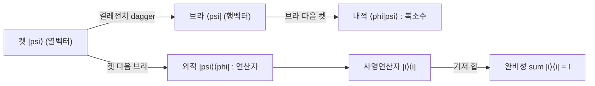

# Dirac Notation

> 양자상태를 켓 $\lvert\psi\rangle$, 그 쌍대를 브라 $\langle\psi\rvert$ 로 적어 내적과 외적, 연산자 작용을 간결하고 기저 독립적으로 표현하는 표기법이다.

## 핵심
디랙 표기법은 양자역학의 선형대수를 다루기 위한 약속된 기호 체계다. 상태벡터를 켓(ket) $\lvert\psi\rangle$ 로 쓰는데, 이는 [[Hilbert Space]]의 한 원소이며 유한 차원에서는 복소 성분을 가진 열벡터로 볼 수 있다. 켓에 대응하는 브라(bra) $\langle\psi\rvert$ 는 그 켤레전치(conjugate transpose)로 얻어지는 쌍대벡터, 즉 행벡터다. 둘의 관계는 다음과 같다.

$$ \langle\psi\rvert = \lvert\psi\rangle^{\dagger} $$

브라와 켓을 붙여 쓰면 두 가지 핵심 연산이 나온다. 먼저 브라가 켓을 만나는 내적(inner product) $\langle\phi\vert\psi\rangle$ 는 하나의 복소수이며, 두 상태가 얼마나 겹치는지를 나타내는 진폭이다. 같은 상태의 내적은 노름의 제곱을 주고, 물리적으로 유효한 상태는 정규화 조건을 만족한다.

$$ \langle\psi\vert\psi\rangle = 1 $$

반대로 켓이 브라를 만나는 외적(outer product) $\lvert\psi\rangle\langle\phi\rvert$ 는 복소수가 아니라 [[Hilbert Space]] 위의 선형연산자(행렬)다. 특히 기저상태 자신의 외적 $\lvert i\rangle\langle i\rvert$ 는 그 방향으로의 사영연산자(projector)가 된다. 임의의 켓에 이 연산자를 작용시키면 $\lvert i\rangle\langle i\rvert\,\lvert\psi\rangle = \langle i\vert\psi\rangle\,\lvert i\rangle$ 처럼 $\lvert i\rangle$ 성분만 추려 낸다.

정규직교기저 $\{\lvert i\rangle\}$ 는 $\langle i\vert j\rangle = \delta_{ij}$ 를 만족하며, 이 기저의 사영연산자들을 모두 더하면 항등연산자가 되는 완비성 관계(completeness relation)가 성립한다.

$$ \sum_{i} \lvert i\rangle\langle i\rvert = I $$

완비성 관계는 임의의 상태를 기저로 전개하는 도구다. $\lvert\psi\rangle = I\,\lvert\psi\rangle = \sum_i \lvert i\rangle\langle i\vert\psi\rangle$ 처럼 항등연산자를 끼워 넣기만 하면 전개계수 $\langle i\vert\psi\rangle$ 가 자동으로 드러난다.

연산자 $A$ 를 상태 사이에 끼운 $\langle\psi\rvert A\lvert\psi\rangle$ 는 기댓값(expectation value)을 준다. $A$ 가 [[Observable (Hermitian Operator)|관측가능량]]을 나타내는 에르미트 연산자일 때 이 양은 항상 실수이며, 상태 $\lvert\psi\rangle$ 에서 그 물리량을 측정했을 때의 평균을 뜻한다.

$$ \langle A \rangle_{\psi} = \langle\psi\rvert A\lvert\psi\rangle $$

## 구조

## 왜 중요한가
디랙 표기법은 양자정보 전 분야의 공용어다. 같은 내용을 명시적 행렬과 성분 합으로 적으면 식이 길어지고 기저 선택에 묶이지만, 브라켓으로 적으면 표기가 짧아지고 어떤 기저를 쓰는지와 무관하게 식이 그대로 성립한다. 이 기저 독립성 덕분에 계산 도중 편한 기저를 자유롭게 갈아끼울 수 있고, 완비성 관계 하나로 기저 전개와 분해가 기계적으로 처리된다.

또한 내적, 외적, 연산자 기댓값이 모두 같은 기호 규칙 안에서 자연스럽게 이어지므로, [[Qubit]]의 상태 기술부터 측정 확률 계산, 얽힘과 [[Tensor Product|텐서곱]] 합성계 표현까지 한 표기 체계로 끊김 없이 다룰 수 있다. 양자정보를 배우고 쓰는 데 가장 먼저 익혀야 할 형식 언어다.

## 연결
- [[Hilbert Space]] 켓과 브라가 사는 벡터공간이자 내적이 정의되는 무대
- [[Qubit]] 디랙 표기로 상태를 적는 가장 기본적인 대상
- [[Observable (Hermitian Operator)]] 기댓값 $\langle\psi\rvert A\lvert\psi\rangle$ 형태로 측정과 연결되는 에르미트 연산자
- [[Tensor Product]] 여러 켓을 결합해 합성계 상태를 만드는 연산
