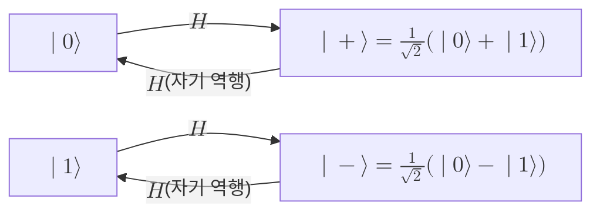

# Hadamard Gate

> 단일 큐비트의 계산 기저를 균등 중첩 기저로 맞바꾸는 자기 역행 유니터리 게이트로, 양자 알고리즘에서 중첩과 간섭을 만들어 내는 가장 기본적인 도구다.

## 핵심
아다마르 게이트는 단일 [[Qubit|큐비트]]에 작용하는 $2 \times 2$ 유니터리 행렬이며, 계산 기저 $\lvert 0 \rangle, \lvert 1 \rangle$에서 다음과 같이 적는다.

$$ H = \frac{1}{\sqrt{2}} \begin{pmatrix} 1 & 1 \\ 1 & -1 \end{pmatrix} $$

이 게이트는 기저 상태를 균등 중첩으로 펼친다. 결정적인 $\lvert 0 \rangle$과 $\lvert 1 \rangle$에 작용하면 각각 두 진폭이 동등하게 섞인 상태가 나오며, 둘은 상대 위상의 부호만 다르다.

$$ H \lvert 0 \rangle = \frac{1}{\sqrt{2}} \big( \lvert 0 \rangle + \lvert 1 \rangle \big) = \lvert + \rangle, \qquad H \lvert 1 \rangle = \frac{1}{\sqrt{2}} \big( \lvert 0 \rangle - \lvert 1 \rangle \big) = \lvert - \rangle $$

따라서 아다마르 게이트는 계산 기저 $\{\lvert 0 \rangle, \lvert 1 \rangle\}$를 [[Quantum Superposition|중첩]] 기저 $\{\lvert + \rangle, \lvert - \rangle\}$로 옮기는 기저 변환으로 읽을 수 있다. 결정적인 입력에서 진폭이 동등한 두 갈래의 [[Quantum Superposition|중첩]]을 만들어 낸다는 점이 이 게이트의 본질이다.

### 자기 역행성
아다마르 게이트는 에르미트이면서 동시에 유니터리이고, 제곱하면 항등으로 돌아온다.

$$ H = H^\dagger, \qquad H^2 = I $$

따라서 같은 게이트를 두 번 적용하면 원래 상태로 복원된다. 예를 들어 $\lvert 0 \rangle$에 아다마르를 걸어 $\lvert + \rangle$를 만든 뒤 다시 걸면 두 갈래 진폭이 간섭을 거쳐 정확히 $\lvert 0 \rangle$로 되돌아온다. 이 자기 역행성 덕분에 아다마르 게이트는 중첩을 만드는 도구이면서 동시에 중첩을 도로 거두어들여 [[Quantum Superposition|간섭]] 결과를 읽어 내는 도구로도 쓰인다.

### 파울리 행렬과의 관계
아다마르 게이트는 [[Pauli Matrices|파울리 행렬]]의 합으로 깔끔하게 분해된다.

$$ H = \frac{1}{\sqrt{2}} \big( \sigma_x + \sigma_z \big) = \frac{X + Z}{\sqrt{2}} $$

이 관계는 아다마르가 켤레변환으로 파울리 연산자를 서로 맞바꾼다는 사실로 이어진다.

$$ H \sigma_x H = \sigma_z, \qquad H \sigma_z H = \sigma_x, \qquad H \sigma_y H = -\sigma_y $$

즉 아다마르는 $X$ 기저와 $Z$ 기저를 맞교환한다. 이 성질은 측정 기저를 갈아 끼우는 데 직접 쓰인다. $X$ 방향 측정을 하고 싶으면 아다마르를 한 번 적용한 뒤 표준 $Z$ 기저로 측정하면 같은 결과가 나온다. [[Bloch Sphere|블로흐 구]]에서 보면 아다마르는 $x$축과 $z$축을 이등분하는 축, 즉 $\hat n = \tfrac{1}{\sqrt 2}(1, 0, 1)$ 둘레로 각 $\pi$만큼 도는 회전이며, 그 결과 북극 $\lvert 0 \rangle$이 적도의 $\lvert + \rangle$로, 남극 $\lvert 1 \rangle$이 적도의 $\lvert - \rangle$로 옮겨진다.

### 다중 큐비트 확장
$n$개 큐비트에 아다마르를 병렬로 거는 텐서곱 $H^{\otimes n}$은 모든 기저 상태가 $\lvert 0 \rangle^{\otimes n}$에서 동등한 진폭을 갖는 균등 중첩을 한 번에 만든다.

$$ H^{\otimes n} \lvert 0 \rangle^{\otimes n} = \frac{1}{\sqrt{2^n}} \sum_{x \in \{0,1\}^n} \lvert x \rangle $$

단 하나의 회로 층으로 $2^n$개 계산 기저 상태를 동시에 담은 중첩을 준비한다는 점이 거의 모든 양자 알고리즘의 출발 단계를 이룬다.

## 구조

## 왜 중요한가
아다마르 게이트는 양자 알고리즘에서 중첩과 간섭을 만드는 표준 입구다. [[Grover's Algorithm|Grover]]와 [[Shor's Algorithm|Shor]]를 비롯한 거의 모든 알고리즘은 초기화 직후 아다마르 층으로 입력 레지스터를 균등 중첩에 올려, 단일 연산이 지수적으로 많은 진폭에 한꺼번에 작용하도록 만든다. 이후 단계에서 정답의 진폭이 보강되고 나머지가 상쇄되도록 [[Quantum Superposition|간섭]]을 설계하는데, 그 마지막 변환도 흔히 아다마르 계열이다.

얽힘 생성에서도 아다마르가 첫 단추다. [[Bell States|벨 상태]]의 표준 생성 회로는 제어 큐비트에 아다마르를 걸어 중첩을 만든 다음 [[CNOT Gate|CNOT 게이트]]로 그 중첩을 타겟 큐비트에 상관시켜 곱 상태를 최대 얽힘 상태로 바꾼다. 아다마르가 없으면 CNOT만으로는 얽힘이 생기지 않으므로, 아다마르는 곱 상태에서 얽힘으로 넘어가는 결정적 단계다. 측정 기저를 바꾸는 도구라는 점까지 더하면, 아다마르 게이트는 중첩 준비, 간섭 설계, 얽힘 생성, 기저 변환이라는 양자정보의 네 가지 기본 동작을 한 게이트로 묶어 주는 핵심 연산이다.

## 연결
- [[Quantum Superposition]] 아다마르 게이트가 결정적 기저 상태에서 만들어 내는 균등 중첩이자 간섭을 설계하는 자원
- [[Pauli Matrices]] 아다마르가 $\tfrac{1}{\sqrt 2}(X+Z)$로 분해되고 켤레변환으로 $X$ 기저와 $Z$ 기저를 맞바꾸는 대수적 관계
- [[Bloch Sphere]] 아다마르가 $x$축과 $z$축을 이등분하는 축 둘레의 회전으로 나타나는 기하 무대
- [[Bell States]] 벨 상태 생성 회로에서 아다마르가 제어 큐비트에 중첩을 만드는 첫 단계
- [[Qubit]] 아다마르 게이트가 작용하는 2준위 양자정보 단위이자 정의역
