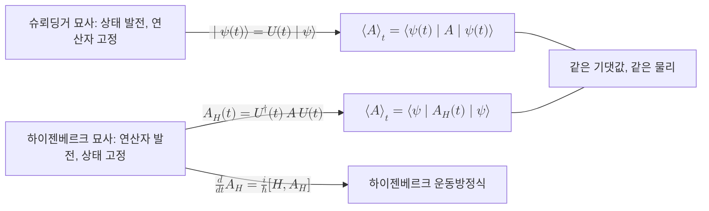

# Heisenberg Picture

> 양자계의 시간 발전을 상태 켓이 아니라 관측가능량 연산자에 싣는 양자역학의 묘사로, 상태는 고정한 채 연산자를 $A_H(t) = U^{\dagger}(t)\,A\,U(t)$ 로 발전시킨다.

## 핵심
같은 양자역학의 동역학을 적는 방식에는 두 갈래가 있다. 친숙한 [[Schrödinger Equation|슈뢰딩거 묘사]]에서는 연산자를 시간에 무관하게 고정하고 상태 켓 $\lvert\psi(t)\rangle$ 만 [[Unitary Evolution|유니터리 발전]]시킨다. 하이젠베르크 묘사는 이 역할을 정확히 뒤집는다. 상태는 초기 시각의 $\lvert\psi\rangle$ 로 붙박아 두고, 시간 발전을 [[Observable (Hermitian Operator)|관측가능량 연산자]]가 짊어진다.

두 묘사가 같은 물리를 준다는 보증은 측정으로 실제 관측되는 양인 기댓값이 양쪽에서 일치한다는 데 있다. 슈뢰딩거 묘사에서 시각 $t$ 의 기댓값은 다음과 같이 적힌다.

$$ \langle A \rangle_t = \langle\psi(t)\rvert A \lvert\psi(t)\rangle = \langle\psi\rvert U^{\dagger}(t)\,A\,U(t)\lvert\psi\rangle $$

여기서 $\lvert\psi(t)\rangle = U(t)\lvert\psi\rangle$ 를 대입했다. 가운데 묶음 $U^{\dagger}(t)\,A\,U(t)$ 를 통째로 하나의 시간 의존 연산자로 정의하면, 같은 기댓값을 고정된 상태 $\lvert\psi\rangle$ 위에서 얻을 수 있다.

$$ A_H(t) \equiv U^{\dagger}(t)\,A\,U(t), \qquad \langle A \rangle_t = \langle\psi\rvert A_H(t) \lvert\psi\rangle $$

이것이 하이젠베르크 묘사의 연산자다. 발전 연산자가 유니터리이므로 이 변환은 닮음 변환(켤레)이고, 따라서 연산자의 스펙트럼과 에르미트성이 그대로 보존된다. 측정 결과로 나올 수 있는 고유값의 집합은 시간이 지나도 변하지 않으며, 변하는 것은 그 고유상태가 어느 방향을 가리키느냐다.

연산자의 시간 변화율을 미분하면 슈뢰딩거 방정식의 짝이 되는 운동방정식이 나온다. 명시적으로 시간에 의존하지 않는 연산자에 대해 다음이 성립한다.

$$ \frac{d}{dt}A_H(t) = \frac{i}{\hbar}\,[H, A_H(t)] $$

이것이 하이젠베르크 운동방정식이다. 연산자의 변화는 [[Hamiltonian|해밀토니안]] $H$ 와의 교환자가 결정한다. $H$ 와 교환하는 연산자는 시간이 지나도 변하지 않는 보존량이라는 사실이 이 식에서 곧바로 드러난다.

## 흐름

## 왜 중요한가
하이젠베르크 묘사는 단순한 표기 취향의 문제가 아니라, 양자정보의 특정 형식이 자라나는 토양이다. 핵심은 발전이 클리포드 회로처럼 잘 구조화되어 있을 때 연산자의 변화가 매우 단순해진다는 데 있다.

상태 $\lvert\psi\rangle$ 를 특정 연산자 $g$ 의 고정점(고유값 $+1$ 의 고유상태)으로 명세하는 발상이 안정자 형식이다. 즉 상태를 진폭의 나열이 아니라 그 상태를 안정시키는 연산자들의 집합으로 기술한다. 발전 $U$ 를 가했을 때 새 상태는 $U g U^{\dagger}$ 가 안정시킨다. 여기서 등장하는 변환 $g \mapsto U g U^{\dagger}$ 가 바로 하이젠베르크 묘사의 연산자 발전과 같은 형태다. 안정자 형식은 본질적으로 하이젠베르크 묘사를 [[Pauli Group|파울리 군]] 위에서 전개한 언어다.

이 구조가 위력을 발휘하는 결정적 사례가 [[Gottesman-Knill Theorem|고테스만-닐 정리]]다. 발전이 클리포드 게이트로만 이루어지면, 파울리 연산자를 켤레한 결과가 다시 파울리 군의 원소가 된다. 따라서 지수적으로 큰 상태 벡터를 추적하는 대신 안정자 생성자 몇 개가 어떤 파울리로 옮겨 가는지만 따라가면 되고, 이는 고전 컴퓨터에서 효율적으로 처리된다. 측정으로 관측되는 양이 결국 연산자의 기댓값이라는 하이젠베르크 묘사의 관점이 없었다면, 상태가 아니라 연산자를 추적한다는 이 우회 자체가 성립하지 않는다.

같은 이유로 양자 오류정정에서도 부호의 논리 연산자와 신드롬 측정을 파울리 연산자의 켤레 발전으로 분석하는 것이 자연스럽다. 하이젠베르크 묘사는 상태 공간의 차원이 큐비트 수에 지수적으로 커지는 부담을 연산자 대수의 구조로 옮겨, 형식을 다룰 수 있는 크기로 압축한다.

## 연결
- [[Schrödinger Equation]] 상태가 발전하고 연산자가 고정되는 짝 묘사로, 하이젠베르크 묘사와 같은 동역학의 다른 표현
- [[Unitary Evolution]] 연산자 발전 $A_H(t)=U^{\dagger}AU$ 를 매개하는 유니터리 발전 연산자
- [[Observable (Hermitian Operator)]] 하이젠베르크 묘사에서 시간 발전을 짊어지는 대상이자 에르미트성이 켤레 변환으로 보존되는 연산자
- [[Pauli Group]] 안정자 형식에서 켤레 발전 $g\mapsto UgU^{\dagger}$ 의 무대가 되는 연산자 군
- [[Gottesman-Knill Theorem]] 클리포드 발전 아래 파울리 연산자의 켤레가 다시 파울리가 되어 고전 시뮬레이션을 가능케 하는 정리
- [[Hamiltonian]] 하이젠베르크 운동방정식에서 연산자의 시간 변화율을 교환자로 결정하는 생성자
