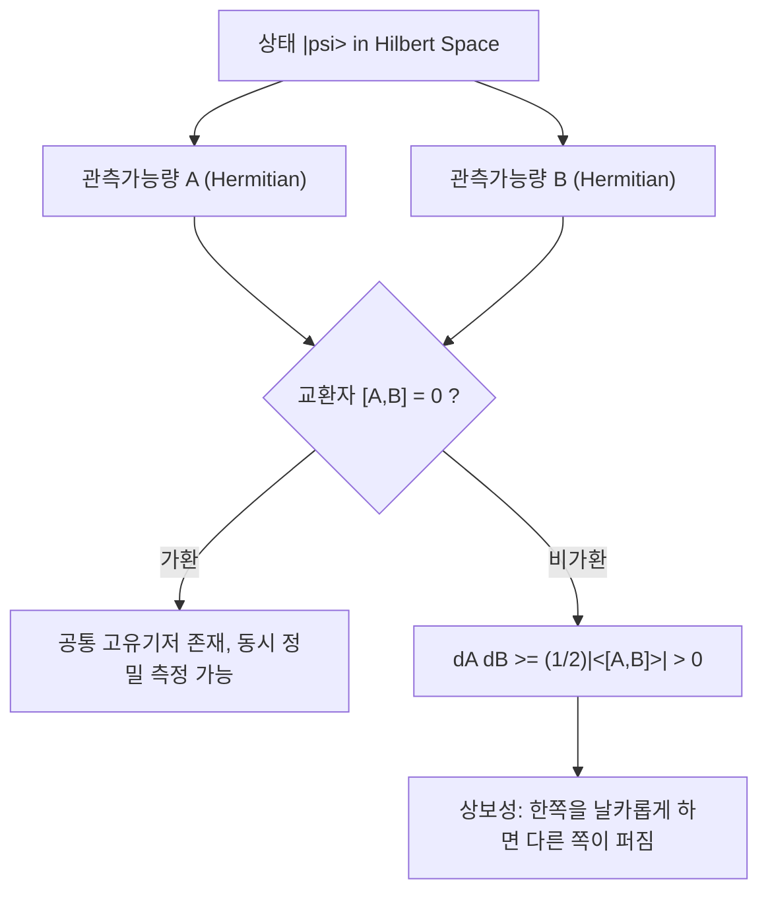

# Heisenberg Uncertainty Principle

> 비가환 관측가능량 쌍은 동일한 양자 상태에서 동시에 임의로 정밀하게 결정될 수 없으며, 두 표준편차의 곱이 두 연산자의 교환자 기댓값으로 하한이 정해진다는 원리다.

## 핵심
불확정성 원리는 측정 장비가 서툴러서 생기는 실용적 제약이 아니라, 양자 상태가 [[Hilbert Space|힐베르트 공간]]의 벡터로 기술되고 [[Observable (Hermitian Operator)|관측가능량]]이 에르미트 연산자로 표현된다는 형식체계 자체에서 따라 나오는 본질적 한계다. 어떤 관측가능량 $A$의 불확정성은 상태 $\lvert \psi \rangle$에서의 표준편차로 정의한다.

$$ \Delta A = \sqrt{\langle A^2 \rangle - \langle A \rangle^2}, \qquad \langle A \rangle = \langle \psi \mid A \mid \psi \rangle $$

가장 일반적인 형태는 로버트슨(Robertson) 부등식으로, 임의의 두 에르미트 연산자 $A$와 $B$에 대해 두 불확정성의 곱이 교환자 $[A,B] = AB - BA$의 기댓값으로 하한을 가진다.

$$ \Delta A \, \Delta B \ge \frac{1}{2} \left\lvert \langle [A,B] \rangle \right\rvert $$

여기서 핵심은 우변이 상태에 의존한다는 점이다. 두 연산자가 가환이면 $[A,B] = 0$이므로 하한은 $0$이 되고, 두 양을 동시에 임의 정밀도로 결정하는 공통 고유상태가 존재할 수 있다. 반대로 비가환이면 적어도 일부 상태에서 곱의 하한이 양수로 강제되며, 어느 한쪽을 날카롭게 만들수록 다른 쪽이 필연적으로 퍼진다.

이 한계는 측정이 상태를 흔드는 효과인 측정 교란과는 구별해야 한다. 측정 교란은 관측 행위가 상태 붕괴를 일으켜 이후 측정에 영향을 주는 동역학적 현상이다. 반면 로버트슨 부등식의 $\Delta A$와 $\Delta B$는 측정을 시작하기도 전에 주어진 상태 $\lvert \psi \rangle$가 이미 품고 있는 통계적 산포를 가리킨다. 즉 단일 상태를 똑같이 무수히 준비해 절반은 $A$만, 절반은 $B$만 측정해도 두 분포의 폭은 이 부등식을 만족한다. 교란 없이도 한계가 존재한다는 점에서 이는 상태의 고유한 성질이다.

위치와 운동량은 정준 교환관계 $[\hat{x}, \hat{p}] = i\hbar$를 만족하므로 로버트슨 부등식에 대입하면 교과서적 특수형이 나온다.

$$ \Delta x \, \Delta p \ge \frac{\hbar}{2} $$

이 경우 우변이 상태와 무관한 상수 $\hbar/2$로 고정되는 것은 교환자가 항등 연산자에 비례하기 때문이며, 가우스 파속에서 등호가 달성된다.

## 구조

## 큐비트 예
연속 변수가 아닌 큐비트에서도 같은 원리가 그대로 작동한다. [[Pauli Matrices|파울리 행렬]]의 스핀 성분 $X$와 $Z$는 가환하지 않고 반가환하여 교환자가 또 다른 파울리 연산자로 닫힌다.

$$ [X, Z] = XZ - ZX = -2iY $$

로버트슨 부등식에 넣으면 다음 하한을 얻는다.

$$ \Delta X \, \Delta Z \ge \left\lvert \langle Y \rangle \right\rvert $$

상태 $\lvert 0 \rangle$를 보면 이 상태는 $Z$의 고유상태라 $\Delta Z = 0$이지만, 그 대가로 $\langle Y \rangle = 0$이 되어 부등식이 자명하게 성립하고 $X$ 쪽은 최대로 퍼진다($\Delta X = 1$). 반대로 $X$ 기저의 고유상태 $\lvert + \rangle$에서는 $\Delta X = 0$이고 $Z$가 완전히 불확정해진다. $Z$의 결정성과 $X$의 결정성을 한 상태에서 동시에 가질 수 없다는 이 양상이 곧 상보성(complementarity)의 큐비트판이다. 블로흐 구의 서로 수직인 축을 따른 성분은 동시에 날카로운 값을 가질 수 없다.

## 왜 중요한가
불확정성 원리는 상보성을 정량화하는 부등식이다. 상보성은 위치와 운동량, 혹은 큐비트의 $X$와 $Z$처럼 한쪽을 또렷하게 알수록 다른 쪽 정보가 사라지는 상보적 관측량 쌍이 존재한다는 정성적 진술이고, 로버트슨 부등식은 그 트레이드오프의 최소량을 교환자로 못박는다.

정보과학의 관점에서 이는 단일 양자계가 담을 수 있는 정보에 근본 제약을 건다. 비가환 관측량 전부를 한 번에 완벽히 측정할 수 없으므로, 미지의 상태로부터 그 상태를 완전히 특정해 내는 일은 단 한 부의 복제본으로는 불가능하다. 이 한계는 임의의 미지 상태를 완벽히 복제할 수 없다는 [[No-Cloning Theorem|복제 불가 정리]]와 같은 뿌리를 공유하며, 양자 키 분배에서 도청자가 통신을 교란 없이 엿들을 수 없게 만드는 물리적 근거의 한 축이 된다.

## 연결
- [[Observable (Hermitian Operator)]] 불확정성의 두 주역인 관측가능량을 정의하는 에르미트 연산자 형식, 교환자가 하한을 결정한다
- [[Pauli Matrices]] 비가환 스핀 성분 $X$와 $Z$로 큐비트에서의 불확정성과 상보성을 보여 주는 구체적 예
- [[Hilbert Space]] 표준편차와 기댓값, 교환자가 정의되는 무대인 상태공간으로 원리가 형식체계에서 유도되는 출발점
- [[No-Cloning Theorem]] 단일 미지 상태에서 비가환 관측량 전부를 확정할 수 없어 완전 복제가 막힌다는 함의를 공유하는 근본 한계
- [[Continuous-Variable Quantum System]] 비가환 직교성분 $\hat{q}$와 $\hat{p}$의 정준교환관계가 직접 불확정성 한계로 이어지는 연속변수 무대
