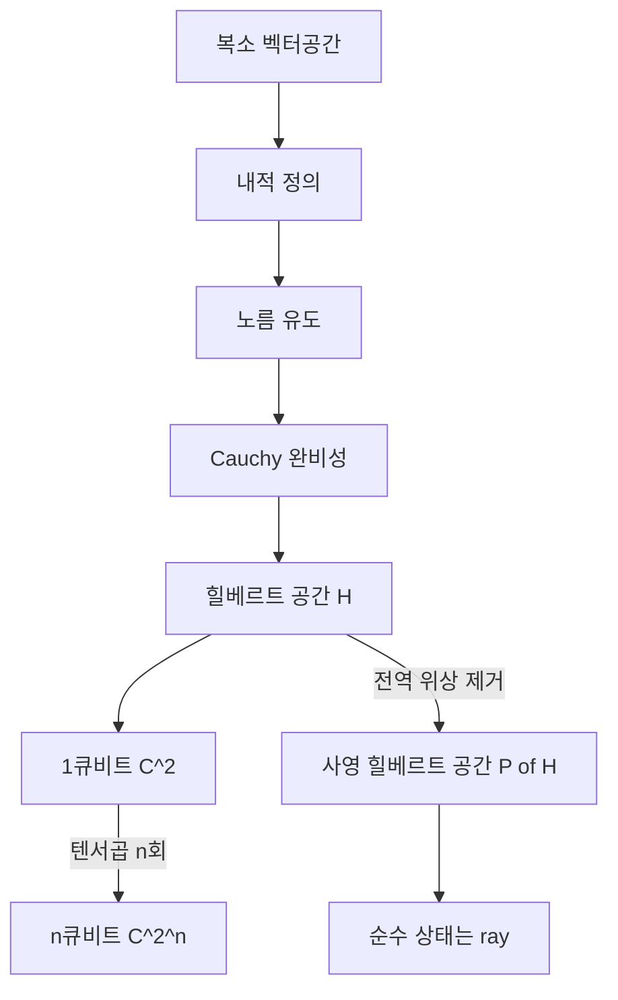

# Hilbert Space

> 내적이 정의되고 그 내적이 유도하는 거리에 대해 완비인 복소 벡터공간으로, 양자계의 상태가 사는 무대가 되는 상태공간이다.

## 핵심
힐베르트 공간 $\mathcal{H}$는 세 가지 구조가 한 몸으로 얹힌 복소 벡터공간이다. 첫째, 임의의 두 벡터에 복소수를 대응시키는 내적 $\langle \phi \mid \psi \rangle$이 있다. 양자정보에서 쓰는 관례로는 둘째 인자에 대해 선형, 첫째 인자에 대해 켤레선형이며, $\langle \psi \mid \psi \rangle \ge 0$이고 등호는 영벡터에서만 성립한다. 켤레 대칭성은 다음과 같다.

$$ \langle \phi \mid \psi \rangle = \overline{\langle \psi \mid \phi \rangle} $$

둘째, 이 내적이 노름 $\lVert \psi \rVert = \sqrt{\langle \psi \mid \psi \rangle}$를 유도한다. 셋째, 이 노름이 정의하는 거리에 대해 공간이 완비(complete)이다. 즉 모든 Cauchy 수열이 공간 안의 한 점으로 수렴한다. 유한차원에서는 완비성이 자동으로 따라오므로 큐비트 같은 계에서는 내적이 정의된 복소 벡터공간이라는 점만 사실상 본질이고, 완비성 조건은 무한차원에서 비로소 구속력을 갖는다.

상태와 연산을 적을 때는 [[Dirac Notation]]의 켓 $\lvert \psi \rangle$과 브라 $\langle \psi \rvert$를 쓴다. 유한차원 $\mathcal{H}$에는 정규직교기저 $\{ \lvert e_i \rangle \}$가 존재하여 $\langle e_i \mid e_j \rangle = \delta_{ij}$를 만족하고, 임의의 상태를 그 기저로 전개한다.

$$ \lvert \psi \rangle = \sum_i c_i \lvert e_i \rangle, \qquad c_i = \langle e_i \mid \psi \rangle $$

### 큐비트와 차원의 지수 증가
가장 단순한 양자계인 [[Qubit]]는 2차원 복소 힐베르트 공간 $\mathbb{C}^2$를 상태공간으로 가지며, 계산 기저는 $\lvert 0 \rangle$과 $\lvert 1 \rangle$이다. 여러 큐비트를 모으면 전체 상태공간은 부분계 공간의 [[Tensor Product]]로 결합된다. 큐비트 하나가 $\mathbb{C}^2$이므로 $n$큐비트 계는 다음 공간에 산다.

$$ \mathcal{H}_n = \underbrace{\mathbb{C}^2 \otimes \cdots \otimes \mathbb{C}^2}_{n} \;\cong\; \mathbb{C}^{2^n} $$

차원이 $2^n$으로 지수적으로 커지는 점이 양자정보 처리력의 원천이자, 동시에 고전 컴퓨터로 일반 양자상태를 시뮬레이션하기 어려운 근본 이유다. 비교하면 고전적으로 $n$비트의 상태는 $2^n$개 중 하나의 점이지만, 양자적으로는 $2^n$차원 공간의 단위벡터 전체가 허용된 상태다.

### 상태는 ray, 사영 힐베르트 공간
양자상태가 물리적으로 동일한지를 따질 때 한 가지 단서가 더 붙는다. 측정 결과를 지배하는 [[Born Rule|보른 규칙]]은 진폭의 크기 제곱에만 의존하므로, 전역 위상 $e^{i\theta}$만 다른 두 단위벡터 $\lvert \psi \rangle$과 $e^{i\theta} \lvert \psi \rangle$는 구별 불가능한 같은 물리 상태다. 따라서 순수 상태는 단위벡터 하나가 아니라 전역 위상을 제외한 동치류, 곧 ray로 본다.

$$ \lvert \psi \rangle \sim e^{i\theta} \lvert \psi \rangle, \qquad \langle \psi \mid \psi \rangle = 1 $$

이 동치 관계로 단위구를 몫공간으로 만든 것이 사영 힐베르트 공간 $\mathbb{P}(\mathcal{H})$이며, 순수 상태의 진짜 거처는 $\mathcal{H}$ 자체가 아니라 이 사영 공간이다. 단일 큐비트의 경우 $\mathbb{P}(\mathbb{C}^2)$가 [[Bloch Sphere|블로흐 구]]와 동일시되는데, 노름 고정으로 자유도 하나, 전역 위상 제거로 또 하나가 줄어 2차원 구면이 남기 때문이다.

## 구조

## 왜 중요한가
힐베르트 공간은 양자역학 공준이 출발하는 첫 문장이다. 상태는 힐베르트 공간의 단위벡터, 관측량은 그 위의 에르미트 연산자인 [[Observable (Hermitian Operator)]], 시간 발전은 내적을 보존하는 [[Unitary Evolution|유니터리 변환]], 측정 확률은 보른 규칙으로 이어지는 전체 형식체계가 모두 이 공간 구조 위에서 정의된다. 내적은 두 상태의 구별 가능성과 측정 진폭을 동시에 책임지고, 정규직교기저는 측정 결과의 가능한 출력 집합을 규정하며, 텐서곱 구조는 얽힘이라는 비고전 상관이 자랄 수 있는 자리를 제공한다.

실용적 함의도 분명하다. 차원이 $2^n$으로 부푸는 성질은 양자 알고리즘의 잠재적 우위와 양자 시뮬레이션의 난이도를 같은 뿌리에서 설명한다. 또한 상태를 벡터가 아니라 ray로 다루는 시각은 전역 위상은 관측 불가능하지만 상대 위상은 간섭을 통해 관측 가능하다는, 양자 간섭 현상의 핵심 구분을 형식적으로 정당화한다.

유한차원만 다룬 위 논의는 큐비트 기반 디지털 양자정보의 표준 무대다. 광자의 위치나 운동량처럼 연속 스펙트럼을 갖는 [[Continuous-Variable Quantum System]]은 무한차원 힐베르트 공간을 요구하며, 이때 비로소 Cauchy 완비성 조건이 본질적으로 작동한다. 그 확장은 별도 노트로 다룬다.

## 연결
- [[Dirac Notation]] 힐베르트 공간의 벡터와 내적을 켓과 브라로 적는 표기 규약
- [[Qubit]] 상태공간이 $\mathbb{C}^2$인 가장 단순한 힐베르트 공간의 실례
- [[Tensor Product]] 복합계의 힐베르트 공간을 부분계 공간으로부터 구성하는 연산
- [[Observable (Hermitian Operator)]] 힐베르트 공간 위에 정의되어 측정 가능량을 나타내는 에르미트 연산자
- [[Unitary Evolution]] 힐베르트 공간의 내적과 노름을 보존하며 닫힌 계의 시간 발전을 주는 유니터리 변환
- [[Continuous-Variable Quantum System]] 무한차원 $L^2(\mathbb{R})$ 위에서 연속 직교성분으로 정보를 담는 확장 사례
