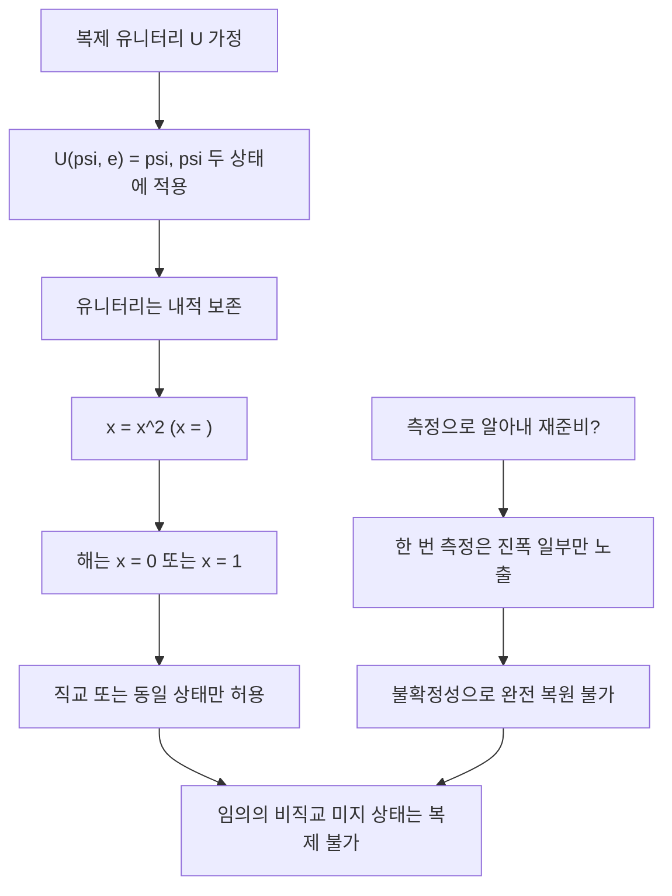

# No-Cloning Theorem

> 임의의 미지 양자 상태 $\lvert\psi\rangle$ 를 완벽하게 복제하는 유니터리 연산은 존재하지 않는다는 정리로, 양자역학의 선형성과 내적 보존에서 직접 따라 나온다.

## 핵심
고전 정보에서는 임의의 비트를 손실 없이 복사하는 일이 당연하다. 반면 양자정보에서는 미리 알지 못하는 임의의 상태 $\lvert\psi\rangle$ 를 또 다른 빈 시스템 위에 그대로 베껴 두 벌의 동일한 상태를 만드는 보편적 장치를 만들 수 없다. 이것이 복제 불가 정리다.

복제 장치가 있다고 가정해 보자. 그것은 원본 시스템과 표준 초기 상태 $\lvert e \rangle$ 에 놓인 빈 시스템을 입력으로 받아, 빈 시스템을 원본의 사본으로 바꾸는 [[Unitary Evolution|유니터리 연산]] $U$ 여야 한다. 임의의 상태 $\lvert\psi\rangle$ 에 대해 다음이 성립해야 완벽 복제라 할 수 있다.

$$ U\left( \lvert\psi\rangle \otimes \lvert e \rangle \right) = \lvert\psi\rangle \otimes \lvert\psi\rangle $$

이제 서로 다른 두 미지 상태 $\lvert\psi\rangle$ 와 $\lvert\phi\rangle$ 를 같은 $U$ 로 복제한다고 하자.

$$ U\left( \lvert\psi\rangle \otimes \lvert e \rangle \right) = \lvert\psi\rangle \otimes \lvert\psi\rangle, \qquad U\left( \lvert\phi\rangle \otimes \lvert e \rangle \right) = \lvert\phi\rangle \otimes \lvert\phi\rangle $$

유니터리 연산은 내적을 보존하므로, 변환 전 두 입력의 내적과 변환 후 두 출력의 내적이 같아야 한다.

$$ \langle\phi\vert\psi\rangle \cdot \langle e\vert e\rangle = \langle\phi\vert\psi\rangle \cdot \langle\phi\vert\psi\rangle $$

$\langle e\vert e\rangle = 1$ 이므로 이는 곧 다음 조건이 된다.

$$ \langle\phi\vert\psi\rangle = \left( \langle\phi\vert\psi\rangle \right)^2 $$

$x = \langle\phi\vert\psi\rangle$ 로 두면 $x = x^2$ 이고, 해는 $x = 0$ 또는 $x = 1$ 뿐이다. 즉 두 상태가 서로 직교($x = 0$)하거나 완전히 동일($x = 1$)한 경우에만 성립한다. 그러나 양자정보에서 정보를 담는 전형적 상태들은 $\lvert 0 \rangle$ 와 $\lvert + \rangle$ 처럼 직교하지도 동일하지도 않은 비직교 [[Quantum Superposition|중첩]] 상태다. 그런 임의의 미지 상태 한 쌍에 대해 위 등식은 모순이므로, 모든 상태를 복제하는 보편적 $U$ 는 존재할 수 없다.

## 측정으로도 우회할 수 없다
복제가 막힌다면 차라리 미지 상태를 측정해 알아낸 뒤 그 정보로 똑같이 다시 준비하면 되지 않느냐는 발상이 떠오른다. 그러나 이 길도 막혀 있다. 미지의 단일 [[Qubit|큐비트]]를 한 번 측정하면 [[Quantum Superposition|중첩]]은 측정 기저의 한 고유상태로 붕괴하고, 그 한 번의 결과만으로는 원래의 복소 진폭 $\alpha$ 와 $\beta$ 를 결정할 수 없다. 측정은 진폭에 대한 부분적이고 확률적인 정보만 흘리며, 비가환 관측량의 동시 결정을 막는 [[Heisenberg Uncertainty Principle|불확정성 원리]]가 이 한계를 더욱 못 박는다. 결국 단 한 벌의 미지 상태로부터는 그것을 다시 만들 만큼의 정보를 얻을 수 없으므로, 측정을 거친 우회 복제 역시 불가능하다.

## 구조

## 왜 중요한가
복제 불가 정리는 금지 정리이면서 동시에 양자정보 기술의 토대다. 가장 직접적인 응용은 [[Quantum Cryptography|QKD]]의 보안성이다. 도청자가 전송 중인 미지 큐비트를 가로채 사본을 떠 두고 원본은 흘려보내려 해도, 정리에 의해 완벽한 사본을 만들 수 없다. 도청 시도는 필연적으로 상태를 교란하므로 송수신 통계에 오류로 드러나고, 두 정당한 당사자는 이를 통계적으로 검출해 도청을 탐지한다. 즉 복제 불가성은 자연이 직접 보증하는 도청 탐지 메커니즘이다.

계산 모형 차원에서도 결과는 분명하다. 고전 회로에서 자유롭게 쓰던 FANOUT, 즉 하나의 신호선을 여러 갈래로 그대로 복사해 분배하는 연산을 임의의 미지 큐비트에 대해서는 구현할 수 없다. 더 일반적으로는, 한 상태를 여러 수신자에게 그대로 퍼뜨리는 broadcasting 역시 순수 상태 수준에서 불가능하다. 혼합 상태로 확장한 형태와 근사적 복제까지 다루는 더 강한 진술은 [[No-Broadcasting Theorem|복제 불가의 확장]]에서 별도로 정리한다.

여기서 흔한 오해 하나를 짚어 둘 필요가 있다. [[Quantum Entanglement|얽힘]]을 이용하면 멀리 떨어진 곳에 상태를 만들어 낼 수 있는데, 이것이 복제 아니냐는 물음이다. [[Quantum Teleportation|양자 원격전송]]은 미리 공유한 얽힘과 고전 통신을 거쳐 상태를 한 위치에서 다른 위치로 옮기지만, 그 과정에서 원본은 측정으로 파괴된다. 사본이 두 벌로 늘어나는 복제가 아니라 한 벌이 자리를 옮기는 이동이므로, 복제 불가 정리와 충돌하지 않는다. 정리가 금지하는 것은 어디까지나 원본을 보존한 채 동일한 사본을 추가로 만드는 일이다.

## 연결
- [[Qubit]] 복제 불가가 적용되는 미지 상태의 가장 단순한 단위
- [[Unitary Evolution]] 내적 보존이라는 유니터리성에서 정리가 직접 유도되는 출발점
- [[Quantum Superposition]] 직교하지도 동일하지도 않은 비직교 중첩 상태가 복제를 막는 핵심 사례
- [[Quantum Entanglement]] 얽힘을 통한 상태 전달이 복제가 아니라 이동임을 구분하는 맥락
- [[Heisenberg Uncertainty Principle]] 비가환 관측량을 한 벌의 상태로 동시 확정할 수 없어 측정을 통한 우회 복제마저 막는 한계
