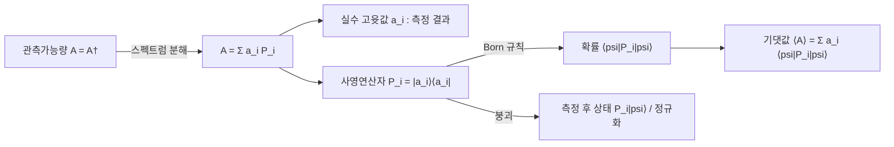

# Observable (Hermitian Operator)

> 측정 가능한 물리량을 나타내는 에르미트 연산자 $A=A^{\dagger}$ 로, 그 실수 고윳값이 측정 결과이고 정규직교 고유상태가 측정 기저를 이룬다.

## 핵심
양자역학의 측정 공준은 모든 물리적 관측가능량을 힐베르트 공간 위의 에르미트(Hermitian, 자기수반) 연산자에 대응시킨다. 즉 관측가능량 $A$ 는 켤레전치가 자기 자신과 같다는 조건을 만족한다.

$$ A = A^{\dagger} $$

이 단 하나의 조건이 측정 이론에 필요한 모든 성질을 끌어낸다. 첫째, 에르미트 연산자의 고윳값은 항상 실수다. 측정으로 읽히는 값은 실수여야 하므로 이 성질이 관측가능량의 자격 요건이 된다. 둘째, 서로 다른 고윳값에 속한 고유상태는 직교하며, 축퇴(degeneracy)가 있어도 적절히 고르면 전체 고유상태를 정규직교기저로 만들 수 있다. 고윳값 방정식과 정규직교 조건은 다음과 같다.

$$ A\lvert a_i\rangle = a_i\lvert a_i\rangle, \qquad a_i\in\mathbb{R}, \qquad \langle a_i\vert a_j\rangle = \delta_{ij} $$

이 고유상태들이 공간 전체를 펼치므로, 관측가능량은 자기 고유기저로의 사영연산자(projector) $P_i=\lvert a_i\rangle\langle a_i\rvert$ 들로 분해된다. 이를 스펙트럼 분해(spectral decomposition)라 부르며, 측정의 모든 결과 구조가 여기에 담긴다.

$$ A = \sum_i a_i\, P_i, \qquad P_i = \lvert a_i\rangle\langle a_i\rvert, \qquad \sum_i P_i = I $$

사영연산자는 $P_i^{\dagger}=P_i$ 이고 $P_i^2=P_i$ 이며 서로 직교한다는 점에서 측정 채널의 기본 단위다. 가능한 측정 결과는 스펙트럼 $\{a_i\}$ 로 고정되고, 각 결과에는 부분공간을 골라내는 사영 $P_i$ 가 짝지어진다.

상태 $\lvert\psi\rangle$ 에서 $A$ 를 측정했을 때의 평균값, 곧 기댓값은 연산자를 상태 사이에 끼워 얻는다. 혼합 상태까지 포괄하려면 밀도연산자 $\rho$ 로 대각합(trace)을 취한 형태를 쓴다.

$$ \langle A\rangle = \langle\psi\rvert A\lvert\psi\rangle = \mathrm{Tr}(\rho A) $$

스펙트럼 분해를 대입하면 기댓값은 결과 $a_i$ 를 그 발생 확률 $\langle\psi\rvert P_i\lvert\psi\rangle$ 로 가중한 평균임이 드러난다. 개별 결과의 확률 규칙은 [[Born Rule]]이 정하고, 측정 직후 상태가 어떤 사영으로 붕괴하는지는 [[Quantum Measurement]]가 정한다. 관측가능량은 이 둘이 작동하는 무대인 셈이다.

## 구조

## 왜 중요한가
관측가능량이 에르미트 연산자라는 공준은 양자이론에서 측정이 무엇인지를 수학적으로 못 박는다. 측정 가능한 양들이 실수 스펙트럼과 정규직교 고유기저를 갖는다는 사실은 곧 측정이 어떤 기저로 이루어지는지를 연산자 자체가 지정한다는 뜻이고, 이로써 상태, 동역학, 측정이 하나의 선형대수 언어 안에서 맞물린다.

두 관측가능량이 동시에 측정 가능한지는 그들의 교환자(commutator)가 결정한다. $[A,B]=AB-BA=0$ 이면 두 연산자는 공통 고유기저를 가지므로 같은 측정으로 두 값을 함께 확정할 수 있다. 반대로 교환하지 않으면 공통 고유기저가 없어 두 양을 임의의 정밀도로 동시에 결정할 수 없고, 그 정량적 한계가 [[Heisenberg Uncertainty Principle|하이젠베르크 불확정성 원리]]로 나타난다. 비가환성은 양자역학을 고전역학과 갈라놓는 핵심 구조다.

큐비트 영역에서 가장 익숙한 관측가능량은 [[Pauli Matrices|파울리 행렬]]이다. $X,Y,Z$ 는 모두 에르미트이고 고윳값 $\pm 1$ 을 가지며, 각각 스핀 $1/2$ 입자의 한 축 스핀 성분이자 단일 큐비트 측정의 기본 관측가능량이 된다. 서로 다른 파울리 연산자는 교환하지 않으므로, 한 축의 측정이 다른 축의 결과를 불확정하게 만드는 비가환성의 가장 단순한 사례를 제공한다.

## 연결
- [[Born Rule]] 관측가능량의 사영 $P_i$ 가 주는 측정 결과의 확률 $\langle\psi\rvert P_i\lvert\psi\rangle$ 을 규정하는 규칙
- [[Quantum Measurement]] 관측가능량으로 정의된 측정의 공준과 측정 직후 상태 붕괴를 다루는 노트
- [[Pauli Matrices]] 큐비트와 스핀의 관측가능량을 이루는 에르미트 연산자 $X,Y,Z$
- [[Heisenberg Uncertainty Principle]] 교환하지 않는 두 관측가능량의 동시 결정 한계를 정량화하는 원리
