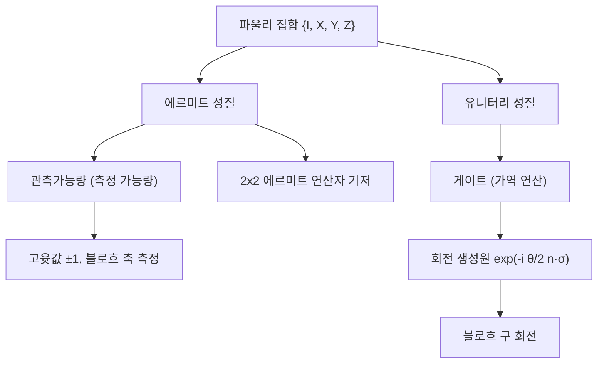

# Pauli Matrices

> 단일 큐비트 공간 위에서 에르미트성과 유니터리성을 동시에 갖는 세 개의 $2 \times 2$ 행렬 $\sigma_x, \sigma_y, \sigma_z$로, 관측가능량이자 양자 게이트이며 모든 단일 큐비트 연산의 대수적 기본 블록이다.

## 핵심
파울리 행렬은 항등 행렬 $I$와 함께 단일 [[Qubit|큐비트]] 위의 선형 연산을 떠받치는 네 개의 기본 행렬이다. 계산 기저 $\lvert 0 \rangle, \lvert 1 \rangle$에서 명시적으로 다음과 같이 적는다.

$$ I = \begin{pmatrix} 1 & 0 \\ 0 & 1 \end{pmatrix}, \quad \sigma_x = X = \begin{pmatrix} 0 & 1 \\ 1 & 0 \end{pmatrix}, \quad \sigma_y = Y = \begin{pmatrix} 0 & -i \\ i & 0 \end{pmatrix}, \quad \sigma_z = Z = \begin{pmatrix} 1 & 0 \\ 0 & -1 \end{pmatrix} $$

세 행렬은 모두 에르미트($\sigma_i^\dagger = \sigma_i$)이면서 동시에 유니터리($\sigma_i^\dagger \sigma_i = I$)라는 드문 성질을 갖는다. 에르미트성 덕분에 실수 고윳값을 갖는 관측가능량으로 쓰이고, 유니터리성 덕분에 상태를 보존하는 가역 연산, 즉 게이트로 쓰인다. 이 이중성이 파울리 행렬을 양자정보의 중심에 두는 이유다.

각 파울리 행렬의 고윳값은 $+1$과 $-1$이며, 제곱하면 항등으로 돌아온다.

$$ \sigma_x^2 = \sigma_y^2 = \sigma_z^2 = I $$

따라서 같은 파울리 연산을 두 번 적용하면 원래 상태로 복원된다. $\sigma_z$의 고유벡터는 계산 기저 $\lvert 0 \rangle, \lvert 1 \rangle$ 자체이고, $\sigma_x$의 고유벡터는 $\lvert \pm \rangle = \tfrac{1}{\sqrt{2}}(\lvert 0 \rangle \pm \lvert 1 \rangle)$, $\sigma_y$의 고유벡터는 $\tfrac{1}{\sqrt{2}}(\lvert 0 \rangle \pm i \lvert 1 \rangle)$이다. 세 연산자의 고유 기저는 [[Bloch Sphere|블로흐 구]]의 세 직교축에 대응한다.

### 대수 구조
파울리 행렬의 힘은 그들이 닫힌 대수를 이룬다는 데서 나온다. 서로 다른 두 파울리 연산자는 반교환하고, 같은 것끼리는 항등을 준다. 이를 반교환자(anticommutator) $\{A, B\} = AB + BA$로 묶으면 다음 한 줄로 압축된다.

$$ \{\sigma_i, \sigma_j\} = 2 \delta_{ij} I $$

한편 교환자(commutator) $[A, B] = AB - BA$로 보면 세 연산자가 순환 구조를 이룬다.

$$ [\sigma_x, \sigma_y] = 2i \sigma_z, \quad [\sigma_y, \sigma_z] = 2i \sigma_x, \quad [\sigma_z, \sigma_x] = 2i \sigma_y $$

이 교환 관계는 첨자 $x, y, z$를 순환시키며 같은 꼴을 유지한다. 반교환자와 교환자를 합치면 곱셈 규칙 $\sigma_i \sigma_j = \delta_{ij} I + i \varepsilon_{ijk} \sigma_k$가 되며, 여기서 $\varepsilon_{ijk}$는 레비치비타 기호다. 이 곱셈 규칙 하나로 파울리 연산의 모든 합성을 계산할 수 있다.

집합 $\{I, X, Y, Z\}$는 모든 $2 \times 2$ 에르미트 연산자의 실수 기저를 이룬다. 임의의 단일 큐비트 에르미트 연산자 $H$는 네 실수 계수 $c_0, c_x, c_y, c_z$로 유일하게 전개된다.

$$ H = c_0 I + c_x \sigma_x + c_y \sigma_y + c_z \sigma_z $$

이 전개는 [[Density Matrix|밀도 행렬]]에도 그대로 적용되어 단일 큐비트 상태를 블로흐 벡터로 좌표화하는 출발점이 된다.

### 회전 생성원
파울리 행렬은 단일 큐비트 유니터리 변환의 생성원이다. 단위 벡터 $\hat{n} = (n_x, n_y, n_z)$ 방향 축을 잡고 $\vec{\sigma} = (\sigma_x, \sigma_y, \sigma_z)$로 두면, 그 축을 중심으로 각 $\theta$만큼 도는 회전 연산자는 다음과 같다.

$$ R_{\hat{n}}(\theta) = \exp\!\left( -i \frac{\theta}{2}\, \hat{n} \cdot \vec{\sigma} \right) = \cos\frac{\theta}{2}\, I - i \sin\frac{\theta}{2}\, (\hat{n} \cdot \vec{\sigma}) $$

오른쪽 닫힌 형태는 $(\hat{n} \cdot \vec{\sigma})^2 = I$라는 사실에서 지수의 테일러 급수를 짝수항과 홀수항으로 나누면 곧바로 나온다. 이 연산자가 [[Bloch Sphere|블로흐 구]] 위의 상태를 $\hat{n}$축 둘레로 $\theta$만큼 회전시키며, 따라서 파울리 행렬은 [[Unitary Evolution|유니터리 발전]]을 구체적으로 생성하는 해밀토니안 항으로 직접 연결된다. 각도에 절반인 $\theta/2$가 등장하는 것은 큐비트의 상태 공간 $SU(2)$가 블로흐 구의 회전군 $SO(3)$를 이중으로 덮기 때문이다.

## 구조

## 왜 중요한가
파울리 행렬은 단일 큐비트 양자정보 전체의 공용어다. 게이트 측면에서 $X$는 $\lvert 0 \rangle$과 $\lvert 1 \rangle$을 맞바꾸는 비트반전(고전 NOT의 양자 대응)이고, $Z$는 $\lvert 1 \rangle$에만 음의 부호를 주는 위상반전이며, $Y$는 둘을 함께 일으킨다. 임의의 단일 큐비트 유니터리는 회전 생성원 표현을 통해 파울리 행렬로 분해되므로, 이들은 단일 큐비트 게이트 집합의 뼈대를 이룬다.

관측 측면에서 세 파울리 연산자는 블로흐 구의 세 축을 따라 큐비트를 측정하는 관측가능량이며, 서로 반교환하기에 동시에 정밀 측정할 수 없다는 불확정성을 대수적으로 드러낸다. 나아가 여러 큐비트로 텐서곱해 확장한 파울리 군은 [[Quantum Error Correction|양자 오류정정]]의 안정자 형식체계와 클리포드 회로의 토대가 된다. 측정 기저, 게이트 분해, 오류 모형, 상태 좌표화가 모두 이 네 행렬 위에서 통일적으로 기술되므로, 파울리 행렬을 정확히 잡는 일은 단일 큐비트 형식체계의 핵심 출발점이다.

## 연결
- [[Qubit]] 파울리 행렬이 작용하는 2준위 양자계이자 이 연산자들의 정의역
- [[Bloch Sphere]] 세 파울리 연산자의 고유 기저가 좌표축이 되고 회전 생성원이 구면 회전을 일으키는 기하 무대
- [[Observable (Hermitian Operator)]] 파울리 행렬이 고윳값 $\pm 1$을 갖는 에르미트 관측가능량으로서 측정에 쓰이는 역할
- [[Unitary Evolution]] 회전 생성원 $\exp(-i\tfrac{\theta}{2}\hat{n}\cdot\vec{\sigma})$를 통해 파울리 행렬이 닫힌 계의 유니터리 시간 발전을 생성하는 관계
