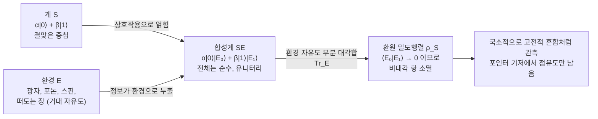

# Quantum Decoherence

> 양자계가 환경과 얽히면서 부분계의 밀도행렬에서 비대각 항(결맞음)이 사실상 소멸해, 결맞은 중첩이 고전적 확률 혼합처럼 보이게 되는 유니터리 과정이다.

## 핵심
이상적인 닫힌 계라면 [[Quantum Superposition|중첩]] 상태 $\lvert \psi \rangle = \alpha \lvert 0 \rangle + \beta \lvert 1 \rangle$는 결맞음을 유지한 채 매끄럽게 발전한다. 그러나 현실의 어떤 계도 환경과 완전히 단절되지 않는다. 계가 주변의 무수한 자유도(광자, 포논, 떠도는 전자기장, 근처 스핀)와 상호작용하면 계와 환경은 [[Quantum Entanglement|얽힘]]을 형성하고, 관측자가 접근할 수 있는 계 단독의 상태에서는 양자적 결맞음이 빠르게 빠져나간다. 이것이 결어긋남이다.

핵심 메커니즘은 계와 환경의 얽힘 생성으로 요약된다. 계의 기저 상태마다 환경이 서로 다른 상태로 갈라진다고 하자.

$$ \left( \alpha \lvert 0 \rangle_S + \beta \lvert 1 \rangle_S \right) \otimes \lvert E_0 \rangle \;\xrightarrow{\ \text{interaction}\ }\; \alpha \lvert 0 \rangle_S \lvert E_0 \rangle + \beta \lvert 1 \rangle_S \lvert E_1 \rangle $$

전체 $SE$는 여전히 순수 상태이고 발전은 전적으로 유니터리다. 그러나 환경의 자유도를 평균해 내는 부분 대각합을 취해 계 $S$의 [[Density Matrix|환원 밀도행렬]]을 보면, 비대각 항이 두 환경 상태의 겹침 $\langle E_0 \vert E_1 \rangle$에 비례하도록 줄어든다.

$$ \rho_S = \mathrm{Tr}_E\left( \lvert \Psi \rangle\langle \Psi \rvert \right) = \begin{pmatrix} \lvert \alpha \rvert^2 & \alpha \beta^{*} \langle E_1 \vert E_0 \rangle \\ \alpha^{*} \beta \langle E_0 \vert E_1 \rangle & \lvert \beta \rvert^2 \end{pmatrix} $$

환경 자유도가 거대하므로 두 환경 상태는 거의 즉시 직교에 가까워지고($\langle E_0 \vert E_1 \rangle \to 0$), 비대각 항은 사라진다. 남는 것은 대각 항만 살아 있는 밀도행렬

$$ \rho_S \;\longrightarrow\; \begin{pmatrix} \lvert \alpha \rvert^2 & 0 \\ 0 & \lvert \beta \rvert^2 \end{pmatrix} $$

으로, 형태상 $\lvert 0 \rangle$과 $\lvert 1 \rangle$의 고전적 확률 혼합과 구별되지 않는다. 즉 같은 대각 분포를 주는 결맞은 중첩과 결맞지 않은 혼합이 [[Density Matrix|밀도행렬]]의 비대각 항으로만 구별되는데, 결어긋남은 바로 그 비대각 항을 지워 전자를 후자처럼 보이게 만든다. 비대각 항의 감쇠는 보통 시간에 대해 지수적이다.

$$ \rho_{01}(t) = \rho_{01}(0)\, e^{-t/T_2} $$

## 흐름

## 포인터 기저와 einselection
결어긋남이 임의의 기저에서 일률적으로 일어나지는 않는다. 환경과의 상호작용 해밀토니안이 특정 기저를 골라내며, 그 기저의 상태들은 환경과 얽혀도 비교적 안정적으로 유지된다. 이 선택된 안정 기저를 포인터 기저(pointer basis)라 하고, 환경이 이 기저를 골라 살아남게 하는 동역학적 선택을 환경 유도 초선택, 즉 einselection이라 부른다. 포인터 상태는 환경에 끊임없이 정보를 흘려도 형태를 유지하므로, 거시 세계에서 우리가 마치 객관적 사실처럼 공유하는 고전적 성질(위치, 전하 분포 같은 양)에 대응한다. 위치 기저가 보통 포인터 기저가 되는 이유는 환경과의 상호작용이 대개 위치에 의존하기 때문이다.

이 그림에서 고전적 세계로의 이행은 신비한 단절이 아니라 결어긋남의 결과로 자연스럽게 설명된다. 거시 물체의 중첩이 관측되지 않는 까닭은 거시 자유도일수록 환경과의 결합이 압도적으로 강해 결어긋남 시간이 상상할 수 없을 만큼 짧기 때문이다. 양자성은 사라진 것이 아니라 관측 불가능할 정도로 빠르게 환경 전체로 번져 국소적으로 회수할 수 없게 된 것이다.

## 진정한 붕괴와의 차이
결어긋남은 [[Quantum Measurement|측정의 파동함수 붕괴]]와 자주 혼동되지만 근본적으로 다르다. 측정 공준은 비유니터리이고 비가역인 단일 결과의 출현을 상정한다. 반면 결어긋남은 합성계 $SE$ 전체로 보면 처음부터 끝까지 유니터리이며, 어떤 정보도 진정으로 소멸하지 않는다. 정보는 파괴된 것이 아니라 계에서 환경으로 옮겨가 사방으로 흩어졌을 뿐이다. 원리적으로 환경 자유도를 전부 회수해 되돌리면 결맞음이 복원되지만, 거대한 환경에서 이는 사실상 불가능하다.

따라서 결어긋남은 측정 문제를 부분적으로만 해명한다. 왜 붕괴가 특정 기저(포인터 기저)에서 일어나고 왜 거시적 중첩이 보이지 않는지는 잘 설명하지만, 고전적 확률 혼합처럼 보이는 상태 가운데 실제로 어느 하나의 결과가 선택되는지는 도출하지 못한다. 결어긋남이 만드는 것은 비대각 항이 사라진 부적절 혼합(improper mixture)이고, 측정이 요구하는 것은 그 가운데 하나가 실현되는 단일 결과의 사실성이다. 이 차이가 결어긋남을 측정의 해소가 아니라 측정이 일어나는 무대를 마련하는 과정으로 자리매김한다.

## 결맞음 시간과 완화
실험과 공학에서 결어긋남은 두 가지 특성 시간으로 정량화된다.

- 위상 완화 시간 $T_2$는 비대각 항, 곧 결맞음이 감쇠하는 시간 척도다. 상대 위상 정보가 환경으로 빠져나가는 속도를 나타내며, 순수한 결어긋남을 가장 직접적으로 측정한다.
- 에너지 완화 시간 $T_1$은 대각 항, 곧 점유도가 평형으로 이완하는 시간 척도다. 들뜬 상태 $\lvert 1 \rangle$이 환경으로 에너지를 잃고 $\lvert 0 \rangle$으로 떨어지는 과정을 지배한다.

에너지 완화는 위상도 흐트러뜨리므로 두 시간은 일반적으로 $T_2 \le 2 T_1$의 관계를 만족한다. 큐비트의 결맞음 수명은 결국 $T_2$가 좌우하며, 이 값이 길수록 붕괴 전에 더 많은 양자 연산을 수행할 수 있다.

## 왜 중요한가
결어긋남은 양자계산의 가장 근본적인 장애물이다. 양자 알고리즘은 [[Quantum Superposition|중첩]]과 얽힘이 결맞은 채로 유지되는 동안 정답의 진폭을 간섭으로 키우도록 설계되는데, 결어긋남은 바로 그 결맞음을 연산이 끝나기 전에 갉아먹는다. 게이트 한 번의 실행 시간과 $T_2$의 비율이 결맞음을 잃기 전 쌓을 수 있는 연산 깊이의 상한을 사실상 결정한다. 그래서 더 긴 $T_2$를 향한 재료와 제어의 개선이 모든 양자 하드웨어 로드맵의 핵심 지표가 된다.

그러나 물리적 결맞음 시간만으로 임의 규모의 계산을 보장할 수는 없으므로, 정보 차원에서 결어긋남에 맞서는 전략이 함께 요구된다. 환경 결합을 줄이는 수동적 방어로 [[Decoherence-Free Subspace|결어긋남 없는 부분공간]]을 활용하고, 오류를 능동적으로 검출하고 정정하는 [[Quantum Error Correction|양자 오류정정]]을 더해 결함허용(fault tolerance) 임계 아래로 잡음을 누르는 것이 확장 가능한 양자컴퓨터의 길이다. 결어긋남을 정확히 이해하는 일은 곧 양자정보를 보호하는 모든 기법의 출발점이다.

## 연결
- [[Density Matrix]] 결어긋남이 작용하는 무대이며, 소멸하는 비대각 항과 환원 밀도행렬로 결맞음 상실을 정량화함
- [[Quantum Measurement]] 측정의 비가역적 단일 결과 붕괴와 달리 결어긋남은 합성계 전체로는 유니터리임을 대조하는 노트
- [[Quantum Entanglement]] 계와 환경의 얽힘 형성이 결어긋남을 일으키는 직접적 원인
- [[Quantum Superposition]] 결어긋남이 파괴하는 대상으로, 결맞은 중첩이 고전적 혼합으로 보이게 되는 과정
- [[Bloch Sphere]] 결맞음 상실과 $T_1$, $T_2$ 완화가 블로흐 벡터의 수축으로 시각화되는 단일 큐비트 기하
- [[Quantum Error Correction]] 결어긋남으로 인한 오류를 능동적으로 검출하고 정정해 결맞음을 보호하는 대응 기법
- [[Decoherence-Free Subspace]] 환경 결합의 대칭을 이용해 결어긋남에 둔감한 상태 공간을 마련하는 수동적 방어
