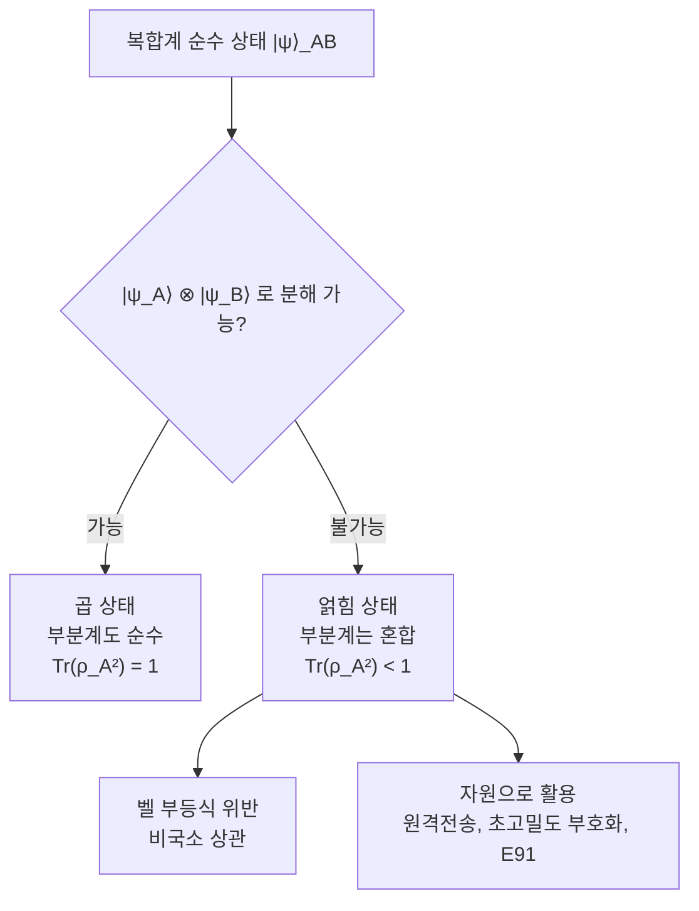

# Quantum Entanglement

> 복합계의 상태가 부분계 상태의 텐서곱으로 분해되지 않는 비분리(non-separable) 현상으로, 부분계 사이에 고전 상관으로는 설명할 수 없는 양자 상관을 남긴다.

## 핵심
얽힘은 둘 이상의 부분계로 이루어진 복합계에서만 정의되는 성질이다. 부분계 $A$와 $B$가 각각 [[Tensor Product|텐서곱]]으로 결합된 복합계 $\mathcal{H}_{AB} = \mathcal{H}_A \otimes \mathcal{H}_B$에 산다고 하자. 복합계의 순수 상태 $\lvert \psi \rangle_{AB}$가 어떤 단일 부분계 상태의 곱으로 적힐 수 있으면 곱 상태(separable state)다.

$$ \lvert \psi \rangle_{AB} = \lvert \psi \rangle_A \otimes \lvert \psi \rangle_B $$

반대로 어떤 $\lvert \psi \rangle_A$와 $\lvert \psi \rangle_B$를 골라도 위처럼 분해할 수 없으면 그 상태는 얽혀(entangled) 있다. 이 분해 불가능성이 얽힘의 정의이며, 추가적인 물리적 가정이 아니라 텐서곱 상태 공간이 곱 상태로 채워지지 않는다는 선형대수적 사실에서 곧바로 따라 나온다. 대표적인 예가 [[Bell States|벨 상태]]다.

$$ \lvert \Phi^{+} \rangle = \frac{1}{\sqrt{2}} \big( \lvert 00 \rangle + \lvert 11 \rangle \big) $$

이 상태를 $(\alpha\lvert 0\rangle + \beta\lvert 1\rangle) \otimes (\gamma\lvert 0\rangle + \delta\lvert 1\rangle)$로 전개하면 교차항 $\lvert 01 \rangle$과 $\lvert 10 \rangle$의 계수가 0이어야 하는데, 그러면 $\lvert 00 \rangle$ 또는 $\lvert 11 \rangle$ 계수 중 하나도 0이 되어 모순이다. 따라서 어떤 곱으로도 적을 수 없다.

### 부분계는 혼합상태가 된다
얽힘의 핵심 결과 중 하나는 복합계가 순수 상태일지라도 부분계 단독은 더 이상 순수 상태가 아니라는 점이다. 부분계 $A$를 기술하려면 $B$의 자유도를 [[Partial Trace|부분 대각합]]으로 평균해 환원 밀도행렬을 얻는다.

$$ \rho_A = \mathrm{Tr}_B\big( \lvert \psi \rangle_{AB} \langle \psi \rvert \big) $$

$\lvert \Phi^{+} \rangle$에 대해 계산하면 부분계는 정보가 전혀 없는 최대 혼합 상태가 된다.

$$ \rho_A = \frac{1}{2}\begin{pmatrix} 1 & 0 \\ 0 & 1 \end{pmatrix} = \frac{I}{2}, \qquad \mathrm{Tr}(\rho_A^2) = \frac{1}{2} < 1 $$

순수도 $\mathrm{Tr}(\rho_A^2)$가 1에서 멀어질수록 두 계가 더 강하게 얽혀 있다. 즉 전체에 대한 완전한 지식이 있어도 부분에 대한 지식은 불완전해진다는 역설적 상황이 얽힘의 정보론적 지문이며, 이 때문에 얽힘 정량화는 [[Density Matrix|밀도행렬]] 형식 위에서 전개된다. 순수 상태에서 얽힘의 양은 환원 밀도행렬의 폰 노이만 엔트로피 $S(\rho_A) = -\mathrm{Tr}(\rho_A \log_2 \rho_A)$인 얽힘 엔트로피로 측정한다.

### 고전 상관을 넘어서는 상관
얽힘은 단순한 상관관계가 아니다. 고전적으로도 두 변수가 상관될 수 있지만, 그런 상관은 측정 이전부터 각 부분계가 가지고 있던 국소적 성질로 모두 설명된다. 얽힘이 만드는 상관은 어떤 국소 숨은 변수 모형으로도 재현할 수 없을 만큼 강하다. 이 초과분이 측정 가능한 형태로 드러나는 것이 [[Bell Inequality (CHSH)|벨 부등식]] 위반이며, 비국소성(non-locality)의 실험적 증거다.

## 흐름

## EPR 역설과 신호 불가
1935년 아인슈타인, 포돌스키, 로젠은 얽힘이 양자역학의 불완전성을 드러낸다고 주장했다(EPR 역설). 한쪽 입자를 측정하는 순간 멀리 떨어진 다른 입자의 측정 결과가 즉시 정해지는 것처럼 보이는데, 이를 아인슈타인은 원격 작용(spooky action at a distance)이라 불렀다. 그러나 이 상관은 정보를 전달하지 못한다. 측정하는 쪽이 자기 결과를 마음대로 고를 수 없고 무작위로만 나오므로, 상대는 자신의 부분계만 보아서는 멀리서 측정이 일어났는지조차 알 수 없다. 이 성질을 신호 불가(no-signaling)라 하며, 얽힘이 상대성이론의 광속 한계와 충돌하지 않는 이유다. 얽힘으로 무언가를 보내려면 측정 결과를 알리는 별도의 고전 통신 채널이 반드시 필요하다.

## 일부일처성 (monogamy)
얽힘은 무제한으로 공유되지 않는다. $A$가 $B$와 최대로 얽혀 있으면, 같은 $A$가 제3의 계 $C$와는 전혀 얽힐 수 없다. 이 자원 보존적 제약을 얽힘의 일부일처성(monogamy of entanglement)이라 하며, 세 큐비트에 대해 정량적 부등식으로 표현된다.

$$ \mathcal{C}^2_{A|BC} \ge \mathcal{C}^2_{AB} + \mathcal{C}^2_{AC} $$

여기서 $\mathcal{C}$는 얽힘을 재는 컨커런스(concurrence)다. 일부일처성은 양자키분배의 보안 근거가 되는데, 도청자가 합법 사용자들의 얽힘을 훔치려 할수록 사용자들 사이의 얽힘이 줄어들어 도청이 통계적으로 드러나기 때문이다.

## 왜 중요한가
얽힘은 양자역학을 고전 물리와 가장 뚜렷하게 가르는 비고전 자원이며, 양자정보과학 거의 모든 응용의 연료다. 측정만으로는 복제할 수 없고 국소 연산과 고전 통신만으로는 새로 만들어낼 수 없는 희소 자원이라는 점에서, 얽힘은 소모하고 분배하고 정제하는 대상으로 다뤄진다. [[Quantum Teleportation|양자 원격전송]]은 미리 공유한 얽힘 쌍을 소모해 미지의 양자 상태를 전송하고, [[Superdense Coding|초고밀도 부호화]]는 한 큐비트로 두 고전 비트를 전달한다. [[E91|E91 프로토콜]]은 얽힘의 비국소 상관을 직접 키 분배와 도청 탐지에 쓴다. 나아가 얽힘은 양자 알고리즘의 가속과 [[Quantum Error Correction|양자 오류정정]] 부호의 작동, 그리고 측정 기반 양자계산의 자원 상태를 떠받친다. 얽힘이 없으면 양자컴퓨터는 고전적으로 효율적으로 시뮬레이션될 수 있다고 여겨질 만큼, 얽힘은 양자 우위의 핵심 원천이다.

## 연결
- [[Bell States]] 두 큐비트의 최대 얽힘 상태 네 가지로, 얽힘과 비국소성을 보이는 표준 예
- [[Tensor Product]] 복합계 상태 공간을 구성하고 곱 상태와 비곱 상태를 가르는 수학적 토대
- [[Bell Inequality (CHSH)]] 얽힘이 만드는 상관이 국소 실재론을 넘어섬을 검증하는 부등식
- [[Density Matrix]] 환원 밀도행렬의 혼합도로 부분계의 얽힘을 정량화하는 형식
- [[Superdense Coding]] 사전 분배한 얽힘을 통신 자원으로 소모해 채널의 고전 용량을 두 배로 늘리는 프로토콜
