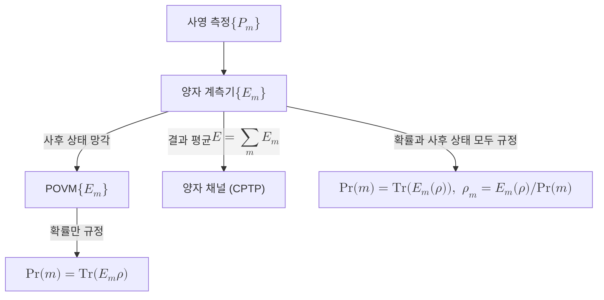
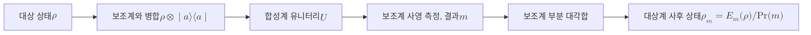

# Quantum Instrument

> 측정에서 얻는 고전 결과의 확률과 그 결과에 따른 사후 양자 상태를 동시에 규정하는, 측정의 가장 완전한 일반 형식이다.

## 핵심
양자 계측기는 측정을 두 측면에서 한꺼번에 기술한다. 하나는 어떤 고전 결과 $m$이 나올 확률이고, 다른 하나는 그 결과가 나왔을 때 계가 어떤 상태로 갱신되는가이다. [[POVM]]이 결과 확률이라는 통계만 다룬다면, 양자 계측기는 거기에 사후 상태까지 더해 측정 과정 전체를 빠짐없이 담는다.

형식적으로 계측기는 결과 $m$마다 하나의 완전 양성 사상(completely positive map) $\mathcal{E}_m$을 대응시킨 집합 $\{\mathcal{E}_m\}$이다. 각 $\mathcal{E}_m$은 상태 $\rho$에 작용해 정규화되지 않은 사후 상태를 내놓으며, 이들의 합 $\mathcal{E} = \sum_m \mathcal{E}_m$이 자취를 보존하는 사상(trace-preserving map)이어야 한다.

$$ \mathcal{E}_m(\rho) \succeq 0, \qquad \mathrm{Tr}\Big(\sum_m \mathcal{E}_m(\rho)\Big) = \mathrm{Tr}(\rho) $$

결과 $m$을 얻을 확률은 해당 사상이 내놓은 정규화되지 않은 상태의 자취로 주어진다. 이는 [[Born Rule]]의 일반화된 형태다.

$$ \Pr(m) = \mathrm{Tr}\big(\mathcal{E}_m(\rho)\big) $$

결과 $m$을 관측한 직후의 정규화된 [[Density Matrix|밀도 행렬]]은 그 확률로 나누어 얻는다.

$$ \rho_m = \frac{\mathcal{E}_m(\rho)}{\mathrm{Tr}\big(\mathcal{E}_m(\rho)\big)} $$

각 사상을 Kraus 형태로 풀어 쓰면 측정 연산자 $K_{m,k}$들의 집합으로 표현된다. 한 결과 $m$에 여러 Kraus 연산자가 대응할 수 있다.

$$ \mathcal{E}_m(\rho) = \sum_k K_{m,k}\, \rho\, K_{m,k}^\dagger, \qquad \sum_{m,k} K_{m,k}^\dagger K_{m,k} = I $$

이때 결과 $m$의 [[POVM]] 효과 연산자는 $E_m = \sum_k K_{m,k}^\dagger K_{m,k}$로 자동으로 정해진다. 즉 계측기에서 사후 상태 정보를 잊고 확률 구조만 남기면 정확히 POVM이 떨어진다. 반대로 하나의 POVM을 실현하는 계측기는 무수히 많은데, 같은 효과 연산자 $E_m$이라도 Kraus 분해를 어떻게 고르느냐에 따라 사후 상태 $\rho_m$이 달라지기 때문이다.

## 위계
측정 형식들은 담는 정보의 양에 따라 위계를 이룬다. 가장 좁은 사영 측정에서 출발해, 결과 통계만 추리면 POVM이 되고, 사후 상태까지 포함하도록 확장하면 양자 계측기가 된다. 결과를 무시하고 모든 가지를 평균하면 일반적인 양자 채널(완전 양성 자취 보존 사상)로 환원된다.

이 그림이 보여 주듯 양자 계측기는 두 갈래로 정보를 흘려보낸다. 결과 $m$을 기록하고 보존하면 사후 상태 $\rho_m$이 정의된 선택적 측정이 되고, 결과를 기록하지 않거나 잊으면 $\sum_m \mathcal{E}_m$이라는 비선택적 측정, 즉 측정 행위가 야기한 평균적 상태 변화만 남는 양자 채널이 된다. 이 평균화는 환경으로 흘러나간 정보를 [[Partial Trace|부분 대각합]]으로 적분해 없애는 과정과 같은 구조다.

## 물리적 실현
양자 계측기는 추상적 정의가 아니라 실제 측정 장치의 동작을 그대로 형식화한 것이다. 대상계를 보조계(ancilla)와 [[Tensor Product|텐서곱]]으로 병합하고, 합성계를 유니터리 $U$로 발전시킨 뒤, 보조계에 사영 측정을 수행하고 그 결과를 읽는다. 보조계에서 결과 $m$을 얻은 뒤 보조계를 [[Partial Trace|부분 대각합]]으로 추적해 없애면, 대상계에는 정확히 $\mathcal{E}_m(\rho)$ 형태의 정규화되지 않은 사후 상태가 남는다.

이 구성은 [[POVM]]의 Naimark 확장에 사후 상태 추적을 더한 형태로, 측정 장치 역시 양자계라는 사실에서 계측기 형식이 왜 가장 일반적인지를 드러낸다. 측정이 대상계와 장치 사이의 얽힘이고 그 장치를 읽는 행위라면, 대상계 입장에서는 사영성이 깨진 완전 양성 사상의 가지들만 보이며, 그 가지 모음이 바로 양자 계측기다.

## 왜 중요한가
양자 계측기는 측정을 다루는 가장 완전한 언어다. [[POVM]]은 한 번 측정한 결과의 확률을 묻는 데는 충분하지만, 측정한 계를 그다음 단계에서 다시 쓰는 상황에서는 부족하다. 측정 후 상태가 무엇인지 알아야 후속 게이트, 후속 측정, 또는 조건부 피드백을 적용할 수 있기 때문이다. 측정 결과에 따라 다음 동작이 갈리는 적응적 프로토콜은 본질적으로 계측기의 언어로 기술된다.

이 형식은 양자정보의 여러 핵심 절차의 공통 토대가 된다. 양자 텔레포테이션과 [[Quantum Error Correction|양자 오류정정]]의 신드롬 측정처럼 결과를 읽고 그 값에 따라 회복 연산을 거는 과정, 약한 측정처럼 정보를 조금만 추출하고 상태를 거의 보존하는 측정, 그리고 측정 기반 양자계산처럼 측정의 연쇄로 계산을 진행하는 모형이 모두 양자 계측기 위에서 정식화된다. 더 근본적으로, 양자 계측기는 정보 획득과 상태 교란의 상충 관계를 한 형식 안에서 정량화하게 해 준다. 결과를 더 선명하게 알수록 사후 상태는 더 크게 흐트러지며, 이 거래가 Kraus 연산자의 구조에 직접 새겨진다.

## 연결
- [[POVM]] 양자 계측기에서 사후 상태 정보를 지우고 확률 구조만 남기면 효과 연산자 $E_m = \sum_k K_{m,k}^\dagger K_{m,k}$로 환원되는 좁은 형식
- [[Quantum Measurement]] 사영 측정과 비선택적 측정을 특수 경우로 포함하는 측정 공준의 가장 넓은 일반화
- [[Density Matrix]] 계측기의 사상이 입력으로 받고 사후 상태로 출력하는 일반 상태 표현
- [[Partial Trace]] 보조계를 추적해 대상계 사후 상태를 얻거나 결과를 평균해 양자 채널로 환원할 때 쓰는 연산
- [[Born Rule]] 결과 확률 $\Pr(m) = \mathrm{Tr}(\mathcal{E}_m(\rho))$로 일반화되는 측정 확률의 근거
- [[Tensor Product]] 대상계와 보조계를 병합해 계측기를 물리적으로 실현하는 합성 구조
