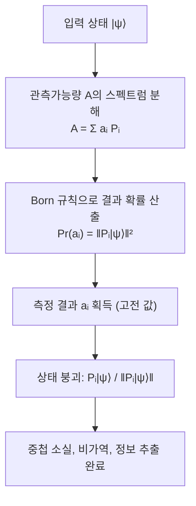

# Quantum Measurement

> 양자 상태로부터 고전 결과를 확률적으로 추출하면서 상태를 측정한 관측가능량의 한 고유성분으로 붕괴시키는, 비유니터리이고 되돌릴 수 없는 양자역학의 공준이다.

## 핵심
측정은 양자역학의 독립된 공준으로, 닫힌 계의 결정론적 시간 발전을 규정하는 [[Unitary Evolution]]과는 성격이 완전히 다르다. 유니터리 발전이 가역적이고 진폭을 보존하는 매끄러운 변환이라면, 측정은 단 한 번에 하나의 고전 값을 뽑아내고 그 대가로 상태를 비가역적으로 바꾼다.

표준적인 사영 측정(projective measurement) 또는 von Neumann 측정은 측정하려는 물리량을 [[Observable (Hermitian Operator)|에르미트 연산자]] $A$로 둔다. $A$가 에르미트이므로 실수 고윳값을 가지는 스펙트럼 분해

$$ A = \sum_i a_i P_i, \qquad P_i = \sum_{k} \lvert a_i^{(k)} \rangle\langle a_i^{(k)} \rvert $$

를 가진다. 여기서 $a_i$는 서로 다른 고윳값이고 $P_i$는 고윳값 $a_i$의 고유공간으로 보내는 사영연산자다. 측정의 가능한 결과는 정확히 이 고윳값들 $a_i$이며, 그 외의 값은 결코 나오지 않는다. 사영연산자는 $P_i P_j = \delta_{ij} P_i$와 $\sum_i P_i = I$를 만족하는 완전한 직교 분해를 이룬다.

상태 $\lvert \psi \rangle$를 측정해 결과 $a_i$를 얻을 확률은 [[Born Rule]]이 규정한다.

$$ \Pr(a_i) = \langle \psi \rvert P_i \lvert \psi \rangle = \lVert P_i \lvert \psi \rangle \rVert^2 $$

결과 $a_i$를 얻은 직후, 상태는 해당 고유공간으로 사영된 뒤 다시 정규화된 형태로 붕괴한다.

$$ \lvert \psi \rangle \;\longmapsto\; \frac{P_i \lvert \psi \rangle}{\lVert P_i \lvert \psi \rangle \rVert} $$

이 사영 후 정규화가 흔히 파동함수 붕괴(wave function collapse)라고 불리는 과정이다. 측정 전 상태에 담겨 있던 다른 고유성분들의 진폭은 이 단계에서 완전히 소거된다.

## 흐름

## 비가역성과 중첩의 붕괴
측정이 유니터리 발전과 결정적으로 갈리는 지점은 비유니터리성과 비가역성이다. 사영연산자 $P_i$는 일반적으로 역원이 없으므로, 측정 후의 상태만 보고 측정 전의 [[Quantum Superposition|중첩]]을 복원하는 것은 불가능하다. 측정 전 상태가 여러 고유성분에 걸친 결맞은 중첩이었더라도, 측정은 그중 하나만 남기고 나머지 진폭과 상대 위상 정보를 영구히 폐기한다.

바로 이 점에서 측정은 정보 추출과 정보 파괴를 동시에 수행한다. 관측자는 고전 결과 $a_i$라는 정보를 얻지만, 그 대가로 측정 기저에서의 결맞음이 사라진다. 동일한 미지의 상태를 한 번 측정한 뒤 다시 같은 상태를 복원해 재측정할 수 없다는 사실은 [[No-Cloning Theorem|복제 불가 정리]]와 함께 양자 정보가 고전 정보처럼 자유롭게 읽고 복사될 수 없는 근본 이유를 이룬다.

## 일반화된 측정 (POVM)
사영 측정은 측정의 가장 깔끔한 특수 경우다. 보다 일반적인 측정은 [[POVM|POVM]](Positive Operator-Valued Measure)으로 기술하며, 측정 장치가 보조계와 결합한 뒤 그 합성계를 사영 측정하는 상황까지 포괄한다. POVM은 양의 준정부호 연산자 집합 $\{E_m\}$으로 주어지고, 완전성 조건

$$ \sum_m E_m = I, \qquad E_m \succeq 0 $$

을 만족한다. 결과 $m$의 확률은 $\Pr(m) = \langle \psi \rvert E_m \lvert \psi \rangle$이다. 사영 측정은 $E_m = P_m$이 직교 사영연산자인 특수한 경우에 해당한다. POVM은 측정 후 상태를 유일하게 지정하지 않으며, 결과의 수가 Hilbert 공간 차원을 초과할 수 있는 등 사영 측정보다 자유도가 크다. 자세한 형식은 별도 노트 [[POVM]]로 분리한다.

## 측정 문제와 결어긋남
측정 공준은 계산 도구로서는 완결적이지만, 왜 그리고 언제 붕괴가 일어나는가라는 해석적 물음은 남긴다. 이것이 측정 문제(measurement problem)다. 유니터리 발전만으로는 비가역적 붕괴가 도출되지 않는데, 측정이라는 동역학을 별도 공준으로 끼워 넣어야 한다는 긴장에서 문제가 비롯된다.

이 지점에서 [[Quantum Decoherence|결어긋남]]의 역할을 분명히 구분하는 것이 중요하다. 결어긋남은 계가 환경과 얽히면서 부분계의 밀도행렬에서 비대각 항(결맞음)이 사실상 사라지는, 어디까지나 유니터리한 과정이다. 이는 왜 거시적 중첩이 관측되지 않고 측정이 특정 기저에서 일어나는지를 설명해 측정 문제를 크게 완화한다. 다만 결어긋남은 결맞은 중첩을 고전적 확률 혼합처럼 보이게 만들 뿐, 그 혼합 가운데 실제로 어느 하나의 결과가 선택되는 단일 결과의 출현 자체를 도출하지는 못한다. 즉 결어긋남은 측정 문제를 해소하는 메커니즘이 아니라, 붕괴가 일어나는 기저를 환경이 어떻게 고르는지를 설명하는 부분적 해명이다.

## 왜 중요한가
측정은 양자 형식체계와 실험실의 고전적 관측을 잇는 유일한 다리다. 아무리 정교하게 중첩과 얽힘을 설계하더라도, 최종적으로 답을 얻는 순간은 항상 측정이며 그 순간 자원으로서의 양자성은 소진된다. [[Quantum Superposition|중첩]]이 측정이 하나의 결과만 반환한다는 제약 아래에서만 의미를 가지는 이유, 양자 알고리즘이 정답의 진폭을 보강하도록 간섭을 설계해야 하는 이유, 양자 키 분배가 도청 시도를 흔적으로 남길 수 있는 이유가 모두 측정의 확률성과 비가역성에서 나온다. 측정은 양자 정보가 고전 세계로 빠져나오는 좁은 문이며, 그 문의 규칙이 곧 양자정보과학의 가능성과 한계를 동시에 규정한다.

## 연결
- [[Born Rule]] 측정 결과 $a_i$의 확률 $\lVert P_i \lvert \psi \rangle \rVert^2$를 진폭으로부터 규정하는 규칙
- [[Observable (Hermitian Operator)]] 측정 가능한 물리량을 나타내며 그 고윳값이 곧 측정 결과가 되는 에르미트 연산자
- [[Quantum Superposition]] 측정이 붕괴시키는 대상으로, 측정 직후 단일 고유성분만 남고 결맞음이 소실됨
- [[Quantum Decoherence]] 측정이 특정 기저에서 일어나는 이유를 부분적으로 설명하나 단일 결과 선택까지는 도출하지 못하는 유니터리 과정
- [[Unitary Evolution]] 가역적이고 결정론적인 닫힌 계 발전과 대비되는 비유니터리이고 비가역인 측정 동역학
- [[POVM]] 사영 측정을 특수 경우로 품으면서 보조계 결합까지 포괄하는 일반화된 측정 형식
