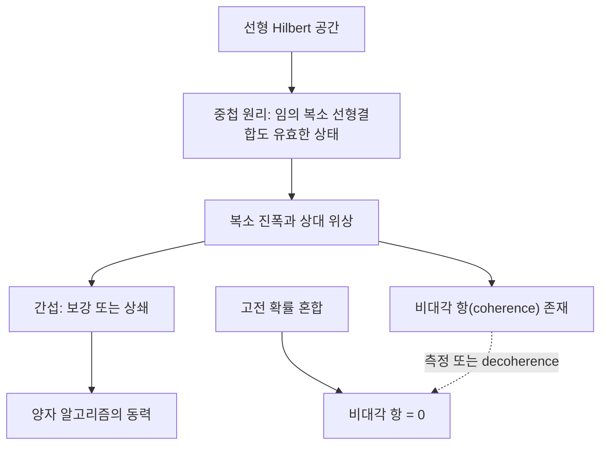

# Quantum Superposition

> 두 유효한 양자 상태의 임의의 복소 선형결합 역시 유효한 양자 상태라는 원리로, 상태공간이 Hilbert 공간이라는 선형 구조에서 직접 비롯된다.

## 핵심
양자역학에서 상태는 복소 Hilbert 공간의 벡터로 기술된다. 이 공간이 선형이라는 사실 자체가 중첩 원리를 강제한다. 즉 $\lvert \psi_1 \rangle$과 $\lvert \psi_2 \rangle$이 가능한 상태라면, 임의의 복소수 $\alpha, \beta$에 대한 결합

$$ \lvert \psi \rangle = \alpha \lvert \psi_1 \rangle + \beta \lvert \psi_2 \rangle $$

또한 (정규화 후) 가능한 상태가 된다. 큐비트의 표준 예시는 계산 기저 $\lvert 0 \rangle$과 $\lvert 1 \rangle$의 동등 중첩인

$$ \lvert + \rangle = \tfrac{1}{\sqrt{2}}\left( \lvert 0 \rangle + \lvert 1 \rangle \right) $$

이다. 여기서 시스템은 0도 1도 아닌, 두 기저 상태에 동시에 진폭을 갖는 하나의 잘 정의된 상태에 놓인다.

계수 $\alpha, \beta$는 단순한 확률이 아니라 복소 진폭이다. 각각을 $\alpha = \lvert \alpha \rvert e^{i\phi_\alpha}$처럼 크기와 위상으로 분해할 수 있고, 측정 통계에 실제로 영향을 주는 것은 두 진폭 사이의 상대 위상 $\phi_\beta - \phi_\alpha$이다. 반면 전체 상태에 곱해진 전역 위상 $e^{i\gamma}$는 어떤 물리적 예측도 바꾸지 못한다. 따라서 $\lvert \psi \rangle$과 $e^{i\gamma}\lvert \psi \rangle$은 같은 물리 상태이며, 상태는 엄밀히는 사영 Hilbert 공간의 한 점으로 본다.

이 상대 위상이 중요한 이유는 간섭(interference) 때문이다. 두 경로의 진폭이 더해질 때 위상이 맞으면 보강되어 확률이 커지고, 위상이 반대이면 상쇄되어 확률이 0에 가까워질 수 있다. 예를 들어 $\lvert + \rangle$에 위상을 한 번 뒤집어 $\lvert - \rangle = \tfrac{1}{\sqrt{2}}(\lvert 0 \rangle - \lvert 1 \rangle)$로 만든 뒤 다시 동일한 변환을 거치면 진폭들이 상쇄와 보강을 거쳐 결정론적으로 $\lvert 1 \rangle$ 같은 결과로 모인다. 이러한 진폭의 보강과 상쇄를 설계하는 것이 [[Grover's Algorithm|Grover]]와 [[Shor's Algorithm|Shor]] 같은 양자 알고리즘의 핵심 동력이다.

## 고전 혼합과의 차이
중첩은 고전적 확률 혼합(incoherent mixture)과 결정적으로 다르다. 동전을 던져 절반은 $\lvert 0 \rangle$, 절반은 $\lvert 1 \rangle$을 준비한 통계적 앙상블은 정보가 결여된 무지의 상태인 반면, $\lvert + \rangle$는 위상 관계까지 완전히 명시된 순수 상태(coherent superposition)다. 두 경우 모두 계산 기저에서 측정하면 0과 1이 각각 절반씩 나오지만, 측정 기저를 바꾸면 차이가 드러난다. $\lvert + \rangle$를 $\{\lvert + \rangle, \lvert - \rangle\}$ 기저에서 측정하면 항상 $\lvert + \rangle$가 나오는 반면, 혼합은 여전히 절반씩 갈린다.

이 구분은 [[Density Matrix]]의 성분으로 명확히 가시화된다. 중첩 상태의 밀도행렬

$$ \rho_+ = \lvert + \rangle\langle + \rvert = \frac{1}{2}\begin{pmatrix} 1 & 1 \\ 1 & 1 \end{pmatrix} $$

은 0이 아닌 비대각 항(coherence)을 가지는 반면, 고전 혼합

$$ \rho_{\text{mix}} = \frac{1}{2}\lvert 0 \rangle\langle 0 \rvert + \frac{1}{2}\lvert 1 \rangle\langle 1 \rvert = \frac{1}{2}\begin{pmatrix} 1 & 0 \\ 0 & 1 \end{pmatrix} $$

은 비대각 항이 모두 0이다. 대각 항(populations)이 동일해도 비대각 항의 존재 여부가 결맞음의 유무를 가른다. 환경과의 상호작용으로 이 비대각 항이 사라지는 과정이 [[Quantum Decoherence|결어긋남]](decoherence)이며, 중첩이 사실상 고전 혼합으로 무너지는 메커니즘이다.

## 흐름

## 왜 중요한가
중첩은 양자정보의 거의 모든 우위가 출발하는 자원이다. $n$개 큐비트는 $2^n$개 기저 상태의 중첩에 동시에 놓일 수 있어, 단일 연산이 지수적으로 많은 진폭에 한꺼번에 작용한다. 다만 이 병렬성 자체가 곧 속도 향상은 아니며, 측정이 단 하나의 결과만 반환하므로 원하는 답의 진폭이 보강되고 나머지가 상쇄되도록 간섭을 설계해야 비로소 이득이 실현된다. [[Quantum Entanglement|얽힘]]은 둘 이상의 시스템에 걸친 중첩으로, 중첩 원리가 합성계로 확장된 결과다.

측정에 이르면 중첩은 유지되지 않는다. 어떤 관측가능량에 대해 측정하면 상태는 그 고유기저의 한 성분으로 붕괴하며, 각 결과의 확률은 [[Born Rule]]이 진폭의 제곱 크기 $\lvert \alpha \rvert^2$로 규정한다. 따라서 중첩은 측정 이전까지만 존재하는 동역학적 자원이고, 무엇을 어떻게 측정하는가에 따라 그 정보가 드러나는 방식이 결정된다. 이 측정 과정의 정식 기술은 [[Quantum Measurement]]가 담당한다.

## 연결
- [[Qubit]] 중첩 원리가 가장 단순하게 실현되는 2차원 상태공간의 기본 단위
- [[Quantum Measurement]] 중첩이 측정으로 붕괴하는 과정과 측정 기저의 역할을 정식화
- [[Born Rule]] 중첩의 복소 진폭을 관측 확률 $\lvert \alpha \rvert^2$로 연결하는 규칙
- [[Density Matrix]] 결맞은 중첩과 고전 혼합의 차이를 대각 항과 비대각 항으로 가시화
- [[Quantum Decoherence]] 환경 결합으로 비대각 항이 사라져 결맞은 중첩이 고전 혼합으로 무너지는 과정
