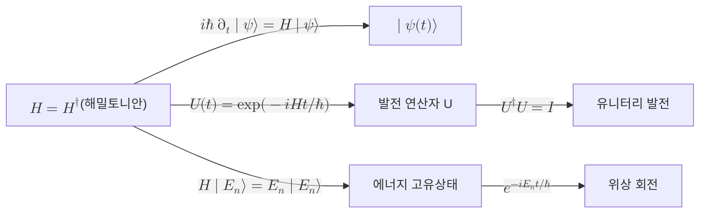

# Schrödinger Equation

> 고립된 양자계의 상태 켓이 시간에 따라 어떻게 변하는지를 규정하는 일계 선형 미분방정식으로, 계의 총에너지를 나타내는 에르미트 연산자 해밀토니안 $H$ 가 상태의 시간 변화율을 결정한다.

## 핵심
양자역학의 동역학 공준은 측정이 개입하지 않는 닫힌 계의 상태가 시간에 따라 결정적으로 변한다고 말한다. 그 변화의 연속적이고 미분적인 형태를 적은 것이 시간 의존 슈뢰딩거 방정식이다. [[Hilbert Space|힐베르트 공간]] 위의 상태 켓 $\lvert\psi(t)\rangle$ 는 다음을 따른다.

$$ i\hbar\,\frac{d}{dt}\lvert\psi(t)\rangle = H\,\lvert\psi(t)\rangle $$

여기서 $\hbar$ 는 약분된 플랑크 상수이고, $H$ 는 계의 총에너지에 대응하는 [[Observable (Hermitian Operator)|에르미트 연산자]]인 해밀토니안이다. 이 방정식은 상태에 대해 선형이며 일계이다. 선형성 덕분에 두 해의 임의의 선형 결합도 다시 해가 되고, 이는 [[Quantum Superposition|중첩]]이 시간 발전 아래에서 보존되는 근거가 된다. 일계라는 사실은 초기 시각의 상태 $\lvert\psi(t_0)\rangle$ 하나만 주어지면 이후의 모든 시각이 유일하게 결정된다는 뜻이다.

해밀토니안이 시간에 무관할 때 이 방정식의 형식해는 지수 사상으로 적힌다.

$$ \lvert\psi(t)\rangle = \exp\!\left(-\frac{i H t}{\hbar}\right)\lvert\psi(0)\rangle $$

이 지수 연산자가 바로 발전 연산자 $U(t)$ 이며, 해밀토니안의 에르미트성($H = H^{\dagger}$)이 곧 $U(t)$ 의 유니터리성을 보장한다. $U^{\dagger}(t) = \exp(+iHt/\hbar)$ 이므로 $U^{\dagger}U = I$ 가 곧바로 따라 나온다. 따라서 슈뢰딩거 방정식은 [[Unitary Evolution|유니터리 발전]]의 미분 형태이고, 유니터리 발전은 슈뢰딩거 방정식을 적분한 형태에 해당한다. 두 진술은 같은 동역학 공준의 두 표현이다.

정상 상태와 에너지 고유값을 다룰 때는 해밀토니안의 고유값 문제로 분리된다. $H\lvert E_n\rangle = E_n\lvert E_n\rangle$ 를 만족하는 에너지 고유상태 $\lvert E_n\rangle$ 는 시간이 지나도 형태가 바뀌지 않고 전역 위상만 회전한다.

$$ \lvert E_n(t)\rangle = e^{-i E_n t / \hbar}\,\lvert E_n\rangle $$

임의의 초기 상태는 이 고유상태들의 중첩으로 전개되며, 각 성분이 자신의 에너지에 비례하는 위상 속도로 회전하면서 전체 상태가 시간에 따라 간섭한다. 양자 알고리즘에서 위상이 정보 운반의 핵심이 되는 이유가 여기에 있다.

## 구조

## 왜 중요한가
슈뢰딩거 방정식은 양자역학에서 결정적 동역학의 모든 것을 담는 단일 법칙이다. 측정에 의한 확률적 붕괴를 제외하면, 모든 양자계의 시간 변화는 이 방정식 하나로 환원된다. 이 점이 양자정보과학에 직접 닿는다.

첫째, 양자 게이트와 회로의 물리적 정체가 곧 이 방정식의 해다. 특정 시간 동안 어떤 해밀토니안을 켜 두면 그 결과로 얻어지는 유니터리 $\exp(-iHt/\hbar)$ 가 하나의 게이트가 된다. 다시 말해 게이트 설계는 원하는 유니터리를 만들어 내는 해밀토니안과 작용 시간을 찾는 문제로 번역된다. 단일 큐비트 회전을 주는 [[Pauli Matrices|파울리 행렬]] 기반 게이트들이 그 직접적 예다.

둘째, 단열 양자계산과 양자 시뮬레이션은 슈뢰딩거 방정식을 더 노골적으로 자원으로 쓴다. 시간에 따라 천천히 변하는 해밀토니안을 설계해 계를 원하는 바닥 상태로 이끌거나, 풀고 싶은 물리계의 해밀토니안을 직접 모사한다. 셋째, 에너지 고유상태의 위상 회전은 [[Quantum Measurement|측정]]으로 드러나기 전까지 간섭을 통해 정보를 실어 나르며, 이 위상 간섭이 양자 우월성을 주장하는 알고리즘들의 근간이다. 결국 닫힌 계의 가역적이고 결정적인 발전과 측정의 비가역적 붕괴라는 두 갈래 동역학 중, 슈뢰딩거 방정식은 전자를 빈틈없이 규정하는 자리에 있다.

## 연결
- [[Unitary Evolution]] 슈뢰딩거 방정식을 적분한 형태가 유니터리 발전 연산자이며, 둘은 같은 공준의 미분 표현과 적분 표현
- [[Observable (Hermitian Operator)]] 방정식의 생성자인 해밀토니안이 총에너지에 대응하는 에르미트 연산자
- [[Hilbert Space]] 시간 발전하는 상태 켓과 해밀토니안이 작용하는 상태 공간
- [[Quantum Measurement]] 슈뢰딩거 발전이 규정하지 못하는 비가역적 붕괴로, 결정적 동역학과 대비되는 다른 갈래
- [[Hamiltonian]] 슈뢰딩거 방정식의 시간 변화율을 결정하는 총에너지 연산자
- [[Pauli Matrices]] 특정 해밀토니안을 작용시켜 얻는 단일 큐비트 게이트의 예
