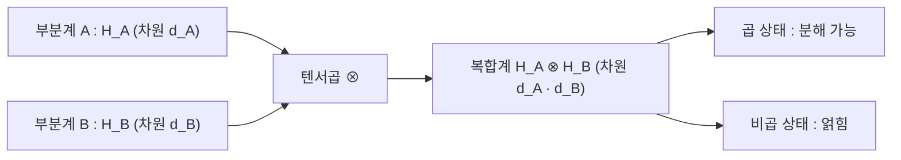

# Tensor Product

> 두 부분계의 힐베르트 공간을 결합해 복합계 전체의 상태 공간을 구성하는 연산으로, 차원이 각 부분계 차원의 곱으로 커진다.

## 핵심
양자역학에서 여러 입자나 큐비트가 모인 복합계를 기술하려면 각 부분계의 상태 공간을 하나로 합쳐야 한다. 이때 쓰는 결합 규칙이 텐서곱이다. 부분계 $A$가 [[Hilbert Space|힐베르트 공간]] $\mathcal{H}_A$에, 부분계 $B$가 $\mathcal{H}_B$에 산다면, 복합계 전체는 다음 공간에 산다.

$$ \mathcal{H}_{AB} = \mathcal{H}_A \otimes \mathcal{H}_B $$

핵심 성질은 차원이다. $\dim \mathcal{H}_A = d_A$이고 $\dim \mathcal{H}_B = d_B$이면, 결합 공간의 차원은 합이 아니라 곱이다.

$$ \dim(\mathcal{H}_A \otimes \mathcal{H}_B) = d_A \cdot d_B $$

이 곱셈 구조가 양자 상태 공간이 부분계 수에 따라 폭발적으로 커지는 근본 이유다.

### 기저와 축약 표기
$\mathcal{H}_A$의 기저가 $\{\lvert i \rangle\}$이고 $\mathcal{H}_B$의 기저가 $\{\lvert j \rangle\}$이면, 결합 공간의 기저는 모든 쌍의 텐서곱으로 주어진다.

$$ \{\, \lvert i \rangle \otimes \lvert j \rangle \,\} $$

복합계의 임의 상태는 이 기저의 선형 결합으로 적는다.

$$ \lvert \psi \rangle = \sum_{i,j} c_{ij}\, \lvert i \rangle \otimes \lvert j \rangle $$

다중 [[Qubit|큐비트]]를 다룰 때는 텐서곱 기호와 켓을 매번 쓰면 번거로우므로 축약 표기를 쓴다. 두 큐비트가 각각 $\lvert 0 \rangle$이면 다음처럼 한 켓 안에 비트열로 묶는다.

$$ \lvert 0 \rangle \otimes \lvert 0 \rangle = \lvert 0 \rangle \lvert 0 \rangle = \lvert 00 \rangle $$

마찬가지로 $\lvert 1 \rangle \otimes \lvert 0 \rangle \otimes \lvert 1 \rangle = \lvert 101 \rangle$로 적는다.

### 곱 상태와 비곱 상태
복합계의 상태가 각 부분계 상태의 단일 텐서곱으로 분해되면 곱 상태(separable state, 또는 product state)라 부른다.

$$ \lvert \psi \rangle_{AB} = \lvert \phi \rangle_A \otimes \lvert \chi \rangle_B $$

이런 상태에서는 두 부분계가 서로 독립이며 각자의 상태를 따로 말할 수 있다. 반대로 어떤 $\lvert \phi \rangle_A$와 $\lvert \chi \rangle_B$를 골라도 위처럼 분해할 수 없는 상태를 비곱 상태(non-separable state)라 한다. 이 분해 불가능성이 바로 [[Quantum Entanglement|얽힘]]의 정의다. 대표적인 예가 [[Bell States|벨 상태]] 중 하나다.

$$ \lvert \Phi^{+} \rangle = \frac{1}{\sqrt{2}} \big( \lvert 00 \rangle + \lvert 11 \rangle \big) $$

이 상태는 어떤 단일 큐비트 상태의 곱으로도 쓸 수 없으므로 얽힌 상태다.

### 연산자의 텐서곱과 국소 연산
상태뿐 아니라 연산자도 텐서곱으로 결합한다. 부분계 $A$에 작용하는 연산자 $A$와 $B$에 작용하는 $B$를 묶으면 복합계 연산자 $A \otimes B$가 된다. 곱 상태에 작용할 때는 각 부분계에 따로 작용한 결과의 텐서곱과 같다.

$$ (A \otimes B)(\lvert \phi \rangle \otimes \lvert \chi \rangle) = (A \lvert \phi \rangle) \otimes (B \lvert \chi \rangle) $$

한 부분계에만 게이트를 걸고 나머지는 그대로 두는 국소 연산(local operation)은 그 부분계 연산자와 항등 연산자의 텐서곱으로 표현한다. 예를 들어 두 큐비트 중 첫 번째에만 $X$ 게이트를 거는 연산은 $X \otimes I$다. 국소 연산만으로는 곱 상태를 얽힌 상태로 만들 수 없다는 점이 얽힘을 자원으로 보는 시각의 출발점이다.

### Kronecker 곱 행렬 표현
유한 차원에서 텐서곱은 행렬의 Kronecker 곱으로 구체적으로 계산된다. 단일 큐비트 기저 벡터를 다음으로 두면,

$$ \lvert 0 \rangle = \begin{pmatrix} 1 \\ 0 \end{pmatrix}, \qquad \lvert 1 \rangle = \begin{pmatrix} 0 \\ 1 \end{pmatrix} $$

두 큐비트 $\lvert 0 \rangle \otimes \lvert 1 \rangle$은 첫 벡터의 각 성분에 둘째 벡터를 곱해 쌓은 4차원 열벡터가 된다.

$$ \lvert 0 \rangle \otimes \lvert 1 \rangle = \begin{pmatrix} 1 \cdot \begin{pmatrix} 0 \\ 1 \end{pmatrix} \\[4pt] 0 \cdot \begin{pmatrix} 0 \\ 1 \end{pmatrix} \end{pmatrix} = \begin{pmatrix} 0 \\ 1 \\ 0 \\ 0 \end{pmatrix} $$

연산자도 같은 규칙을 따른다. 두 행렬 $A$와 $B$에 대해 Kronecker 곱은 $A$의 각 성분 $a_{ij}$를 블록 $a_{ij} B$로 치환한 큰 행렬이다.

$$ A \otimes B = \begin{pmatrix} a_{11} B & a_{12} B \\ a_{21} B & a_{22} B \end{pmatrix} $$

## 구조

## 왜 중요한가
텐서곱은 양자정보의 표현력과 계산 난이도를 동시에 떠받치는 토대다. $n$개의 큐비트로 이루어진 레지스터의 상태 공간은 $\underbrace{\mathbb{C}^2 \otimes \cdots \otimes \mathbb{C}^2}_{n}$이고 차원은 $2^n$이 된다. 부분계 수에 대해 차원이 지수적으로 늘어나므로, $n$큐비트 일반 상태를 고전 컴퓨터로 적으려면 $2^n$개의 복소 진폭이 필요하다. 이 지수적 상태 공간이 양자 알고리즘이 노리는 잠재력의 원천이자, 고전 시뮬레이션을 어렵게 만드는 장벽이다.

동시에 텐서곱은 얽힘이라는 개념을 수학적으로 가능하게 한다. 만약 복합계가 항상 곱 상태였다면 부분계 사이의 양자 상관은 존재할 수 없다. 텐서곱 공간이 곱 상태로 분해되지 않는 벡터들을 품기 때문에 비로소 [[Quantum Entanglement|얽힘]]이 정의되고, 그 위에서 양자 원격전송과 초고밀도 부호화 같은 프로토콜이 작동한다.

## 연결
- [[Hilbert Space]] 텐서곱이 결합하는 각 부분계의 상태 공간이자 결과 복합계도 다시 힐베르트 공간이 됨
- [[Quantum Entanglement]] 텐서곱 공간에서 곱 상태로 분해되지 않는 비곱 상태가 곧 얽힘의 정의
- [[Bell States]] 텐서곱으로 만든 2큐비트 공간에서 분해 불가능한 최대 얽힘 상태의 대표 예
- [[Qubit]] 텐서곱으로 결합되는 양자정보의 기본 단위이자 $n$큐비트 레지스터의 구성 요소
